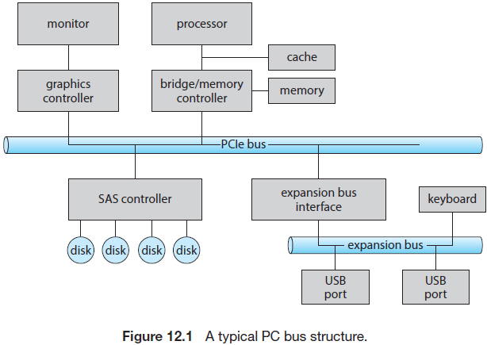
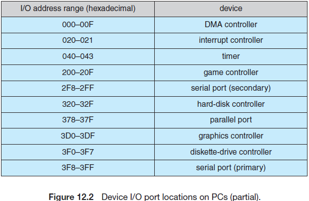
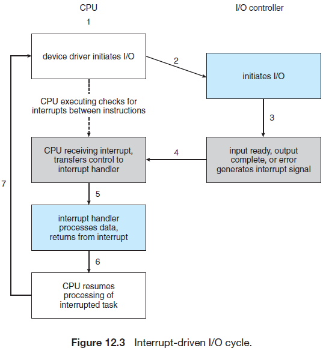
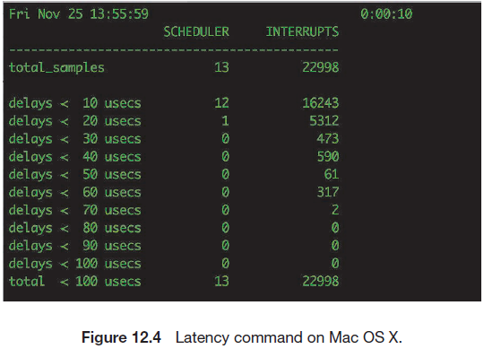
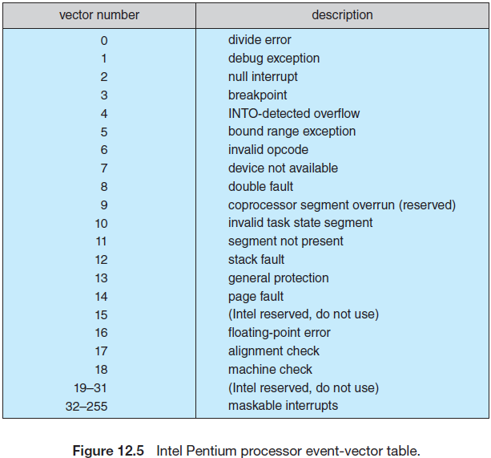
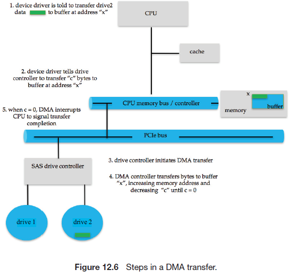
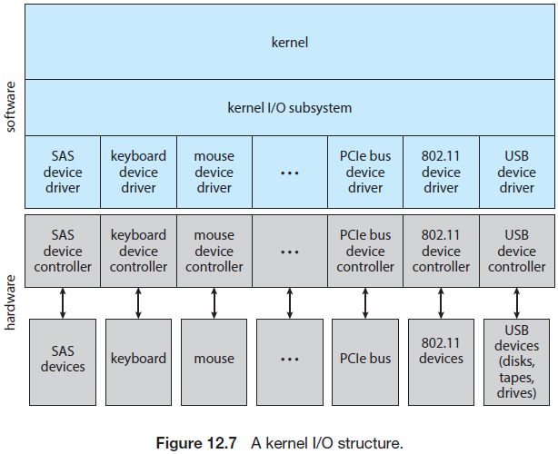
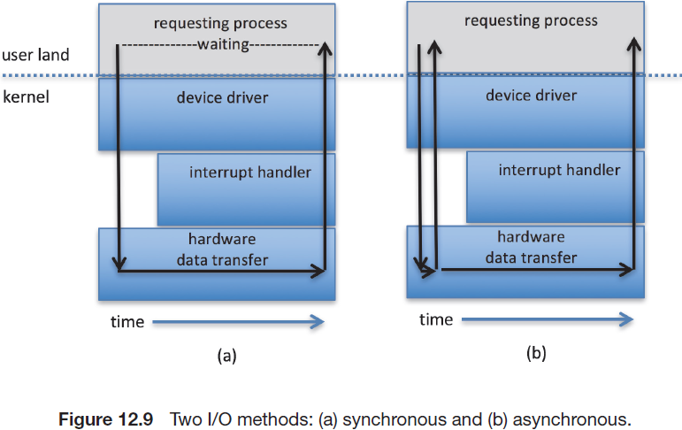

## I/O Systems

一个计算机中的两个主要任务是I/O和计算。大多数情况下，主要的任务I/O，计算或处理仅仅是附带的。例如，当浏览一个web页表或编辑一个文件时，我们感兴趣的时读或获取一些信息，而不是计算出某个答案。

操作系统在计算机I/O中的角色是管理并控制I/O操作和I/O设备。虽然在其他章节中已经进行了类似的讨论，但这里会完整地对I/O进程描述。由于硬件接口限制了操作系统的内部设施，因此会首先会描述I/O硬件的概念。下面会讨论操作系统提供的I/O服务以及这些服务在应用I/O接口中的体现。然后讨论操作系统是如何在硬件接口和应用接口间搭建桥梁的。我们也会讨论UNIX System v STREAMS机制，该机制允许一个应用自动组合驱动代码的处理流程。最后会讨论I/O的性能以及提升I/O性能下的操作系统设计原则。

### 12.1 Overview

操作系统设计者需要重点关注如何控制连接到计算机的设备。由于I/O设备的功能和速度各不相同(例如鼠标，硬盘，闪驱以及录音机器人)，需要使用多种方法进行控制。这些方法组成了内核的I/O子系统，并将内核从复杂的I/O设备管理中解脱出来。

I/O设备技术表现出两种相互矛盾的趋势。一方面软件和硬件接口的标准在增加，这种趋势将改进后的设备集成到现有的计算机和操作系统中；另一方面，I/O设备的种类也在增加。一些新的设备与老设备不尽相同，要将这些设备集成到我们的计算机和操作系统中会面临比较大的挑战。这个挑战涉及软件和硬件技术。基本的I/O硬件元素，如端口，总线和设备控制器等都可以容纳多种I/O设备。为了封装设备的细节和各种差异，操作系统的内核使用了设备驱动模块。设备驱动体提供了统一的到I/O子系统的设备访问界面，类似在应用和操作系统之间提供了标准接口的系统调用。

### 12.2 I/O Hardware

计算机会操作很多各种类型的设备。大多数属于通用类型的存储(硬盘，磁带)，传输设备(网络连接，蓝牙)以及人机界面设备(屏幕，键盘，鼠标，音响等)。其他设备则更加专业化，如与喷气机转向有关的设备。在这种飞机上，由人通过操纵杆和脚踏板输入飞行计算机，然后计算机会发送输出命令，使电动机将舵，襟翼和燃料移动到发动机。虽然I/O设备的类型多种多样，但我们仅需要很少的概念来理解设备是如何连接的，以及软件是如何控制硬件的。

设备通过电脑或空气发送信号来与计算机系统进行通信，通过连接点或端口(如，串口)来与机器进行通信。(术语PHY是OSI模型物理层的简写，也用于指端口，但在数据中心命名法中更常见。)如果设备共享一组通用的线路，这种连接称为总线。一个总线(如现今大多数计算机使用的PCI总线)是一种严格定义的协议，该协议指定了可以在这组线路上发送的一组消息。在电子层面，这些消息通过以规定的时序施加到线路上的电压(模式)进行传输。当设备A有一条与电缆与设备B相连，且设备B有一条电缆与设备C先连，设备C插入计算机的一个端口，这种组织方式成为菊花链。一个菊花链通常用于总线。

总线在计算机架构种被广泛使用，且不同的总线有不同的发送信号的方法，速度，吞吐量以及连接方式。图12.1展示了一个典型的PC总线结构。在图中，一个PCIe总线(通用PC系统总线)将处理器-内存子系统连接到了快速设备中，而扩展总线连接到相对较慢的设备，如键盘和串口和USB端口。在图中的最左下方，四个硬盘通过一个串行连接的SCSI(SAS)总线一起接入到SAS控制器中。PCIe是一种灵活的总线，可通过一个或多个“通道”发送数据，一个通道包含两个信号对，一对信号用于接收数据而另一对信号用于传输数据。因此每个通道包含四条线路，且每个通道使用全双工字节流，可以以8位(一个字节)的方式同时在两个方向上传输数据包。物理上，PCIe链路可能会包含1，2，4，8，12，16或32个通道，由"x"前缀表示。例如，一个使用8个通道的PCIe卡或连接器定义为x8。此外，PCIe已经出现了很多代，未来还会有更多的类型。因此，例如，一个"PCI gen3x8"的卡表示它使用3代PCIe并使用8个通道。这种设备的最大吞吐量为每秒8GB。PCIe的更多详情参见https://pcisig.com。



控制器是可以操作端口，总线或设备的电子器材的集合。一个串口控制器是一个简单的设备控制器，它是一个(或部分芯片)控制串口线路上的信号的芯片。相反，一个光纤通道(FC)总线控制器则没有那么简单。由于光纤通道协议比较复杂，且通常用于数据中心，而非PC。因此FC总线控制器通常是一个连接到计算机总线的独立电路板(或主机总线适配器(HBA))，通常会包括处理FC控制消息的处理器，微码和一些私有内存。一些设备会内置控制器。如果你看一下硬盘设备，就可以在一侧看到电路板，这个板就是硬盘控制器，它实现了硬盘侧用于某些连接的协议，例如SAS和SATA。硬盘控制器还有一些用于处理如坏扇区映射，预取，缓冲和缓存的微码和处理器。

#### 12.2.1 Memory-Mapped I/O

处理器是如何将命令和数据传递给控制器来完成一个I/O传输的？简单来说，控制器有一个或多个寄存器来处理数据和控制信号。处理器通过读取和写入这些寄存器中的位的模式来与控制器进行通信。通信中使用的一种方式是通过使用的特殊I/O指令将一个字节或一个字传递到一个I/O端口地址。I/O指令会触发总线选择合适的设备并将这些比特位转移进/出一个设备寄存器。或者，设备可以支持内存映射I/O，这种情况下，设备控制寄存器会映射到处理器的地址空间中。CPU使用标准数据传输指令，在设备控制寄存器映射的物理内存位置中进行读写，以此来执行I/O请求。

在过去，PC经常会通过I/O指令来控制一些设备或内存映射I/O来控制其他设备或内存映射I/O。图12.2展示了PC一般使用的I/O端口地址。图形控制器具有用于基本控制操作的I/O端口，但该控制器页具有用于保存屏幕内容的大内存映射区域。当一个线程可以通过将数据写入到内存映射区域的方式将数据输出到屏幕。控制器生成屏幕图形的内容取决于这段内存中的内容。这种技术很容易被使用，而且，将上百万个字节写入到图形内存要快于执行上百万个I/O指令。因此，随着事件，系统更加倾向于使用内存映射I/O。现在，大多数控制器都使用内存映射I/O来执行I/O。



I/O设备通常包括四个寄存器，称为状态，控制，入数据(data-in)和出数据(data-out)寄存器。

- 主机会读取入数据寄存器来获取输入
- 主机会写入出数据寄存器来发送输出
- 主机可以读取状态寄存器中的比特位。这些比特位指定了状态，如是否完成了当前的命令，是否能够从入数据寄存器中读取字节，以及是否产生了一个设备错误。
- 主机可以通过控制寄存器来启动一个命令或修改设备模式。例如，串口控制寄存器中的某个特定比特位用于在全双工和半双工通信之间进行选择，以及用于奇偶性校验的比特位，用于设置字长为7或8位的比特位，用于选择串口支持的速度的比特位。

数据寄存器通常为1到4个字节。一些控制器使用FIFO芯片扩展了控制器(超出数据寄存器能保留的数据大小)，使其能够保存多个字节的输入或输出。如果设备或主机无法接收芯片中的数据，FIFO芯片可能会出现短暂的数据峰值。

#### 12.2.2 Polling

一个完整的用于的在主机和控制器间交互的协议是比较复杂的，但基本的握手概念则比较简单。下面举例讲一下握手。假设使用2比特位来协调控制器和主机之间的生产者-消费者关系。控制器使用状态寄存器中的`busy`位来标识其状态。当控制器处于繁忙工作时会设置该`busy`位，而在能处理下一条指令时清除`busy`位。主机通过`command`寄存器中的`command-ready`位来实现这种功能，当控制器能够执行指令时会设置`command-ready`位。在这个例子中，当主机需要通过一个端口写入输出时，需要与控制器按照如下步骤进行握手协调。

1. 主机会重复检查`busy`位，直到该位被清除
2. 主机设置`command`寄存器中的`write`位，并写入一个字节到出数据寄存器
3. 主机设置`command-ready`位
4. 当控制器注意到`command-ready`位被置位，则设置`busy`位
5. 控制器读取`command`寄存器并看到`write`命令。它会读取出数据寄存器中的内容，并执行设备的I/O
6. 控制器清除`command-ready`位，清除状态寄存器中的`error`位来标识设备I/O成功，并通过清除`busy`位来表示I/O结束

每个字节都会重复上述流程。

在步骤1中，主机正忙于等待或轮询：这是个循环，一遍遍读取状态寄存器，直到`busy`位被清除。如果控制器和设备够快，这是个比较合适的方法。但如果等待时间比较长，主机应该切换到另一个任务。那么主机如何知道控制器何时会变得空闲？对于一些设备，主机必须快速做出响应，否则会发生数据丢失。例如，来自串口或来自键盘的数据流，如果控制器的缓冲过小，且主机在读取字节前等待的时间过长，可能会导致数据丢失。

在很多计算机架构中，需要3个CPU指令周期来轮询一个设备：读取设备寄存器，和提取出的状态位作逻辑与操作，如果不为0，则做其他处理。显然，基本的轮询操作已经足够满足要求。但当反复尝试却很少发现可以使用的设备，而此时还有其他未完成的(有用的)CPU任务时，轮询又显得效率低下。

这种情况下，应该让硬件控制器在设备可以处理服务时通知CPU，而不是请求CPU重复轮询完一个I/O。这种使设备能够通知CPU的机制称为中断。

#### 12.2.3 Interrupts

基本的中断机制的运行方式如下：CPU硬件有一个称为中断请求线的线路，在每次指令执行完后会感知到它。当CPU探测到一个控制器在中断请求线上发出一个信号时，CPU会保存状态并跳转到(位于内存中固定地址的)中断处理例程。中断处理器会确定产生中断的原因，执行必要的流程，状态存储，然后执行一个中断返回(`return from interrupt`)指令来使CPU返回到中断之前的执行状态。通俗来讲，设备控制器通过在中断请求线上发送一个信号来发出一个中断，CPU会捕获该中断并将其分发给中断处理器，然后中断处理器会处理并清除该中断 。图12.3概括了中断驱动的I/O周期。





在本章中我们强调中断管理，即使是单用户的现代系统，每秒也可以管理数百个中断，而服务器每秒可处理数十万个中断。例如，图12.4为macOS上`latency`命令的输出，显示了台式计算机在十秒钟内执行了将近23,000次中断。

上述描述的基本的中断机制使得CPU能够在设备控制器就绪时处理异步时间。然而，在现代操作系统中，我们需要更加复杂的中断处理特性。

1. 我们需要能够在关键处理期间推迟中断处理的能力。
2. 我们需要一种更有效的方式将设备发出的中断分配给合适的中断处理器，而无需轮询所有设备来查看哪个设备发起的中断。
3. 我们需要多种级别的中断，这样操作系统可以区分高和低优先级中断，这样在同时有多个中断时可以按照紧急程度进行响应。
4. 我们需要一种能够直接引起操作系统注意的指令方法(与I/O请求分开)，例如分页错误，除以0等错误。后面我们将看到使用"traps"来完成这种任务。

在现代计算机硬件中，这些特性由CPU和中断控制硬件提供。

大多数CPU有两条中断请求线。一个是不可屏蔽中断，这种中断预留给如不可恢复的内存错误。第二种为可屏蔽中断，在CPU执行重要的且不能被中断的指令前可以关闭这种中断。可屏蔽的中断用于设备控制器请求服务。

中断机制会接收一个地址，该地址用于(从一个小的集合中)选择特定的中断处理例程。大多数架构下，该地址为表中的偏移量，称为中断向量。这种向量包含特定的中断处理器的地址。使用带向量的中断机制的目的是减少对单一中断处理器的需求(使用一个中断处理器时需要查找所有的中断源来决定哪个设备需要服务)。然而，实践中计算机的设备(也即中断处理器)比在中断向量中的地址元素还要多。一种解决办法是使用中断链，即中断向量中的每个元素指向中断处理器列表的首部。当发生一个中断时，会依次调用对应列表上的处理器，直到发现一个可以处理该请求的处理器。这种结构是使用大型中断表时的大内存开销和分配到单一中断处理器时的低效率之间的折衷。

图12.5展示了Intel 奔腾处理器的中断向量。从0到31的事件都是不可屏蔽的，用于显示各种错误情况(可能会导致协调崩溃)，分页错误(需要立即处理)，以及调试请求(停止普通操作并跳转到调试程序)。从32到255的事件都是可屏蔽的，用于如设备生成的中断。



中断机制页实现了一个中断优先级系统。这些级别使得CPU能够在没有屏蔽所有中断的前提下推迟低优先级中断的处理，使得该优先级中断能够抢占低优先级中断的执行。

一个现代操作系统会使用多种方式与中断机制进行交互。在启动时，操作系统会通过探测硬件总线来确定目前有哪些设备并在中断向量中安装对应的中断处理器。在I/O期间，各种设备控制器会在准备服务时发出中断。这些中断表明输出已经结束或输入数据已经就绪，或已经探测到失败。中断机制也会用于处理多种异常，如除以0，访问被保护或不存在的内存地址，或尝试在用户模式下执行一个特权指令。触发中断的事件会有一个共同的属性：它们诱导操作系统执行紧急的、自包含的例程。

由于大多数情况下，中断处理受事件和资源限制，因此实现起来比较复杂，系统经常会将中断分为第一级中断处理器(FLIH)和第二级中断处理器(SLIH)。FLIH会执行上下文切换，状态存储和对需要处理的操作的排队，而单独调度的SLIH则会执行请求操作的处理。

操作系统使用中断也有好处。例如，很多操作系统会在虚拟内存中使用中断机制。一个分页错误就是一个异常，会发起一个中断。该中断会挂起当前进程并跳转到内核中的分页错误处理器。分页错误处理器会保存进程的状态，并将进程移动到等待队列，执行分页缓存管理，调度一个I/O操作来获取分页，然后调度另外一个进程来恢复执行，最后从中断中返回。

另一个例子是系统调用的实现。探测一个程序会使用库来发起系统调用，库例程会检查程序输入的参数，构造传递给内核且包含参数的数据结构，然后执行一个特殊的指令，称为软中断，或trap。该指令有一个标识所需内核服务的操作数。当一个进程执行trap指令时，中断硬件会保存用户代码的状态，切换到内核模式并分派给内核例程或实现了服务请求的线程。trap的相比硬件中段来说，其优先级比较低(由程序执行的一个系统调用没有比服务一个设备控制器要紧)。

中断也可以用于管理内核的控制流程。例如，考虑一个处理硬件读请求的过程。有一步需要将数据从内核空间拷贝到用户缓存。这种拷贝会花费一些时间且不紧急(不能阻塞其他高进程中断的处理)。另一步中会启动该硬盘下一个挂起的I/O。这一步需要高一些的优先级。如果硬盘需要高效率使用，我们需要在前一个I/O结束后立即启动下一个I/O。因此会使用一对中断处理器来实现完成硬盘读的内核代码。高优先级处理器会记录I/O状态，清除设备中断，启动下一个挂起的I/O，并让低优先级中断完成其工作。再往后，当CPU不使用高优先级工作时，会调度低优先级中断。对应的处理器会通过将数据从内核缓存拷贝到应用空间的方式完成用户级别的I/O，然后调用调度器将应用放置在ready队列中。

线程内核体系架构非常适合实现多个中断优先级，并在内核和应用例程中强制中断处理优先于后台处理。在Solaris中，中断处理器以内核线程的方式运行，并会给这些线程保留一个高优先级范围。这些用于中断处理器的优先级高于应用代码和内核的普通任务，并实现了中断处理器间的优先级关系。这些优先级会导致Solaris线程调度器在有高优先级中断处理器时抢占低优先级中断处理器，且线程实现使得多处理器硬件能够同时运行多个中断处理器。我们会在20章节描述Linux下的中断架构，21章中描述Windows10，以及在附录C中描述UNIX。

总之，现代操作系统使用中断处理异步事件并在内核的监管模式例程中捕获该事件。为了使最紧急的任务能够第一时间解决，现代计算机使用了中断优先级系统。设备控制器，硬件错误和系统调用都会产生中断，并触发内核例程。对于时间敏感的处理来说，中断还是比较笨重，为了提高系统性能，需要高效地处理中断。现在中断驱动I/O比轮询更加通用，轮询通常用于高吞吐量的I/O中。有时会同时使用这两种方案。一些设备驱动会在I/O速率低时使用中断，并在I/O速率上升到使用轮询更快更高效时切换到轮询。

#### 12.2.4 Direct Memory Access

对于一个执行大量传输的设备，如硬盘设备，使用通用处理器监视状态位以及每次只将一个字节的数据传输到控制器寄存器(该进程称为程序I/O，PIO)的方式会比较浪费。计算机使用一种称为直接内存访问(DMA)的特殊处理器来降低由于PIO造成的主存压力。为了初始化DMA传输，主机会将一个DMA命令块写入内存，该命令块包含一个指向传输源的指针，一个指向传输目的地的指针，以及一个计算传输字节的计数器。命令块可能更加复杂，包含不连续的源和目的地址的列表。这种分散-聚合方法允许通过一个DMA模块同时执行多条传输。CPU将该命令块的地址写入DMA控制器，然后继续进行其他工作。DMA控制器继续直接操作内存总线，在没有主CPU协助的情况下在总线上传输该地址。一个简单的DMA控制器已经成为从智能手机到大型机的所有现代计算机的一个标准组件。

注意目标地址位于内核地址空间中的方式是最简单的，如果位于用户空间，用户可以在传输时修改这块空间的内容，导致部分数据丢失。为了获取使用DMA传输到用户空间的为线程访问准备的数据，需要第二次拷贝操作，这次拷贝从内核内存到用户内存。这种两次缓存数据的方式比较低效。随着时间推移，操作系统已经使用内存映射(12.2.1章节)来在设备和用户地址空间之间直接执行I/O传输。

DMA控制器和设备控制器之间的握手通过一对称为DMA-请求和DMA-确认的线路完成。当有数据需要传输时，设备控制器将一个信号放到DMA-请求线路上。该信号会使得DMA占用内存总线，将期望的地址放到内存地址线路上，并在DMA-确认线路上发送一个信号。当设备控制器接收到DMA-确认信号，它将数据字传输到存储器，并删除DMA请求信号。

当整个传输结束后，DMA控制器会中断CPU，图12.6描述了该过程。当DMA控制器占用内存总线，CPU将暂时无法访问主存(虽然CPU仍然能访问缓存中的数据)。虽然这种周期性的挪用降低了CPU的运算，但会将传输数据的工作转移到DMA控制器，通常会提高整个系统的性能。一些计算机架构会允许DMA使用物理内存地址，但也提供了直接虚拟内存访问(DVMA)的方式，使用已经转换为物理地址的虚拟地址。DVMA能够在两个内存映射设备间执行传输，且不需要CPU和主存的接入。

*DMA不需要CPU参与，但会导致CPU无法访问内存，因此在DMA结束后需要通过中断通知CPU，以便CPU使用内存*



对于保护模式下的内核，操作系统通常会阻止进程直接发出设备命令。该准则可以保护数据不受访问控制的侵犯，还可以保护系统不受设备控制器错误使用的影响(这些问题可能会导致系统崩溃)。相反，操作系统会提供一些功能，使得有足够特权的进程能够访问底层硬件上的低级操作。对于没有内存保护的内核，进程可以直接访问设备控制器。由于可以避免内核通信，上下文切换和内核软件层，因此这种直接访问可以用于实现高性能。不幸的是，它干扰了系统的安全性和稳定性。通用的操作系统会保护内存和设备，这样能够使系统避免各种错误或恶意的应用程序。

#### 12.2.5 I/O Hardware Summary

虽然考虑到电子硬件设计时，硬件方面的I/O是非常复杂的，但上面提到的概念已经足够我们理解操作系统的很多I/O特性。下面回顾一下主要概念：

- 总线
- 控制器
- I/O端口及其寄存器
- 主机和设备控制器的握手
- 通过轮询或中断来执行握手
- 将大型传输的作业移交给DMA控制器

本章中已经给出了一个设备控制器和主机之间进行握手的一个简单例子。实际中，各种各样的可用设备给操作系统实现者带来了一个问题。每种设备都有其各自的特性，定义的控制位和与主机交互的协议等，这些都不尽相同。如何在不重写操作系统的前提下来适配这些设备？以及在设备大量变化时，操作系统如何给应用提供一个便利的，统一的I/O接口？下面将关注这些问题。

#### 12.3 Application I/O Interface

本章中，我们会设计一些技术和接口来让操作系统用一种标准的，通用的方式来对待I/O设备。例如，应用如何在不知道哪种硬盘的前提下打开硬盘上的文件，以及如何在不干扰操作系统的前提下将新的硬盘和其他设备添加到计算机？

就像其他复杂的软件工程问题，这里的方法设计抽象，封装和软件分层。具体地，我们可以通过定义一些通用类型来抽象出I/O设备的详细差别。通过一个标准的功能集(接口)来访问每个通用类型。封装了这些差异的内核模块称为设备驱动，其内部是根据特定设备定制的，但提供了一个标准接口。图12.7描述了内核的I/O相关部分是如何在软件层中的构造。



设备驱动的目的是从内核的I/O子系统中隐藏设备控制器之间的差异，I/O子系统会使用一些通用的类来封装设备的行为，对应用程序隐藏硬件的差异。这样使得I/O子系统独立于硬件，并简化了操作系统设计者的工作。设计一个新设备只需要与现有主机控制器接口(如SATA)兼容，或通过编写设备驱动给操作系统提供一个新硬件接口。这样，我们就可以为计算机添加新的外设，而无需等待厂商开发相应的支持代码。

对设备硬件制造商不幸的是，每个操作系统都有其各自的设备驱动接口。一个给定的设备可能需要提供多个设备驱动，例如Windows，Linux，AIX和macOS。设备在多个维度都不尽相同，见图12.8


- 字符流或块。一个字符流设备会一个字节一个字节地进行传输，而一个块设备会以一块字节为单位进行传输
- 顺序或随机访问。顺序的设备会以设备规定的固定顺序传输数据，而随机访问设备则可以指示设备查找任何可用数据的存储位置。
- 同步或异步。同步设备与系统的其他功能协调，使用可预测的响应时间执行数据传输，与系统的其他方面进行协调。而异步设备则展现出不规则或不可预测的响应时间，且不会与其他计算机事件协调。
- 共享或专用。一个共享设备可以同时被多个进程或线程使用；而专用设备则不能
- 读写，只读，只写。一些设备会执行输入和输出，但其他设备则只支持一个方向的数据传输。一些允许数据在写后进行修改，但其他则仅允许一次写操作，且后续只读。

为了应用的访问，操作系统屏蔽了很多这类差异，且将设备分为几种常规类型，由此产生的设备访问方式被认为是有用且广泛适用的。虽然不同的操作系统的系统调用会有所不同，但设备种类则非常标准。主要的访问规则包括块I/O，字符流I/O，内存映射文件访问和网络套接字。操作系统也提供了一些特殊的系统调用来访问一些额外的设备，如时钟和定时器。一些操作系统为图形显示，视频，和音频设备提供了一个系统调用集。

大都数操作系统都会有一个允许应用将任意命令透明地传递给设备驱动的逃逸(或后门)。在UNIX上，这种系统调用为`ioctl()`(用于I/O控制)。`ioctl()`系统调用允许一个应用访问任何功能，这些功能能够被任何驱动实现，而无需创造一个新的系统调用。`ioctl()`系统调用有三个参数。第一个是将应用连接到驱动的设备描述符，指出驱动管理的一个硬件设备。第二个参数是一个整型，用于选择驱动中实现的某个命令。第三个是一个指向内存中任意数据接口的指针，允许应用和设备交互任何需要的控制消息或数据。

UNIX和Linux的设备标识符是一个"主和次"设备号的元组。主号表示设备类型，次号表示设备的实例。例如，考虑系统上的SSD设备。如果发使用命令：

```
% ls -l /dev/sda*
```

输出如下：

```
brw-rw---- 1 root disk 8, 0 Mar 16 09:18 /dev/sda
brw-rw---- 1 root disk 8, 1 Mar 16 09:18 /dev/sda1
brw-rw---- 1 root disk 8, 2 Mar 16 09:18 /dev/sda2
brw-rw---- 1 root disk 8, 3 Mar 16 09:18 /dev/sda3
```

输出显示有8个主设备号。操作系统使用该信息将I/O请求路由到合适的设备驱动。次号为0，1，2，3，表示设备的实例，用来为请求选择准确的设备。

#### 12.3.1 Block and Character Devices

块设备接口用于满足访问硬盘和其他面向块的设备的各方面需求。设备需要理解一些诸如`read()`和`write()`的命令。如果是一个随机访问设备，它还需要一个`seek()`命令来指定下一个传输的块。应用通常会通过文件系统来访问一个设备。我们可以看到`read()`，`write()`和`seek()`可以满足块存储设备的基本行为，这样使应用程序与设备之间的底层差异隔离开来。

如同数据库管理系统，操作系统本身也是一种特殊的应用，可能会倾向以简单的线性块数组访问块设备。这种访问模式有时被称为裸I/O(raw I/O)。如果应用有自身的缓存，那么使用文件系统会导致冗余的缓冲。同样地，如果一个应用提供了自身的块锁或域锁，那么在最差情况下，所有的操作系统的锁定服务都将是冗余且矛盾的。为了避免这种冲突，裸设备或将设备控制直接传达给应用，而不会经过操作系统。不幸的是，这种设备不能使用操作系统的所有服务。一种常见的折衷方案是操作系统允许操作禁用缓冲和锁定的文件，在UNIX中，称为直接I/O。

内存映射文件访问可以位于块设备驱动之上。除了提供读写操作，内存映射接口也提供了通过主存的字节数组访问硬盘存储的途径。将文件映射到内存的系统调用会返回包含文件副本的虚拟内存地址。仅当需要满足对内存镜像的访问时，才会执行实际的数据传输。由于传输使用与按需分页虚拟内存访问相同的机制处理，因此内存映射I/O的效率比较高。对编程人员来说，内存映射也很方便，访问一个内存映射的文件正如读取或写入内存一样简单。提供了虚拟内存的操作系统通常会使用内核服务的映射接口。例如，为了执行一个程序，操作系统将可执行文件映射到内存，并将控制传递到可执行文件中的入口地址。内核访问硬盘的交换空间时通常也会用到映射接口。

键盘是一种使用字符流接口访问的设备。应用可以使用该接口中的基本系统调用来`get()`或`put()`一个字符。在这个接口之上，可以构建提供一次访问一行的库，并提供缓冲和编辑服务(例如，当一个用户类型为退格，会从输入流中移除一个字符)。这种访问方式可以为一些“自发”生成输入数据的输入设备提供便利，如键盘、鼠标和调制解调器，即应用程序不一定能预测输入的时间。这种访问方式可以为输出设备提供便利，如打印机和音响板等，它符合线性字节流的概念。

#### 12.3.2 Network Devices

因为网络I/O的性能和寻址特性与磁盘I/O有很大的不同，大多数操作系统提供了一个与硬盘使用的`read()`–`write()`–`seek()`接口不同的网络I/O接口。有一种适用于很多操作系统的接口，包括UNIX和Windows，即网络套接字接口。

想想墙上的电源插座：所有的电器都可以插入使用。以此类推，一个应用可以使用套接字接口中的系统调用创建套接字，将本地套接字连接到远端地址(将此应用程序插入另一个应用程序创建的套接字中)，监听所有插入到本地套接字的远端应用，从连接上发送和接口报文。为了实现网络服务器，套接字接口也提供了管理套接字的函数`select()`。对`select()`的调用会返回可以接收报文的套接字或有空间可以发送报文的套接字。`select()`的使用消除了网络I/O所需的轮询和繁忙等待。这些功能封装了网络的基本行为，可以更方便地创建使用任意底层网络硬件和协议栈的分布式应用。

还有其他实现进程间通信和网络通信的方式。例如，Windows提供了一个到网卡的接口，以及到网络协议第二个接口。UNIX作为网络技术的试验场有着悠久的历史，我们可以找到半双工管道，全双工FIFO，全双工STREAMS，消息队列和套接字等。C.9章节给出了UNIX网络的信息。

#### 12.3.3 Clocks and Timers

大多数计算机都有硬件时钟和定时器，它们提供了3个功能：

- 给出当前时间
- 给出已经经过的时间
- 设定一个在时间T触发操作X的定时器

操作系统大量使用了这些功能，特别是时间密集型应用。不幸的是，实现这些功能的系统调用并不能跨系统使用。

衡量经过的时间并触发某种操作的硬件称为可编程间隔定时器。可是将其设置为等待一定时间，然后会产生一个中断。这种操作可以执行一次或多次来周期性产生中断。使用这种机制生成中断的的调度器会在其时间片之后抢占某个进程。硬盘I/O子系统使用定时器来周期性地将脏缓存刷新到硬盘，网络子系统使用定时器来取消由于网络拥塞或失败造成的过慢的操作。操作系统也会用户进程提供了定时器接口，操作系统可以通过仿真虚拟定时器来支持多于硬件定时器的定时器请求。为了达到这种目标，内核(或定时器设备驱动)维护了一个其例程或用户请求需要的中断列表，按照最早时间排序。它将定时器设置为最早时间(*即使用列表的第一个元素*)，当定时器中断时，内核会通知请求者并使用下一个最早时间重载定时器。

计算机中的时钟硬件用于各种用途。现代PC包含一个高性能时间定时器(HPET)，它以10兆赫兹内的速率运行。这种PC上有一些比较器，当HPET中的时间与比较器的时间匹配时，可以触发一次或多次比较器。当触发器产生一个中断时，操作系统的时钟管理例程会判断定时器的用途以及后续的动作。触发器的精度受到计时器分辨率以及维护虚拟时钟的开销的限制。再者，如果使用定时器刻度来维护系统的日历，则系统时钟可能会发送漂移。可以使用协议来修正时钟漂移，如NTP，网络时间协议，使用复杂的延迟计算来使计算机的时钟几乎精确到原子钟水平。大多数计算机中，硬件时钟由高精度计数器构成。一些计算机中，可以从设备寄存器中读取计数器的值，这种情况下，可以将该计数器看作一个高分辨率时钟。虽然这种时钟不会产生中断，但它提供了精确测量时间间隔的途径。

#### 12.3.4 Nonblocking and Asynchronous I/O

系统调用的另外一个方面与阻塞和非阻塞有关。当一个应用发起一个阻塞的系统调用时，正在被调用的线程会被挂起，并从操作系统的运行队列转移到等待队列。在系统调用结束后，该进程会移回到运行队列，使之继续运行。当该线程恢复运行后，它会接收到系统调用返回的数值。I/O设备执行的物理操作通常是异步的，它们会花费可变的且不可预测的时间。然而，由于阻塞应用代码要比非阻塞应用代码简单，因此操作系统为应用接口提供了阻塞的系统调用。

一些用户级别的进程会需要非阻塞I/O。例如，一个用户界面可以同时接收键盘和鼠标的输入，并在屏幕上处理和显示数据。另一个例子是，视频应用可以同时从硬盘中的文件读取帧，并解压缩并在显示器上显示输出。

一个应用程序编写人员可以使用多线程应用来与I/O操作并行。一些线程可以执行阻塞的系统调用，而其线程则继续执行。一些操作系统提供了非阻塞I/O系统调用，一个非阻塞的调用不会暂停线程的执行。相反，它会很快返回一个表示已经传输多少字节的数值。

一个替代非阻塞系统调用的方法是使用异步系统调用。一个异步调用会立即返回，不会等待I/O结束。线程会继续执行代码。当未来某个时间I/O结束后会通过某种方式通知线程，如通过在线程的地址空间中设置某些变量或通过触发一个信号或一个软中断或一个在线程的线性控制流之外执行的回调例程。非阻塞和异步系统调用之间的区别是，非阻塞的`read()`会返回可用的数据信息，即与请求的数据的数目相同，少于请求请求的数据或没有数据。而一个异步的`read()`请求将会传输全部数据，且在未来的某个时间点完成。图12.9显示了这两种I/O方法。



现代操作系统中会发生异步活动，虽然这些活动很少会暴露给用户或应用，但是在操作系统操作中会涉及到很多。以二级存储设备和网络I/O为例，默认情况下，当一个应用发起一个网络发送请求或存储设备写请求时，操作系统会注意到该请求，缓存I/O，并返回给应用。当为了提高整体系统的性能(*如合并发送*)，当可以处理请求时，操作系统会完成该请求的处理。如果系统在这个短暂的时间内发生了故障，则由于会丢失"正在途中"的请求。因此，操作系统通常会限制多久会缓存一个请求。例如，一些版本的UNIX会每30秒刷新一次辅助存储缓冲区，或每个请求会在其请求后的30秒内被刷新。系统提供了一种允许应用刷新一些缓存(如二级存储缓存)的方法，这样就能够强制将数据刷新到二级存储中，而不必等待缓存刷新间隔。内核维护着应用的数据一致性，在向设备发出I/O请求之前会从其缓冲区读取数据，确保能够将尚未写入的数据返回给请求方。注意对同一文件执行I/O的多线程可能不会得到一致的数据，具体取决于内核如何实现其I/O。这种情况下，线程可能会使用锁协议。一些I/O请求需要立即执行，因此I/O系统调用通常可以标明一个给定的请求，或将I/O指定到特定的设备，这种操作应该同步执行。

一个比较好的非阻塞的例子是使用`select()`系统调用来选择网络套接字。该系统调用使用一个参数来指定最大的等待时间，如果设置为0，会使用一个线程轮询网络活动(不会被阻塞)。由于`select()`只能检查一个I/O是否可用，因此使用`select()`会引入额外的开销。当需要数据传输时,`select()`后面必须跟上如`read()`或`write()`之类的命令。在Mach上，该方法的一个变种是使用阻塞的多次读调用。它在一个系统调用中指定了多个服务的读请求，并在其中一个结束后返回。

#### 12.3.5 Vectored I/O

一些操作系统通过应用接口提供了其他主要的I/O。向量I/O允许一个系统调用执行多个与位置相关的I/O操作。例如，UNIX的`readv`系统调用接口一个多缓存向量，能够将数据源读入该向量或将数据从向量中写入目的地。多次单独的调用系统会产生相同的数据传输，但这种分散-聚合方式有多种用途。

可以通过一个系统调用传输多个单独的缓存，避免上下文切换和系统调用开销。如果没有向量I/O，数据需要以正确的顺序传递到一个大的缓存，然后一起发送出去，这种效率比较低。此外，一些版本的分散-聚合提供了原子性，保证所有的I/O能够在没有中断的请求下完成(避免在其他线程操作这些缓存的请求下损坏数据)。如果可以，编程人员可以使用分散-聚合I/O特性来增加吞吐量并降低系统开销。

### 12.4 Kernel I/O Subsystem