[TOC]

## Virtual Memory

在第9章中，我们讨论了计算机系统中内存管理的各种策略。所有这些策略的目的都相同：通过允许内存中的多个进程同时运行来允许多道程序。然而，程序在运行前倾向于要求整个进程都在内存中。

虚拟内存运行的进程必须被全部载入到内存。该方案的一个主要好处是程序可以大于物理内存。虚拟内存将物理内存抽象位一个无限大的统一的存储列表，将程序员所看到的逻辑内存与物理内存分开。这种技术将编程人员从内存存储限制的担忧中解脱。虚拟内存也允许进程共享文件和库，以及实现共享内存。此外，它还提供了进程创建的高效机制。虚拟内存不容易被实现，且如果使用不当，可能会大大降低性能。本章中，我们会详细讲解虚拟内存，它是怎么实现的，以及实现的复杂性和价值。

### 10.1 Background

第9章提出的内存管理算法是必要的，因为被执行的指令必须存在于内存中。第一种实现该需求的方法是将整个逻辑地址放到物理内存中。动态链接可以帮助放宽这一限制，但通常需要特殊的预防措施并需要程序员进行额外的工作。

将需要执行的指令放在物理内存中看起来既必要又合理，但也很不幸，它按照物理内存的大小限制了程序的大小。实际上，对真实程序的测验表明，在大多数场景下，并不需要运行整个程序。例如，考虑如下几点：

- 程序经常需要使用代码来处理不常见的错误场景。由于这种错误很少，因此在实际中这种代码几乎不会被执行
- 经常会为数组，列表和表分配大于其实际需要的内存。一个数组可能声明了100*100个元素，即使它很少会大于10\*10个元素
- 程序很少使用到的特定选项或特性。例如，美国政府计算机上平衡预算的例行程序已经很多年没有使用过了。

即使需要运行整个程序，也可能不会同一时间全部运行。

能够执行仅一部分在内存中的程序将带来很多好处：

- 一个程序不再受可用的理内存的限制。用户可以使用无限大的虚拟地址空间来编写程序，简化编码任务
- 由于每个程序仅会使用少量物理内存，这样可以同时运行更多的程序员，相应地增加了CPU利用率和吞吐量，但没有增加响应时间或周转时间。
- 只需较少的I/O就可将部分程序加载或交换到内存中，这样每个程序会运行地更快。

这样，当一个程序不需要完全载入内存时，对系统和用户都有利。

虚拟内存涉及将开发者感知的逻辑内存与物理内存的分割。这种分割允许在仅有少量物理地址可用的情况下给编程人员提供无限大的虚拟地址(图10.1)。虚拟地址使得编程更加容易，因此编程人员不用再担心是否有足够的物理内存，而更关注编程中需要解决的问题。


一个进程的虚拟地址空间指进程如何存储在内存中的逻辑（或虚拟）视图。通常该视图中，一个进程从特定的逻辑地址开始，即，地址0，并以连续内存的形式存在，见图10.2。回想第9章，实际物理内存由页帧构成，且分配给进程的物理页帧可能不是连续的，其具体形式取决于内存管理单元(MMU)如何将逻辑地址与物理页帧进行映射。

注意，在图10.2中，我们允许堆随着动态内存分配向上增长。类似地，我们允许栈随着函数调用向下增长。堆和栈之间的空白属于虚拟地址空间的一部分，当堆或栈增长时会请求实际的物理页。虚拟地址空间中的空白称为稀疏地址空间。使用稀疏地址空间是有利的，该空白可以在(程序执行期间)堆或栈增长或期望动态地链接库(或其他共享对象)时被填充。

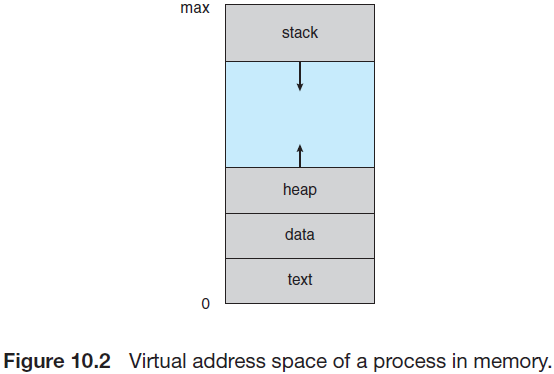

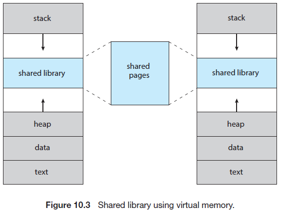

除了将逻辑内存与物理内存进行分割，虚拟内存允许两个或多个进程间通过内存分页共享文件和内存，这种方式有如下优点：

- 系统库，如标准C库可以被多个进程通过将共享对象映射到虚拟地址空间的方式共享。虽然每个进程会将该库认为是其虚拟地址空间的一部分，但该库实际的物理分页是在多个进程间共享的(见图10.3)。通常，一个库会以只读方式映射到每个链接该库的进程的空间中。
- 类似地，进程可以共享内存。回想第3章节中，两个或多个进程可以使用共享内存通信。虚拟内存允许一个进程创建一段与其他进程共享的内存。共享该内存的进程会将该内存视为其虚拟空间的一部分，但实际上使用的是共享的物理内存页，见图10.3
- 使用`fork()`系统调用创建的进程间可以共享分页，因此加速了进程的创建。

后面我们会探讨这些或其他虚拟内存的优势。首先需要讨论如何使用分页实现虚拟内存。

### 10.2 Demand Paging

考虑一个执行的程序人员和从辅助存储器中加载到内存中。一种方式是在程序执行时将整个程序加载到物理内存中。然而这种方式的问题是我们可能不需要在内存中初始化整个程序。假设一个程序使用用户选择的一系列选项启动时，将整个程序加载到内存中会导致加载所有选项对应的代码，而不考虑用户是否会最终使用某个选项。

一种替代策略时仅载入需要的分页。这种技术称为按需分页，通常用在虚拟内存系统中。通过虚拟内存的按需分页，仅在程序运行需要时才会加载分页，永远不会访问的分页将永远不会加载到物理内存中。一个按需分页系统类似使用交换的分页系统(9.5.2章节)，即进程放在辅助内存中(通常时HDD或NVM设备)。按需分配解释了使用虚拟内存的主要好处之一，通过仅加载需要的部分程序使得内存使用更加高效。

#### 10.2.1 Basic Concepts

按需分页背后的一般概念是，仅在内存中加载需要的分页。因而，当一个进程执行时，一些分页会加载到内存中，而一些则会保留在辅助存储中。因此，我们需要某种形式的硬件支持来区分这两种存储。9.3.3章节中描述的有效-无效位可以实现这种目标。当该位设置为"有效"时，相关的分页是有效的且会被加载到内存中；如果该位设置为"无效"，则该页要么无效(不在进程的逻辑地址空间中)或虽然有效但是当前还处于辅助存储中。一个加载到内存中的分页的页表项会设置为"有效"，而一个当前不在内存中的分页的页表项会设置为"无效"。图10.4展示了这种场景。(注意如果进程永远不会访问该分页，则将一个分页设置为无效时不会产生任何影响。)

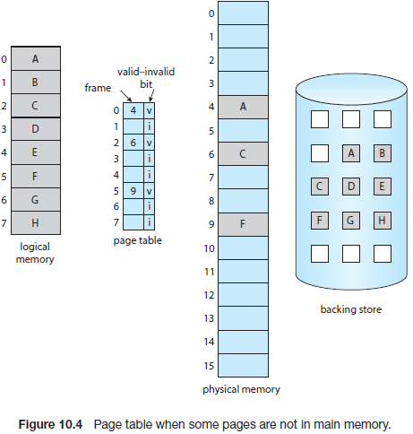

但一个进程尝试访问一个不在内存中的分页时会发生什么?访问一个标记为无效的分页会产生分页错误。负责在页表中转换地址的分页硬件会注意到该分页设置了无效，并触发一个trap给操作系统。该trap在操作系统无法将期望的分页加载到内存时产生。处理这种分页错误的过程很简单(见图10.5)。

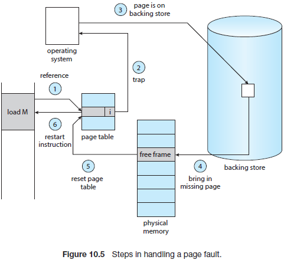

1. 首先通过该进程的内部表(通常保存在进程控制块中)来确定该引用是有效的还是无效的内存访问
2. 如果引用是无效的*(注意是"引用无效"，而不是"分页无效")*，则终止该进程。如果是有效的，但还没有加载该分页，则现在加载
3. 找到一个空闲的帧(例如，通过空闲帧列表)
4. 通过操作辅助存储来将需要的分页加载到新分配的帧中
5. 当读取存储结束后，修改进程保存的内部表，以指示该页现在位于内存中
6. 重启由于trap中断的指令，此时进程可以访问该分页，就像它一直在内存中一样

在极端场景下，可能需要在内存中没有任何分页的情况下启动执行一个进程。当操作系统将指令指针设置位进程的第一个指令时(在非内存驻留页上)，进程会立即出现分页错误，在分页加载到内存中后，该进程可以继续执行，分页错误一直会持续到所需要的所有分页加载到内存中为止，此时不再有任何分页错误。这种方案称为纯按需分页。除非需要，否则不要加载任何分页到内存中。

理论上，一些程序可以在执行一个指令时可以访问内存中多个新的分页(指令占一个分页，数据占多个分页)，这种情况可能在一个执行产生多个分页错误时产生。这种情况会导致不可接受的系统性能。幸运的是，对运行进程的分析表明，这种行为几乎不可能发生。如10.6.1章节描述，程序中往往具有参考位置，这使得需求分页的性能比较合理。

支持按需分页的硬件和支持分页和交换的硬件相同：

- 页表。这种表可以使用有效-无效位或特殊的防护位来将一个表项设置为无效
- 辅助内存。这种内存保存了当前不在主存中的分页。辅助内存通常使用告诉硬盘或NVM设备，称为交换设备，这种需求下的存储部分称为交换空间。第11章介绍了交换空间的分配

按需分页的一种重要需求是能够在分页错误后重启任何指令。由于保存了中断进程的状态(寄存器，条件代码，指令计数器等)，当发生分页错误是，必须在相同的位置和状态下重启进程(除非需要的分页不在内存中，且无法访问)。大多数场景下，很容易满足这种需求。任何内存引用都可能发生分页错误，如果在获取指令时发生了分页错误，可以重启获取指令的操作。如果在获取操作数时发生了分页错误，必须重新获取并解码指令，然后再获取操作数。

最坏的场景下，例如，使用内存A和B的三目操作数ADD，结果为C。这种执行步骤为：

1. 获取并解码指令ADD
2. 获取A
3. 获取B
4. A和B相加
5. 保存和C

如果在保存C时发生页错误(由于C的分页不在内存中)，后续会加载需要的页，修正页表并重启指令。为了获取结果会要求重新获取指令并解码，获取两个操作数并相加。然而，并没有很多重复工作(少于一个完整的指令)，且制造分页错误时才需要重复这些操作。

当一个指令需要修改不同位置时可能会出现困难。例如，考虑IBM System 360/370 MVC指令，该系统最大可以将256字节的数据从一个位置移动到另一个位置(可能会重叠)。如果块(源或目的)跨分页边界，在完成部分移动后可能发生分页错误。此外，如果源或目的块重叠，源块可能已经被修改，这种情况下就不能简单重启指令。

可以使用两种不同的办法解决这种问题。一种方案是微码计算并尝试访问两个块的两端。如果将产生分页错误，那么会在这一步发生(在任何内容被修改前)。如果已经知道不会产生分页错误，由于所有相关的分页已经被加载到内存中，此时可以执行移动指令。另一种方案是使用临时寄存器来保存被覆盖的位置。如果产生了分页错误，所有的旧值会在产生trap前写回内存。该动作在指令开始前还原了内存状态，这杨就可以继续重复执行指令。

这绝不是将分页添加到现有架构以允许按需分页所导致的唯一的架构问题，但也说明了涉及到的一些问题。分页位于计算机系统的CPU和内存之间。它对进程来说应该是完全透明的。因此，人们认为分页可以添加到任何系统中。虽然这种假设对非按需分页环境(分页错误为致命错误)来说是正确的，但对于将分页错误仅仅认为是需要将其他分页加载到内存中并重启进程的系统来说并不正确。

#### 10.2.2 Free-Frame List

当发生分页错误时，操作系统必须将需要的分页从辅助存储中加载到主存中。为了解决分页错误，大多数操作系统维护了一个空闲帧列表，用于满足这种请求的空闲帧池(图10.6)(当堆或栈段需要扩展时也需要分配帧)。操作系统通常会使用一种称为按需零填充的技术分配(zero-fill-on-deman)空闲帧。按需零填充帧在分配前会归零，通过这种方法擦除之前的内容(可以考虑下在重新分配前没有擦出分页中的信息造成的潜在的安全问题)。

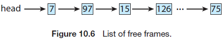

当一个系统启动时，所有可用放入内存都会放到空闲帧列表中。在请求空闲帧后(例如，通过按需分页)，空闲帧列表的长度会缩短。一些情况下，该列表长度会变为0或低于指定阈值，此时必须重新填充。我们将在10.4章节涵盖这些情况下的策略。

#### 10.2.3 Performance of Demand Paging

按需分页会严重影响到一个计算机系统的性能。为了探究原因，下面计算按需分页系统下的有效访问时间。假设内存访问时间为ma，10纳秒。当不存在分页错误时，有效访问时间等于内存访问时间。然而，当发生分页错误时，必须首先从辅助存储中读取相关的分页，然后才能访问期望的内容。

设p为发生分页错误的概率(0 ≤ p ≤ 1)。我们预期p接近0，即，我们预期仅会发生很少的分页错误。此时有效访问时间为：

```
有效访问时间 = (1 - p) × ma + p × 分页错误次数
```

为了计算有效访问时间，必须知道需要多少时间来处理一个分页错误。分页错误会导致以下步骤：

1. 产生一个trap给操作系统
2. 保存寄存器和进程状态
3. 确认该中断是否是一个分页错误
4. 检查分页引用是否合法，并确定辅助存储中的分页位置
5. 将分页从存储中读取到空闲帧中
   1. 在一个队列中等待，直到读取请求被处理
   2. 等待设备查找和/或等待时间
   3. 开始将分页传输到空闲帧中
6. 在等待时间内，将CPU核分配给一些进程
7. 从存储I/O子系统中接收中断(I/O完成)
8. 保存其他进程的寄存器和进程状态(如果执行了第6步)
9. 确定中断来自辅助存储设备
10. 修正页表以及其他表，指出所需要的分页正在内存中
11. 等待该进程分配到CPU核
12. 恢复寄存器，进程状态和新页表，并恢复中断的指令

在每个场景下，并不需要执行所有的步骤。例如，假设第6步中，在发生I/O时，CPU会分配给其他进程。这种分配方式允许多道程序来维护CPU利用率，但在I/O传输接收后，需要额外的时间来恢复分页错误服务例程。

在任何情况下，分页错误处理时间主要包括3个主要的任务：

1. 处理分页错误中断
2. 读取分页
3. 重启进程

第一个和第三个任务可以通过编程来减低处理时间，并支持几百个指令。每个任务可能会花费1到100微秒。考虑使用HDD作为分页设备的场景，分页切换时间可能会接近8毫秒。(典型的硬盘的平均延迟为3，查找时间为5毫秒。传输时间为0.05毫秒。因此，总的分页时间为8毫秒，包括软件和硬件时间。)同时需要注意到设备处理时间。如果一个进程队列等待设备处理，此时不得不添加在队列中等待空闲分页设备的时间，增加了page in的时间。

在分页错误处理时间为8毫秒，以及内存访问时间为200纳秒的前提下，有效访问时间为(单位纳秒)：

```
有效访问时间 = (1 − p) × (200) + p (8 milliseconds)
           = (1 − p) × 200 + p × 8,000,000
           = 200 + 7,999,800 × p.
```

可以看到有效访问时间和分页错误率成正比。如果每访问1000个分页产生1个分页错误，则有效访问时间为8.2微秒。计算机速率会因为按需分页降低40倍！如果需要性能下降少于10%，则需要保证分页错误概率满足以下条件：

```
220 > 200 + 7,999,800 × p,
20 > 7,999,800 × p,
p < 0.0000025
```

即，为了将分页造成的性能的下降保持在合理范围内，需要保证分页错误低于1/399990。总之，将一个按需分页系统中的分页错误率降低很重要。否则，会增加有效访问时间，并大大降低进程的执行。

按需分页的另一个方面是交换空间的处理和整体使用。将I/O切换到交换空间通常会比文件系统快，原因是相比文件系统，交换空间能够分配到更大的块，更快的文件查询速度以及不会使用间接分配方法(第11章节)。为系统获取更好的分页吞吐量的方式是在进程启动时将整个文件镜像拷贝到交换空间中，然后从交换空间中执行按需分页。这种方法的明显缺点是需要在程序启动时拷贝文件镜像。第二种方法是几种操作系统所使用的，包括Linux和Windows，初始时从文件系统中按需分页，但是在这些分页替换时会将分页写入交换空间。这种方法会保证只会从文件系统中读取所需的分页，后续的所有分页通过交换空间完成。

一些系统会尝试限制二进制可执行文件使用的按需分页的交换空间大小。这类文件的按需分页会采用直接从文件系统加载的方式。当需要替换分页时，这些简单地覆盖掉这些帧(由于从来没有被修改)，在需要时可以从文件系统中读取这些分页。使用这种方法，文件系统本身也作为后端存储。然而，与文件不关联的分页(称为匿名内存)仍然可以使用交换空间，这种分页包括进程的栈和堆。这种看起来是一种比较好的这种方式，可以用于多种系统中，包括Linux和BSD UNIX。

正如在9.5.3中所描述的，移动操作系统通常不支持交换，相反，这些系统的按需分页来自文件系统，以及在应用的内存受限时回收只读分页(如代码)。这类数据可以在后续需要时会从系统中按需分页。iOS下，永远不会从应用中回收匿名内存，除非应用关闭或明确释放内存。10.7章节中会涵盖内存压缩，一种移动系统中常用的交换替代方法。

### 10.3 Copy-on-Write

在10.2章节中描述了如何通过按需分页的页中包含的第一个指令来启动进程。然而，使用`fork()`系统调到用创建的进程的初始化可能会绕过按需分页，而使用一种类似分页共享的技术(9.3.4章节)。这种技术提供了快速创建进程并减少分配给新创建进程的新分页的数目。

使用`fork()`系统调用创建的子进程实际是对父进程的复制。传统上，`fork()`工作当时为，为子进程复制父进程的地址空间(复制属于父进程的分页)。然后，很多子进程在创建后会立即调用`exec()`系统调用，此时可能不需要拷贝父进程的地址空间。相反，我们可以使用一种称为"写诗拷贝"技术，这种技术允许父进程和子进程在初始时共享相同的分页，这些共享的分页称为写时拷贝分页，意味着在任何一个进程写入共享分页时，会创建该共享分页的一个副本。图10.7和10.8描绘了写时拷贝，即在进程1修改分页C前后的物理内存。

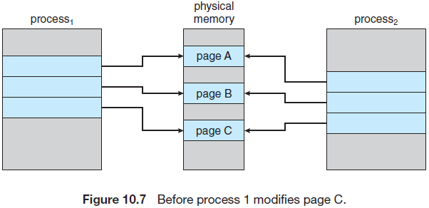

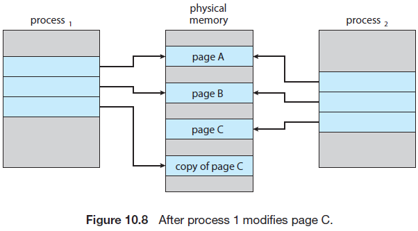

例如，假设子进程尝试修改栈中的一个分页，该分页设置了写时拷贝，此时操作系统会从空闲帧列表中获得一个帧，并创建该分页的副本，将其映射到字节内存的地址空间中。子进程随后会修改它的副本分页，而不是属于父进程的分页。线程当使用写时拷贝时，只有被进程修改的分页才会被复制，所有未修改的分页可以在父进程和子进程之间共享。注意，只有需要被修改的分页才会被标记为写时复制。无法被修改的分页(包含可执行的代码分页)可以被父进程和子进程共享。写时复制是一种被多种操作系统采用的通用技术，包括Windows，Linux和macOS。

一些版本的UNIX(包括Linux，macOS和BSD UNIX)提供了一个`fork()`相同调用的变种，`vfork()`(虚拟内存fork)，与使用写时复制的`fork()`不同，当使用`vfork()`时，父进程会被挂起，子进程会使用父进程的地址空间。由于`vfork()`不需要写时复制，如果子进程中的任何分页属于父进程的地址空间，但父进程恢复后可以看到被修改的分页。因此`vfork()`必须谨慎使用，保证子进程不会修改父进程的地址空间。`vfork()`在子进程在创建后立即调用`exec()`时使用。由于没有发生分页拷贝，`vfork()`在进程创建中的效率非常高，有时会被用于实现UNIX 命令行shell界面。

### 10.4 Page Replacement

在我们之前讨论的分页错误率场景下，假设当分页被引用时，每个分页错误最多发生一次。然而这种表达并不准确。如果一个有10个分页的进程，实际仅使用了一半分页时，按需分页机制会省去加载用不带的另外5个分页的I/O，这样我们可以通过运行两倍数目的进程来提高我们的多道程序的程度。这样，如果有40个帧，我们可以允许8个进程，而不是在一个进程需要10个帧时只能允许4个进程(每个进程有5个分页未使用)。

如果提高了多道程序的程度，此时会过度分配(over-allocating)内存。如果运行了6个进程，每个进程有10个分页，但只用了5个分页，此时保留了10个帧，CPU和吞吐量都更高。然而，对于任何一个进程，为了获取特定的数据集，可能会突然使用它所有的分页，导致会需要60个帧，但此时只有40个帧可用。

更进一步，考虑系统内存不仅仅用于存储程序分页。I/O的buffer也会使用大量内存。这种使用会对内存放置算法产生压力。决定哪些内存分配给I/O以及哪些内存分配给程序分页至关重要。一些系统会给I/O buffer分配固定比例的内存，而其他一些系统则会给进程和I/O子系统分配所有系统内存。14.6章节讨论I/O buffer和虚拟内存技术的整合关系。

过度分配内存的表现如下：当一个进程执行时发生了分页错误，操作系统需要确定辅助存储中期望的分页的位置，但发现空闲帧列表中没有空闲的帧，即所有内存都在使用。图10.9描绘了这种场景，打问号的地方描绘了没有空闲的帧。

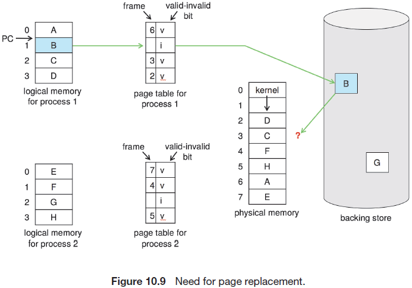

此时操作系统有几种选项，可以结束进程。然而，操作系统会尝试使用按需分页来提升计算机的利用率和吞吐量。用户不会感知到他们的进程运行在一个分页系统上(分页在逻辑上对用户应该是透明的)，因此这种方法不是最佳的。

操作系统可以使用标准交换将进程交换出去，释放该进程的所有帧，并减少多道程序的级别。然而，正如9.5章节中讨论的，由于需要在内存和交换空间中拷贝整个进程，因此大多数操作系统不再支持标准标准交换。现在，大多数操作系统将交换分页与分页替换(page replacement)结合，本章节后续将描述这种技术。

#### 10.4.1 Basic Page Replacement

分页替换会采用下面的方式。如果没有空闲帧，会查找当没有没有使用的帧并释放它，这样就可以通过将该帧中的内容写入交换空间，并修改页表(和其他表)来指明该分页不再在内存中(图10.10)。现在就可以给产生分页错误的进程提供释放后的帧。我们通过修改分页错误服务例程来包含分页替换：

1. 找出辅助存储中期望的分页的位置
2. 找到一个空闲帧
   1. 如果有空闲帧，则直接使用该帧
   2. 如果没有空闲帧，使用分页替换算法来选择一个"被牺牲的帧"
   3. 将这个"被牺牲的帧"写入辅助存储中(如果需要)，并修改对应的分页和帧表
3. 从新的空闲帧中读取需要的分页，并修改分页和帧表
4. 从发生分页错误的地方继续运行进程

注意，如果没有空闲帧，此时需要两个分页(一个用于page-out，一个用于page-in)。这种情况使得页面错误服务时间加倍，并增加了对应得有效访问时间。

我们可以使用使用一个"修改位(modify bit)"(或"脏位"，dirty bit)降低这些时间消耗。当使用这种方案时，每个分页或帧在硬件中都有一个与之关联的修改位。

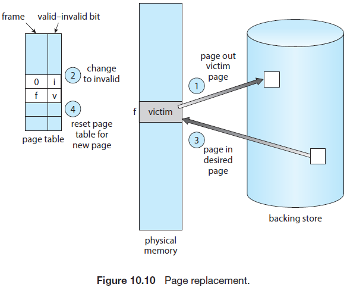

我们可以使用修改位(modify bit)(或脏位，dirty bit)来降低时间消耗。在使用这种方案时，当分页中有字节写入时，硬件会设置该分页的修改位，表明该分页已经被修改。当分页替换选择一个分页时，会校验该分页的修改位，如果设置了该位，则表明该分页从辅助存储中读取后已经做了修改，此时必须将该分页写回存储。如果没有设置修改位，则表明自从该分页被读取到内存之后没有做任何修改。这种情况下，我们不需要将内存分页写回存储。这种技术也应用于只读分页(例如，二进制代码分页)。这种分页不能被修改，这样在需要时可以被丢弃。如果页面没有被修改，使用这种方法可以将I/O时间减少一半，由此可以显著降低处理分页错误的时间。

分页替换是按需分页的基础，完全将逻辑内存和物理内存进行了分离。使用这种机制，可以在仅有少量物理内存时给编程人员提供无限多的虚拟内存。如果没有按需分页，逻辑地址会映射到地址上，且两个地址集各不相同，一个进程的所有分页必须同时存在于物理内存中。使用按需分页时，逻辑地址空间大小不再受物理内存限制。如果一个进程有20个分页，我们可以使用按需分页的10个帧运行该程序，然后使用分页替换算法在需要时查找空闲帧。如果需要替换一个已经被修改的分页，那么首先需要将该分页的内容拷贝回辅助存储。后续对该分页的引用将会导致分页错误，此时，该分页需要重新加载回内存，有可能回替换掉其他进程的分页。

在实现按需分页时需要解决两种主要的问题：必须开发一个帧分配算法和分页替换算法。即，如果内存中有多个进程，我们必须决定需要给每个进程分配多少帧；以及何时需要分页替换，此时需要选择被替换的帧。由于辅助存储的I/O非常珍贵，因此设计合理的算法来解决这些问题是一项重要的任务。按需分页方法中即使是很小的提升也可能很大程度上提升系统性能。

有很多种分页替换算法，每个操作系统有其独立的替换方案。那么如何选择一个特定的替换算法呢？通常选择具有最低分页错误率的算法。

我们通过在特定的内存引用字符串上运行算法并计算分页错误数目来对该算法进行评估。这种内存引用字符串称为引用字符串。我们可以通过人为的方式(例如使用随机数生成器)或通过跟踪系统并记录每个引用的内存地址来生成引用字符串。后一种方法回生成大量数据(例如每秒1百万个地址)。为了降低数据，我们基于如下规定：

首先，对于一个给定的分页大小(分页大小通常由硬件或系统固定)，仅需考虑分页的数量，而不是整个地址。其次，如果我们已经有一个分页p的引用，后续紧跟的任何对p的引用不将会产生分页错误。在首次引用后，分页p会位于内存中，这样后续紧跟的引用不会产生分页错误。

例如，如果跟踪某个特定的进程，可能记录如下地址序列：

```
0100, 0432, 0101, 0612, 0102, 0103, 0104, 0101, 0611, 0102, 0103,
0104, 0101, 0610, 0102, 0103, 0104, 0101, 0609, 0102, 0105
```

如果每个分页100字节，则该序列降低为如下引用字符串：

```
1, 4, 1, 6, 1, 6, 1, 6, 1, 6, 1
```

为了确定特定引用字符串的分页错误数目和分页替换算法，需要直到可用的分页帧数目。显然，在可用的帧数目增加时，分页错误数目会降低。例如对于之前的引用字符串，假如有3个或更多帧，我们仅会得到3个分页错误---每个分页首次引用都会产生一个分页错误。相反，如果只有一个可用帧，则需要为每个引用字符串作分页替换，导致12个分页错误。通常我们期望的曲线如图10.11所示。随着帧数目的增加，分页错误的数目会降低到最小水平。当然，增加物理内存会增加帧数。

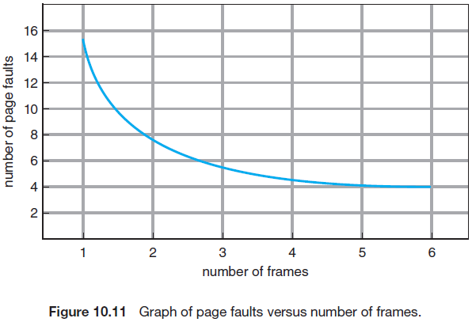

下面讨论几个分页替换算法。为了评估这些算法，我们使用如下引用字符串，内存为3个帧

```
7, 0, 1, 2, 0, 3, 0, 4, 2, 3, 0, 3, 2, 1, 2, 0, 1, 7, 0, 1
```

#### 10.4.2 FIFO Page Replacement

最简单的分页替换算法是先进先出算法(FIFO)。FIFO替换算法在每个分页加载到内存中时会与之关联。当需要替换一个分页时，会替换掉老的分页。注意不需要严格记录一个分页加载进来的时间。我们创建一个FIFO队列来持有内存中的所有分页，当需要替换时，会替换掉队列头部的分页，当一个分页加载到内存中时，会将其插入到队列尾。

对于例子中的引用字符串，初始的3个帧是空的。前3个引用引用字符串(7,0,1)会导致分页错误，并将需要的分页加载到内存中。由于7是第一个，因此下一个引用字符串(2)会替换7，由于0是下一个引用的字符串，且已经被加载到内存中，因此不会产生分页错误。由于此时0是第一个，因此对3的引用会导致替换分页0。然后分页0会替换分页1.图10.12展示了进程的运行。当发生一个分页错误时，会在3个帧中显示该分页。总计会发生15个分页错误。

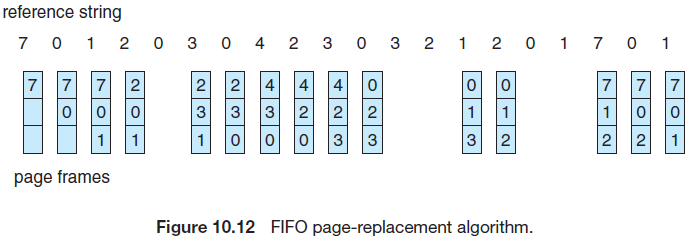

很容易理解和编程FIFO分页替换算法。然而，该算法的性能并不总是好的，一方面，被替换掉的分页可能属于一个很久以前使用过但不再需要的初始化模块；另一方面，该算法可能包含大量早已初始化且频繁使用的变量。

注意，即使替换正在被使用的分页，所有功能仍然可以正常运作。在使用一个新的分页替换正在使用的分页后，几乎立即会产生一个分页错误来检索正在使用的分页。可能会通过替换掉其他分页来将活动的分页重新加载回内存。因此，不好的替换选择会增加分页错误率，并降低进程的执行，但不会导致执行异常。

为了展示FIFO分页替换算法的问题，考虑下面引用字符串：

```
1, 2, 3, 4, 1, 2, 5, 1, 2, 3, 4, 5
```

图10.13展示了引用字符串导致的分页错误相比可用帧的曲线。注意4个帧下的分页错误数(10)大于3个帧下的分页错误数(9)！这种异常结果称为Belady’s anomaly:对于一些分页替换算法，分页错误率可能会随着分配的帧数的增加而增加。我们期望，如果给一个进程更多的内存会提升其性能。一些早期的研究中，研究人员发现这种假设不总是正确的，并发现了Belady’s anomaly。

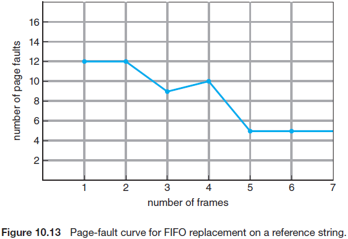

#### 10.4.3 Optimal Page Replacement

Belady’s anomaly的发现导致寻求一种最佳分页替换算法，该算法有最低的分页错误率且不会受Belady’s anomaly的影响，这种算法称为OPT或MIN，简述为：替换长久不使用的分页。

使用这种分页替换算法保证，对于固定数量的帧，其可能发生分页错误的数次最低。

例如，对于我们采样的引用字符串，最佳分页替换算法会导致9个分页错误，如图10.14。前3个引用会导致填充3个空的帧的分页错误。由于分页7在第18个引用之前不会被使用，因此分页2会替换分页7，一次类推，分页0会在第5个引用时使用，分页1会在第14个引用时使用。由于1是内存中3个分页中最后一个会再被引用的分页，因此对分页3的引用会替换分页1。由于只有9个分页错误，最佳替换算法要大大优于导致15个分页错误的FIFO算法。(如果忽略前3个所有算法都会产生的分页错误，此时最优替换的性能是FIFO替换的2倍)实际上，没有其他替换算法能够在少于9个分页错误的前提下处理完这些引用字符串(使用3个帧)。

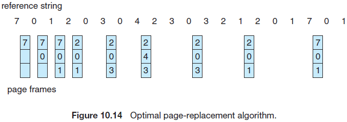

不幸的是，由于需要事先知道被引用的字符串信息，因此很难实现最佳分页替换算法(5.3.2章节中的SJF CPU调度算法也遇到者类似的情况)最终，最佳算法主要用于研究比较。例如，虽然一个新的算法不是最佳的，但可以计算出最坏情况下，它在最佳值的12.3%以内，平均在4.7%以内，这些信息是有用的。

#### 10.4.4 LRU Page Replacement

如果最佳算法不可行，那么是否可能使用一种近似的算法。FIFO和OPT算法的主要区别是，FIFO算法会在内存加载到内存是花费时间，而OPT算法则在分页被使用时花费时间。如果将最近的过去近似为不久的将来，那么就可以替换掉最长时间没有使用的分页，这种方法称为最近最少使用(LRU)算法。

LRU分页替换于每个分页上一次使用的时间相关。当必须替换一个分页时，LRU会挑选最长时间内没有使用的分页。我们可以把这个策略看作是回溯过去(而不是向前)的最佳分页替换算法。(奇怪的是，如果设S^R^为反向的引用字符串S，OPT算法下基于S的分页错误率与基于S^R^的分页错误率相同。类似地，LRU算法下，基于S的分页错误率与基于S^R^的分页错误率相同)。

在我们引用字符串的例子中应用LRU分页替换算法的结果如图10.15。LRU算法会生成12个分页错误。注意，前5个分页错误与最佳替换算法相同。当引用分页4时，从LRU替换角度看，内存中的3个帧中，分页2最近最少被使用。这样，LRU算法会替换分页2，它不知道分页2将会被使用。当分页2产生分页错误后，LRU算法会替换分页3，此时分页3最近最少使用内存中3个帧。除了这些问题，产生12个分页错误的LRU替换要远比产生15个分页错误的FIFO好。

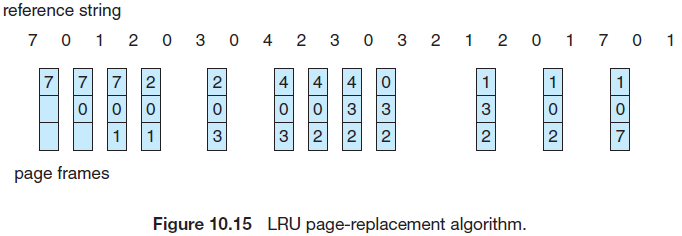

LRU策略通常作为一种分页替换算法，被认为是合格的。主要的问题是如何实现LRU替换。一个LRU分页替换算法可能需要一些硬件的支持。问题是如何确定帧的顺序来定义上一次被使用的时间，有两种可行的实现方式：

- 计数器。最简单的场景是将每个分页表项与一个使用次数段管理，并给CPU添加一个逻辑时钟或计数器。每次引用都会增加时钟。当引用一个分页时，时钟寄存器的内存会拷贝到该分页对应的分页表项的使用次数。通过这种方式可以获得每个分页最近被引用的时间，然后替换具有最小次数值的分页。这种方案需要查找分页表来找出LRU分页并在每一次内存访问时写入内存(分页表中的使用次数字段)。当分页表变动时(由于CPU调度)也需要维护该使用次数字段。还必须考虑时钟溢出。
- 栈。另一种实现LRU替换的方法是使用一个分页数大小的栈。当引用一个分页时，该分页会被移动到栈顶。通过这种方法，最近最少使用的分页总是位于底部。由于必须从栈底移除表项，因此最好通过使用带有头指针和尾指针的双链接列表来实现这种方法。移除一个分页并在栈顶放置一个分页，最坏情况下需要修改6个指针。每次更新都比较昂贵，但不需要通过搜索来实现替换，尾指针指向栈底，即LRU分页。这种方法特别适合使用LRU实现软件或微码的LRU替换。

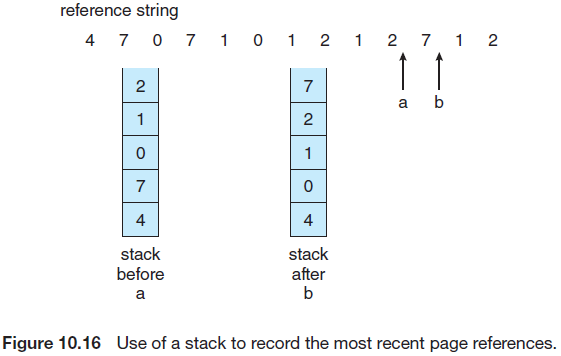

正如最佳替换，LRU替换页不会受Belady’s anomaly的影响，它们都属于一类分页替换算法，称为栈算法，永远不会表现出贝拉迪的异常。可以证明，栈算法中，n个帧对应的内存中的分页集总是n+1个帧对应的内存中的分页集的子集。对于LRU替换，内存中的分页集为n个最近引用的分页。如果帧的数目增加，这n个分页仍然是最近引用的，因此会停留在内存中。

注意，如果没有标准TLB寄存器以外的硬件协助现都是不可能实现LRU的。每次内存引用都必须更新时钟字段或栈。如果我们在每次引用时使用一种中断来允许软件更新这种数据结构，则会每次内存引用降低至少会10倍，因此每个进程的内存访问会降低10倍。极少系统可能容忍这种级别的内存管理。

#### 10.4.5 LRU-Approximation Page Replacement

很多计算机系统不能提供足够的硬件来支持LRU分页替换。事实上，一些系统根本不会提供硬件支持，此时必须使用其他分页替换算法(如FIFO算法)。很多系统提供了一些辅助功能，如引用位。当一个分页被引用时(读取或写入分页任意字节)，硬件会设置该分页的引用位。引用位与分页表中的每一项有关。

初始时，操作系统会清空所有位。当执行一个进程时，与分页有关的位会被硬件设置为1。一段时间后，我们可以提供检查引用位来确定哪些分页已经被使用，而哪些没有被使用(虽然不知道分页被使用的顺序)。该信息是很多近似LRU算法的分页替换算法的基础。

##### 10.4.5.1 Additional-Reference-Bits Algorithm

我们可以通过定期记录引用位来获得额外的信息。我们可以在内存中位每个分页保存一个8-bit字节，在一定的间隔内(如100毫秒)，一个定时器中断会将控制传递到操作系统。操作系统会将每个分页的引用位移动到它的8-bit字节的高位，将其他位向右移动一位，并丢弃最低位。这些8-bit移位寄存器保存了前8个周期的历史。例如，如果移位寄存器包含00000000，则表示该分页在8个周期内没有被使用。每个周期至少使用一次的分页，则该分页的移位寄存器值位11111111。寄存器值为11000100分页比寄存器值为01110111的分页更常用。如果将这些8-bit字节解释为无符号整型，则具有最小值的分页为LRU分页，可以被替换。注意，具有最小值的分页的数目是不确定的，可以替换所有具有最小值的分页或使用FIFO方法进行选择。

当然，可以改变移位寄存器中包含的历史记录的位数，通过选择(依赖硬件)并尽快进行更新。极端情况下，移位寄存器中的值会降低为0，仅留下引用位。这种算法称为二次机会页面替换算法(second chance page-replacement algorithm.)

##### 10.4.5.2 Second-Chance Algorithm

二次机会替换的基本算法是一个FIFO替换算法。当选择一个分页时会检查引用位。如果值为0，可以继续替换该分页，但如果引用位设置为1，我们会给该分页第二次机会，继续选择下一个FIFO分页。当一个分页得到第二次机会时，会清除其引用位，并将该分页的到达时间设置为当前时间。这样就给了一个分页第二次机会，且在所有其他分页被替换前不能被替换。此外，如果一个分页经常被使用，使得其引用位保持置位，这样该分页将不会被替换。

一种实现二次机会算法(有时值时钟算法)的方式是环形队列。一个指针(即时钟的一个指针)指示下一个被替换的分页。当需要帧时，该指针会向前移动，直到找到一个引用位为0的分页。当指针移动时，会清除引用位(图10.17)。一旦发现一个可以"牺牲的"分页，则替换该分页，新的分页会插入到(环形队列的)该位置。注意，最坏情况下，当设置了所有位时，指针会遍历整个队列，给每个分页一个二次机会。它会在选择下一个替换的分页前清除所有的引用位。当设置了所有位时，二次机会替换退化为FIFO替换。

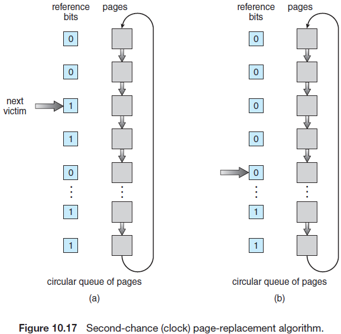

##### 10.4.5.3 Enhanced Second-Chance Algorithm

我们可以通过引用位和修改位(10.4.1章节)的组合来增强二次机会算法。使用这两个位，可以有如下四种类型：

1. (0,0)，最近既没有把使用，也没有被修改----可以替换的最佳分页
2. (0,1)，最近没有被使用，但没有被修改----不太合适，由于该分页需要在替换前需要被写出内存
3. (1,0)，最近被使用，但没有被修改 ----不久可能会被重新使用
4. (1,1)，最近被使用，被修改 ----不久可能会被使用，该分页需要在替换前需要被写出到辅助存储。

每个分页可能是上述四种之一。当需要替换分页时，我们会使用与时钟算法相同的方案，但会校验指向的分页的引用位是否置为1，并校验该分页所属的类型，并替换遇到的最低非空类型的第一个分页。注意在找到一个可替换的分页前可能需要遍历环形队列好几遍。该算法与简单时钟算法的最大区别是，这里我们根据是否修改给予了分页偏好，降低了需要的I/O数量 。

#### 10.4.6 Counting-Based Page Replacement

有很多种算法可以用于分页替换。例如，我们可以保留与分页引用数目相同的计数器，并开发出如下两种方案：

1. 最少使用(LFU)分页替换算法要求替换计数最少的分页。这种选择的原因在于，一个活动且被使用的分页会有一个比较大的引用计数。但该算法有一个问题，考虑当一个分页在进程初始阶段被大量使用，但后续没有再用到的场景，由于被大量使用，因此即使后续没有被使用，它的计数仍然足够大，因此会被保存在内存中。一种方案是在固定间隔内将计数右移一位，形成指数衰减的平均使用计数。
2. 最常使用(MFU)分页替换算法基于具有最小计数的分页，这种分页可能刚被加载进来，还没有被使用

正如预期的，MFU和LFU替换都不常见。实现这些算法是昂贵的，且没有很好地近似为最佳分页替换(OPT)。

#### 10.4.7 Page-Buffering Algorithms

除了特定的页面替换算法之外，还经常会涉及到其他处理过程。例如，系统一般会保留一个空闲帧池。当发生分页错误时，会首先选择一个"被牺牲的"帧。然而，在"被牺牲的帧"被写出之前会将期望的分页读入一个空闲帧，通过这种方式可以尽快重启进程，而无需等待写出"被牺牲的"分页。当后续"被牺牲的"分页被写出去后，该释放的帧会加入到空闲帧池中。

可以通过维护一个被修改的分页列表的方式来实现这种想法。当分页设备空闲时，会选择一个被修改的分页并写入辅助存储中，然后重置其修改位。这种方案增加了在选择一个分页用于替换，且该分页不需要被写出去的情况下清理该分页的可能性。

另一个修改是保留一组空闲帧，但要记住每个帧对应哪个分页。由于当一个帧写入到辅助存储时，该帧中的内容并不会被修改，因此在该帧被重用前，可以从空闲帧池中重用其对应的旧的分页，这种情况下不会产生I/O。当发生分页错误时，我们首先需要检查需要的分页是否在空闲帧池中，如果不存在，则必须选择一个空闲帧，并读入对应的分页。

某些版本的UNIX系统会将该方法与二次机会算法结合。该方法可以用于增强任何一种替换算法，来减少因为选择了错误的"被牺牲的"分页而产生的惩罚。我们将在10.5.3章节描述这种组合方法。

#### 10.4.8 Applications and Page Replacement

特定场景下，如果操作系统没有提供buffer，应用通过操作系统虚拟内存访问数据会表现的更遭。典型的例子是数据库，它提供了内存管理和I/O 缓存，像这种知道其内存使用和存储的应用会比实现了通用算法的操作系统性能好。更进一步讲，如果操作系统正在缓冲I/O，而应用程序也在缓冲I/O，则一组I/O会使用两倍的内存。

另一种例子是，数据仓库经常执行大规模的顺序存储读取，然后是计算和写入。LRU算法会移除旧的分页并保留新的分页，而应用可能会偏向读取旧的分页(重新执行顺序读)。这里MFU会比LRU更有效。

由于这些问题，一些操作系统赋予了特殊程序使用辅助存储分区作为逻辑块的大型逻辑块顺序数组的能力，而不使用文件系统数据结构。这种数组有时被称为裸硬盘，对该数据的I/O操作称为裸I/O。裸I/O会绕过文件系统父，如文件I/O按需分页，文件锁，预取，空间分配，文件名和目录。注意，虽然在裸分区上实现特定存储服务的应用会更加高效，但大多数应用在使用常规文件系统服务时的表现更好。

### 10.5 Allocation of Frames

下面看一下帧分配中的问题。如何为多种进程分配固定数量的空闲内存？如果有93个空闲帧，而只有两个进程，那么每个进程该分配多少栈?

考虑一个有128个帧的系统，操作系统可能会使用35个，给用户进程留下93个帧。在纯按需分页下，这93个帧初始时会放在空闲帧列表中。当一个用户进程执行时，会产生一系列的分页错误。一开始的93个分页错误会导致从空心帧列表中获取所有的空闲帧。当空闲帧列表被消耗完后，会对内存中的93个分页使用分页替换算法来替换第94个分页，以此类推。当进程结束后，93个帧会重新放回空闲帧列表中。

这个简单的策略有很多变种。我们可以要求操作系统从空闲帧列表中分配其需要的所有buffer和表空间，当操作系统不再使用这些空间时，可以用于支持用户分页。我们可以尝试始终在空闲帧列表中保留三个空闲帧，这样当发生分页错误时，就会立即提供一个可用的帧。在进行分页交换时，可以选择替换一个分页，然后将该分页写入存储设备，此时用户进程继续执行。还有其他方式，但基本的策略是清晰的：可以给用户进程分配任何空闲帧。

#### 10.5.1 Minimum Number of Frames

分配帧的策略受到多种因素的限制，例如分配的帧不能超过总的可用帧(除非有共享分页)。此外，我们还必须至少分配最小数目的帧(*以支持进程的运行*)。在这里，我们将更仔细地研究后者的要求。

分配至少最少数目的帧的原因与性能有关。显然，当分配给每个进程的帧数下降时，分页错误率会上升，并降低了进程的执行。此外，要注意到在执行的指令结束前发生了分页错误，必须重启该指令。因此，我们必须为任何一个指令引用的不同分页分配足够的帧。

例如，考虑一台所有内存引用指令只能引用一个内存地址的机器。这种情况下，我们至少需要为指令分配一个帧，并为内存引用分配一个帧。此外，如果允许一级间接寻址(例如，帧16上的`load`指令会引用帧0上的地址，间接引用到帧23)，那么每个进程至少需要3个帧来分页。

计算机架构定义了最小帧数。例如给定架构中的移动指令，某些寻址模型可能会移动大于一个字(word)的数据，该指令可能跨两个帧进行操作。此外，如果该指令的两个操作系都是间接引用，则需要总结6个帧。再举个例子，Inter-32和Inter-64架构下的移动指令仅允许数据在寄存器和寄存器以及寄存器和内存之间进行，不允许直接在内存间移动，因此限制了一个进程需要的最小帧数。

系统定义了每个进程需要的最小帧数，最大帧数则受制于可用的物理内存数目。在这两者之间，对于帧分配来说还有很大的操作空间。

#### 10.5.2 Allocation Algorithms

最简单的是将m个帧划分给n个进程，并分配给每个进程相同的份额，即m/n个帧(忽略操作系统需要的帧)。例如，如果93个帧要分配给5个进程，每个进程会获得18个帧，留下的3个可以放在空闲帧缓存池中，这种方案称为平均分配。

一种替代方案是识别不同进程需要的不同数量的内存。考了一个有1KB帧大小的系统，如果一个小型的10KB大小的学生进程和一个127KB大小的交互式数据库是系统上仅有的两个进程，总计需要62个空闲帧，此时能平均分配给每个进程31个帧。学生进程不需要大于10个的帧，因此浪费了21个帧。

为了解决这种问题，可以使用比例分配，使用这种方法，将可用内存按照进程大小进行分配。设pi进程的虚拟内存为si，则
$$
S = Σsi
$$
那么，如果总的可用帧数为m，我们将a<sub>i</sub>个帧分配给了进程p<sub>i</sub>，则a<sub>i</sub>近似为：
$$
ai = si/S × m.
$$
当然，我们必须将每个a<sub>i</sub>调整为一个整数，并使计算结果能大于指令集需要的最小帧数，且不超过m。

使用按比例分配，我们将62个帧划分到两个进程中，(一个10个分页，另一个127个分页)，各自分到4个帧，和57个帧：

```
10/137 × 62 ≈ 4 and
127/137 × 62 ≈ 57.
```

通过这种方式，每个进程根据其需求分到了可用的帧。

在平均和按比例分配中，在多道程序下会发生变化。如果增加了多道程序的级别，那么每个进程都会损失一部分帧来支持新的进程。相反，如果多道程序级别下降，之前分配给离开的进程的帧会分配给所有剩余的进程。

注意，不管是平均还是按比例分配中，该优先级进程与低优先级进程并没有任何区别。根据其定义，我们可能会给予高优先级进程更多的内存来加速其运行，这种方式对低优先级进程是不友好的。一种解决方案是使用按比例分配算法，但参照的不是进程的相对大小，而是进程的优先级，或大小和优先级的集合。

#### 10.5.3 Global versus Local Allocation

另一种影响分配给各种进程帧的因素是分页替换。当多个进程竞争帧时，我们可以使用按照等级将分页替换算法划分为两大类：全局替换和局部替换。全局替换允许一个进程所有的帧中选择一个需要替换的帧，即使此时该帧已经分配给了某些进程，即一个进程可以从其他进程获取帧。局部替换要求每个进程仅能从它分配到的帧集中获得帧，

例如，考虑一个允许高优先级进程从低优先级进程中选择帧进行替换的分配方案。一个进程可以从本身拥有的帧或低优先级进程拥有的帧中进行帧替换。这种方式允许一个高优先级进程在以低优先级进程为代价的前提下增加分配到的帧。然而，在局部替换策略下，一个进程分配到的帧数并没有变化，当使用全局替换时，一个进程可能仅会凑够其他进程中分配帧，这样旧增加了分配到该进程的帧(假设其他进程没有从该进程选择帧进行替换)。

全局替换算法的一个问题是，一个进程的内存中过的分页集不仅会依赖进程的分页行为，同时也会依赖其他进程的分页行为。因为完全是外部环境，因此相同的进程可能会表现不同(例如，一次执行可能花费0.5秒，而另一次执行可能会花费4.3秒)。而这些情况在局部替换中不会发生。在局部替换中，一个进程内存中的分页集仅受该进程分页行为的影响。然而，由于局部替换无法在可用的内存分页不足的情况下给进程提供可用的帧，因此可能会阻碍进程的运行。由此可见，全局替换会提高系统的吞吐量，因此更常被使用。

> 主要和次要的分页错误
>
> 10.2.1章节中描述过，当进程的地址空间中的分页没有有效的映射时会产生分页错误。操作系统通常要区分两种类型的分页错误：主要和次要的错误(Windows中与主要和次要错误对应的分别是硬和软错误。)当引用一个分页且该分页不在内存中时会产生主要的分页错误。处理主要的分页错误需要从后端存储中读取期望的分页，并将其存储到一个空闲帧中，并更新分页表。通常按需分页在初始时的主要分页错误率很高。
>
> 当一个进程的分页没有逻辑映射时会产生次要分页错误，此时该分页位于内存中。次要分页错误发生原因可能为下面之一：首先，一个进程可能会引用位于内存中的共享库，但该进程的页表中没有映射到该库的表项。这种情况下，只需要更新页表来指向内存中存在的分页即可；另一种导致次要分页错误的场景是，一个进程需要回收一个分页，并将其分会空闲帧列表，但该分页没有被清零，且已经分配给了其他进程。当发生这种情况时，会从空闲帧列表中移除该帧，并重新分配给进程。正如期望的，解决一个次要分页错误通常花费的时间要少于解决一个主要分页错误花费的时间。
>
> 可以通过命令`ps -eo min flt,maj flt,cmd`来查看Linux系统中进程的主要和次要分页错误数量:
>
> ```
> MINFL MAJFL CMD
> 186509 32 /usr/lib/systemd/systemd-logind
> 76822 9 /usr/sbin/sshd -D
> 1937 0 vim 10.tex
> 699 14 /sbin/auditd -n
> ```
>
> 有趣的是，对于大多数命令，主要分页错误通常比较低，而次要分页错误则会比较高。这表示Linux进程倾向使用更新库，如当一个共享库载入到内存后，后续与该库有关的分页错误都只属于次要错误。

下面我们关注实现全局分页替换原则的策略。通过这种方法，我们能够满足空闲帧列表上的所有内存请求，而不会在列表长度标为0后才开始选择分页替换。在列表长度小于某一特定阈值后就开始执行替换。这种策略尝试保证对于每个新的请求总能提供足够的空闲内存。

图10.18描绘了这种策略，目的是将空闲的内存保持在最小阈值之上。当可用内存低于这一阈值时，会启动一个内核例程从系统中的所有进程上回收分页(除内核外)。这种内核例程称为收割者(reaper)，可能应用于10.4章节中提到的所有分页替换算法中。当空闲内存的数量达到最大阈值时，内存收割者会挂住，只有当空闲内存低于最小阈值时才会回收内存。

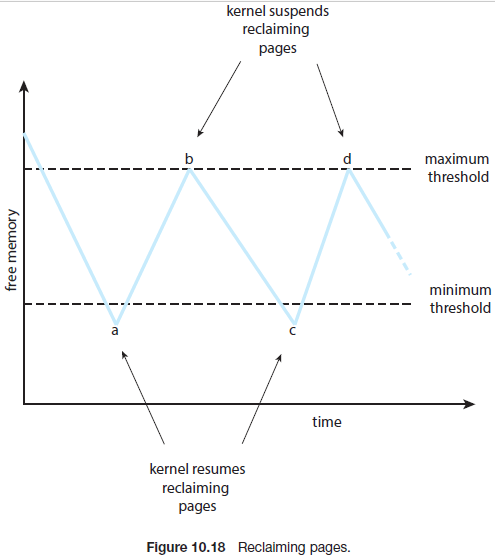

在图10.18中可以看到当空闲内存的数量下降到最小阈值下时，内核开始回收分页并将其添加到空闲帧列表，这种操作会持续到空闲内存数量达到最大阈值(b点)。随着时间的推移，还会有其他内存请求，在c点时，内存又会降低到最低阈值之下，而在空闲内存数量达到最大阈值后(d点)会挂起分页回收。该进程的运行时间于系统运行时间相同。

就像之前提到的，内核收割例程可能会采纳任何替换算法，但通常会使用某种格式的LRU近似算法。考虑如果空闲内存低于最小阈值时，而收割者无法维护空闲帧列表时会发生什么。在这种情况下，收割例程可能会更激进地回收分页。例如，它可能会挂起二次机会算法，并使用纯FIFO算法。更极端的情况，以Linux为例，当空闲内存调到很低的水平时，称为内存不足(OOM) killer 的例程会选择终止一个进程来释放内存。那么Linux怎么决定终止哪个进程呢？每个进程都有一个称为OOM 分数的值，OOM killer例程会偏向终止高分数的进程。OOM 分数通过进程使用的内存百分比计算出来，即内存使用比例越高，OOM分数越高(OOM分数可以通过/proc文件相同获得，pid为2500的进程的分数可以通过/proc/2500/oom_score获得)

通常，不仅可以改变收割例程回收内存的激进程度，也可以修改最小和最大阈值。这些值可以使用默认值，但一些系统可能允许系统管理员根据系统中物理内存使用量来进行配置。

#### 10.5.4 Non-Uniform Memory Access

到目前为止对虚拟内存的讨论中，我们假设创建的主存都相同，或至少访问的主存都相同。在非统一内存访问(NUMA)系统上有多个CPU，情况不尽相同。在这类系统上，一个给定CPU访问主存中某些部分的速度要比访问其他部分的速度快。系统中CPU和内存的交互方式导致了这些性能差异。这种系统由多个CPU组成，每个CPU有其本都内存(图10.19)。多个CPU通过同一个系统互连，且一个CPU访问本地内存要快于访问其他CPU的本地内存。NUMA系统并不比之访问一个主存的系统慢。然而正如1.3.2章节描述的，NUMA系统可以适应更多的CPU，因此能够提高更大的吞吐量和并行。

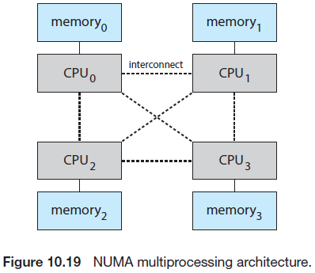

分页帧存储位置的管理对NUMA系统性能的影响很大。如果将内存视为统一的，则CPU因为内存访问等待的时间可能会使用了修改过的内存分配算法的NUMA系统长。5.5.4章节中描述了一些修改的算法，这类算法的目的是将分配的内存尽可能靠近进程运行所在的CPU。("近"的定义是"最小延迟")。因此，当一个进程发生了分页错误，感知NUMA的虚拟内存系统会给该进程分配一个尽可能靠近该进程所在的CPU的帧。

为了处理NUMA系统，调度器必须跟踪每个进程上一次运行的CPU。如果调度器尝试将每个进程调度到它们之前运行的CPU上，且虚拟内存系统尝试给进程分配靠近其所在的CPU的帧，这样会提升缓存命中率并降低内存访问时间。

如果增加了线程会变得更加复杂。例如，一个包含很多线程的进程可能最终会被调度到不同的系统板上。这种过去看下如何分配内存呢？

正如5.7.1章节讨论的，Linux通过内核标识的调度域的层次结构来管理这种情况。Linux CFS调度器不允许跨域迁移线程(如果允许会导致内存访问惩罚)。Linux为每个NUMA节点划分了独立的空闲帧列表，因此保证一个线程会从其运行的节点分配到内存。Solaris通过在内核中创建类似lgroups(地区团体)的方式解决这种问题，并且该组中的每个CPU都可以在定义的时间间隔内访问该组中的任何内存。此外，根据各组之间的延迟量，有一个类似Linux调度域的lgroup的层次结构。Solaris尝试调度一个进程中的所有线程并分配同一个lgroup中的内存。如果不可行，它会选择附近的lgroup来获取所需的其余资源。这种方法减小了整体的内存延迟并最大化CPU缓存命中率。

#### 10.6 Thrashing

考虑如果一个进程没有足够的帧时(即没有支持进程的工作集的最小帧数)会发生什么？此时进程会立即产生分页错误，此时必须替换一些分页。然而，由于它的所有分页都在使用中，必须替换掉将再次需要的页面，结果，该进程很快会再次产生分页错误，并一直产生分页错误，被替换掉的分页必须很快被加载会内存。

这种高频率的分页活动称为抖动，如果一个进程花费在分页上的时间大于其执行的时间，则该进程正在抖动。抖动会导致严重的性能问题。

#### 10.6.1 Cause of Thrashing

考虑以下基于早期分页系统的行为，操作系统会监控CPU的利用率，如果CPU利用率过低，则会通过引入新的进程来增加多道程序的级别。如果使用了全局分页替换：它会替换分页而不考虑该分页所属的进程。假设一个进程进入一个新的程序执行阶段，该阶段需要更多的帧。该进程会产生分页错误并从其它进程获取帧。由于这些进程也需要被替换掉的分页，因此也会产生分页错误，并从其他进程获取帧，它们会使用分页设备执行换入和换出。由于这些进程会排队等待分页设备的响应，进而导致CPU的ready队列为空，此时CPU利用率会降低。

当CPU调度器检测到CPU利用率下降后会提高多道程序的级别，新引入的进程会从运行的进程中获取帧，进而导致更严重的分页错误以及(分页设备中的)更长的队列。最终，CPU利用率还会下降，CPU调度器会尝试提高更多的多道程序级别。此时便发生了抖动，系统吞吐量会大幅下降，分页错误率大幅提高。结果，提高了有效内存访问时间。由于进程将所有时间花费在了分页上，因而无法正常工作，

图10.20描绘了这种CPU利用率相对多道程序级别的变化现象。当多道程序级别增加时，CPU利用率也会增加，直到到达一个最大值。如果继续增加多道程序的级别，会引入抖动，此时CPU利用率会骤降。此时，为了提升CPU利用率并停止抖动，我们需要降低多道程序的级别。

我们可以使用本地替换算法(或优先级替换算法)来限制抖动造成的影响。正如之前提到的，本地替换需要每个进程从它自己分配到的帧中获取需要的帧。因此，当一个进程开始抖动时，它不能从其他进程中获取帧，也不会导致更多的抖动。然而，问题并没有完全解决。如果一个进程正在抖动，它会将大部分时间用来在队列中等待分页设备。因为分页设备的平均队列更长，分页错误的平均处理时间也会增加。这样也增加了不会发生抖动的进程的有效访问时间。

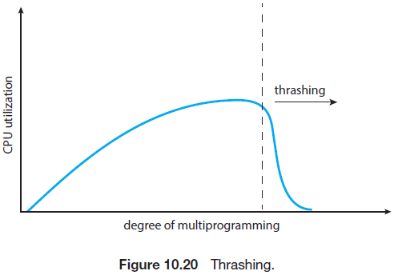

为了防止抖动，我们必须给一个进程提供其需要的帧。但我们怎么直到一个进程需要多少帧呢？一种策略是查看一个进程使用了到底多少帧，这种方法定义了进程执行的局部模型。

局部模型声明为，当一个进程执行时，分页会从一个局部移动到另一个局部。一个局部表示一起使用的分页。一个运行的程序通常会包含多个不同的局部，各个局部可能会重叠。例如，当调用一个函数时，它会定义一个局部，在这个局部中，引用的内存用于函数调用中的指令，本地变量，以及全局变量子集等。当退出函数时，由于不会再使用到本地变量以及函数指令，因此会离开这个局部，但后续可以再次进入。

图10.21描绘了局部的概念以及一个进程的局部随时间的变化。在时间(a)时，局部的分页为{18, 19, 20, 21, 22, 23, 24, 29, 30, 33}，而在时间(b)时变为了{18, 19, 20, 24, 25, 26, 27, 28, 29, 31, 32, 33}，注意分页是有交叉的，例如分页18，19，20都存在两个局部中。


因此可以看到局部由程序结构和数据结构所定义。局部性模型指出所有程序都将展示除这种基本的内存引用结构。注意到目前为止，本书对缓存的讨论并不涉及局部模型。如果访问数据是随机的，没有任何规则，则无需使用缓存。

假设我们给一个进程分配了足够的帧来满足其当前的局部，然后该进程会产生分页错误来从局部获取分页，直到所有的分页都被加载到内存中。然后在其再次变动局部前不会产生分页错误。如果没有为当前的局部分配足够的帧，由于无法将所有使用的分页加载到内存中，因此该进程会发生抖动，

#### 10.6.2 Working-Set Model

工作集模型基于局部性假设，这种模型使用一个参数Δ来定义工作集窗口，用于检查最近引用的Δ个分页。工作集等于最近引用的Δ个分页集(图10.22)。当一个分页正在被使用时，它会处于工作集中，如果不再使用该分页，则会在距离上一次被引用的Δ个时间单位后从工作集中移除，这样工作集近似为程序的局部。

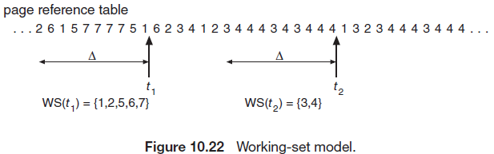

例如，图10.22中给出了一系列的内存引用，如果Δ=10个内存引用，那么t<sub>1</sub>时间的工作集为{1, 2, 5, 6, 7}。在时间t<sub>2</sub>时，工作集变为{3, 4}。

工作集的精确度取决于选择的Δ，如果Δ过小，该工作集可能不会包含整个局部；如果Δ过大，则可能包含多个局部。极端情况下，Δ取无限大，此时工作集等于进程执行中涉及到的分页集。

工作集最主要的属性是它的大小，如果为系统中的每个进程计算工作集大小WSS<sub>i</sub>，则：
$$
D = Σ WSSi,
$$
D为需要的总的帧数。每个进程都会使用其工作集中的分页。这样进程i会使用WSS<sub>i</sub>个帧。如果需要的总数大于可用的帧数(D>m)，由于某些进程无法获得足够得内存，此时会发生抖动。

一旦选定了Δ，那么工作集模型就比较简单了。操作系统会监控每个进程的工作集，并给工作集分配等同于工作集大小的帧。如果还有额外的帧，则可以启动新的进程。如果工作集长度增加了，并超过总的可用帧，操作系统会选择挂起一个进程。该进程的分页会被交换出去，并将其拥有的帧重新分配给其他进程。被挂起的进程后续可以重启。

工作集策略可以防止抖动，并保持多道程序足够高的等级。通过这样来优化CPU利用率。工作集模型最大的难点是如何持续追踪工作集。工作集窗口是一个活动窗口，在每次内存访问时，会在窗口一端添加一个新的引用，并在另一端移除一个老的引用。如果一个分页在工作集窗口的任何位置被引用，则该分页会处于工作集中。

> 工作集和分页错误率
>
> 进程的工作集和分页错误率有直接关系。如图10.22所示，通常一个进程的工作集会由于数据的引用以及代码段从一个局部移动的另一个局部而随时间变化。假设有足够的内存来保存一个进程的工作集(即进程不会抖动)，该进程的分页错误率随着时间在高峰和低谷间转变。如下图所示：
>
> 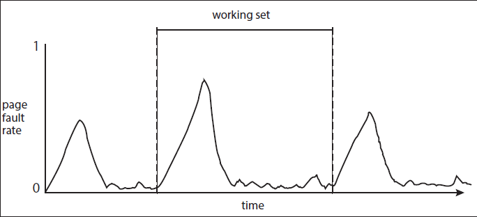
>
> 当在一个新的局部开始按需分页时会出现分页错误率高峰。然而，一旦这个新局部的工作集被加载到内存中，此时分页错误率会下降。当进程移动到一个新的工作集时，分页错误率又会上升到高峰，而在新的工作集被加载到内存后优惠回到低谷。从一个高峰开始到另一个高分开始之间的时间跨度体现了工作集的切换。

我们可以使用一个固定间隔定时器中断和引用位来近似一个工作集模型。例如，假设Δ等于10,000个引用，且我们可以在每5,000个引用时触发定时器中断。当获取到定时器中断，我们会拷贝并清除每个分页上的引用位。这样，当发生一个分页错误时，就可以通过校验当前的引用位以及两个"位于内存"位来决定在先前的10,000到15,000个引用之间是否使用过该分页。如果使用过，则至少会将这些位的某一个置位。如果没有被使用，则会清除这些位。如果一个分页中至少有一个位置位，则认为该分页处于工作集中。

由于无法知道5000个引用的间隔在哪里，因此这种约定并不完全准确。我们可以通过增加历史位(history bits)和中断频率(如使用10个位以及1000个引用作为间隔)来减少不确定性。然而，处理这些更加频繁的中断的成本也会相应变高。

#### 10.6.3 Page-Fault Frequency

工作集模型是成功的，并且可以用于预分页(10.9.1章节)，但使用该模型来控制抖动会显得比较笨拙，可以采用一种更直接的方法，分页错误频率（PFF）。

具体的问题是防止抖动，抖动时的分页错误率高。因此需要控制分页错误率。当该值过高时，我们会知道进程需要更多的帧，相反地，如果该值过低，则说明分配给进程过多的帧。我们可以确定期望的页面错误率的上限和下限(图10.23)。如果实际的分页错误率超过了上限，此时会将其他帧分配给该进程。如果分页错误率低于下限，则需要将这些帧从进程中移除。因此，我们可以直接测量并控制分页错误率来防止抖动。

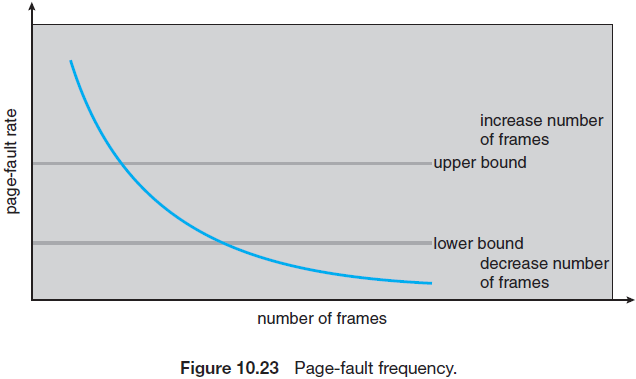

使用工作集测量可能需要换出一个进程。如果分页错误率上升到没有可用的空闲帧，此时必须选择一个进程将其交换到后端存储中。被释放的帧会分配给具有高分页错误率的进程。

#### 10.6.4 Current Practice

实际上，抖动和导致的交换对性能的影响很大。最好的实践是实现一个包含足够物理内存的计算机系统来防止抖动和交换。从智能手机到大型服务器都提供足够的内存来将所有的工作集同时保存在内存中(除非发生极端情况)，保证了最佳的用户体验。

### 10.7 Memory Compression

一种替代方案是使用内存压缩。此时会将多个帧压缩为一个帧，而不会将修改过的帧放到(paging out)交换空间。这样在没有交换分页的情况下可以降低内存使用。

在图10.24中，空闲帧列表包含6个帧。假设空闲帧数目下降到一个特定阈值时，会触发分页替换，替换算法(如LRU近似算法)会选择4个帧，15，3，35和26来放到空闲帧列表中。首先这些帧会放到"被修改帧"列表中。通常被修改帧列表中的内存会被写入交换空间，使得这些帧能够加入空闲帧列表中。一种替代测量是压缩一定数量的帧，例如，3个，并将这些压缩的版本保存到一个页帧中。

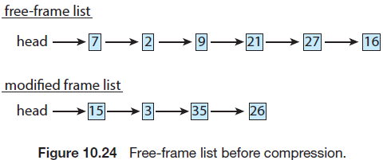

在图10.25中，帧7会从空闲帧列表中移除。帧15，3和35会被压缩并保存到帧7，帧7后被保存到"被压缩帧"列表中。帧15，3，35现在可以被移动到空闲帧列表中。如果后续引用到了这三个被压缩的帧中的某一个，则会发生分页错误，被压缩的帧会被解压缩，并将3个分页15，3，和35恢复到内存中。

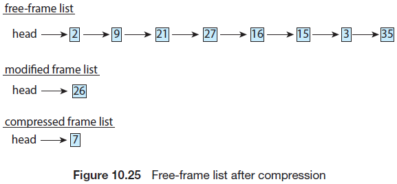

就像之前提到的，移动系统通常不会支持标准交换或交换分页。因此，内存压缩是大多数移动操作系统的内存管理策略的一个组成部分，包括Android和iOS。此外Windows和macOS都支持内存压缩。对于Windows10，微软开发了通用Windows平台(UWP)架构来为运行在Windows10上的app提供通用平台，包括移动设备。运行在移动设备上的app是使用内存压缩的对象。吗cOS在10.9版本的操作系统上首次支持内存压缩，在空闲内存不足时首先会压缩LRU分页，如果没有解决问题，再将分页交换出去。性能测试表明内存压缩要快于分页交换(即使是使用了SSD作为辅助存储的笔记本电脑和台式macOS系统)。

虽然内存压缩并不要求为被压缩的分页分配空闲帧，因此可以很大程度上节省内存(取决于压缩算法实现的压缩程度)(在上面的例子中，3个帧降低为原来大小的三分之一)，由于压缩的数据格式不同，压缩算法的速度和压缩的量(称为压缩率)也会有所差异。通常，该压缩率大的算法通常运行速度慢且计算量大。今天使用的大多数算法都会权衡两个因素，使用较快的算法来实现较高的压缩率。此外，可以通过多计算核核并行压缩来对压缩算法进行提升。例如，微软Xpress和苹果的WKdm压缩算法被认为是快速的，且能够压缩原始大小的30%~50%。

### 10.8 Allocating Kernel Memory

当一个运行在用户模式下的进程请求额外的内存时，会从内核管理的空闲帧列表上分配分页，该列表通常是使用10.4章节中讨论的分页替换算法产生的，且列表中的空闲分页散布在整个物理内存中。同时也要注意，当一个用户进程请求一个字节的内存时，会产生内存碎片，此时该进程会分配到一整个页帧。

内核内存通常使用与普通用户模式进程不同的空闲内存池来分配内存。有如下两大原因：

1. 内核请求的数据结构的内存大小各不相同，一些请求的内存大小会小于一个分页。因此内存必须谨慎使用内存并减小由于碎片导致的内存浪费，这种理念是非常重要的，因为很多操作系统并不会将内核代码或数据提交给分页系统。
2. 分配给用户模型的进程并不需要物理内存是连续的。然而，特定的硬件设备会直接与物理内存交互(不会使用虚拟内存接口)，因此需要物理连续页中的内存。

下面章节中，我们会讨论两种管理分配给内核进程的空闲内存的策略：伙伴系统(buddy system)和slab分配。

#### 10.8.1 Buddy System

伙伴系统使用包含连续物理页的固定大小的段来分配内存。使用二次幂分配器来分配这些段对应的内存，即可以满足二次幂大小的内存(4KB，8KB，16KB等等)。单位大小不合适的请求将被舍入到下一个最高的2次方。例如请求11KB的内存会分配到16KB的段。

下面考虑一个简单的例子，假设一个内存段初始为256KB，且内核请求21KB的内存，则该段会被初始化为2个伙伴，称为A<sub>L</sub>和A<sub>R</sub>，各组分配128字节，其中一个又被分为两个64字节的伙伴，称为B<sub>L</sub>和B<sub>R</sub>，对于21KB的下一个最高二次幂数值为32KB，因此B<sub>L</sub>或B<sub>R</sub>可以被划分为2个32KB的伙伴，称为C<sub>L</sub>和C<sub>R</sub>，其中任意一个都可以满足21KB的请求。图10.26描绘了这种方案，此时使用C<sub>L</sub>来满足21KB的请求。

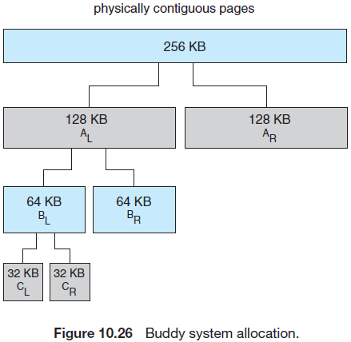

伙伴系统的优势是可以使用一种称为联合的计数来快速组合临近的伙伴来支持更大的段请求。在图10.26中，当内核释放了C<sub>L</sub>，则系统可以将C<sub>L</sub>和C<sub>R</sub>结合成一个64KB的段，而这个段B<sub>L</sub>可以和<sub>R</sub>结合为一个128KB的段，最终可以获得原始的256KB的段。

伙伴系统最模型的缺陷是使用四舍五入到下一个最高二次幂的段可能会在分配的段中产生碎片。例如，一个33KB的请求仅能分配到64KB的段。实际上，我们不能保证由于内部碎片浪费的内存会少于已经分配到的内存的50%。下面章节中，我们会讨论一种不会由于碎片导致空间浪费的内存分配方案。

#### 10.8.2 Slab Allocation

第二种分配内核内存的策略称为slab分配。一个slab由一个或多个连续的物理页组成，一个缓存包含一个或多个slab。每个独立的内核数据结构都有一个缓存，例如，代表进程描述符的数据结构，代码文件对象的缓存，以及代表信号量的缓存等。每个缓存都填充了该缓存所表示的内核数据结构的实例。例如，代表信号量的缓存保存了信号量对象的实例，代表进程描述符的缓存保存了进程描述符对象的实例等等。图10.27展示了slab，缓存和对象之间的关系，该图展示了两个3KB大小的内核对象，和3个7KB大小的对象，每个对象都保存在一个独立的缓存中。

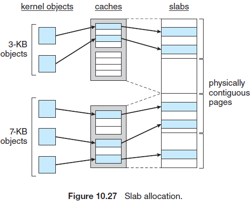

slab分配算法使用缓存来保存内核对象。当创建一个缓存时，会给该缓存分配一系列的对象(这些对象初始设置为空闲--free)，对象的数目取决于相关的slab的大小。例如，一个12KB的slab(包含3个连续的4KB分页)能够保存6个2KB的对象。当一个内核数据结构需要一个新的对象时，分配器会从缓存中分配任意空闲的对象来需要这个请求。此时，缓存中被分配的对象被标记为已使用--used。

考虑一个内核为一个表示进程描述符的对象从slab分配器中请求内存的场景，在Linux系统上，进程描述符的类型为`struct task_struct`，大约需要1.7KB的内存。当Linux内核创建了一个新的任务时，需要为缓存中的`struct task_struct`对象请求内存，然后缓存会使用已经分配在slab中且标记为空闲的struct task_struct对象来满足该请求。

在Linux中，一个slab可能有如下三种状态：

1. 满。slab中的所有对象都被标记为已使用
2. 空。slab中的所有队列都被标记为空闲
3. 部分。slab既包含已使用的对象，也包含空闲的对象

slab分配器会首先尝试使用部分slab中的空闲对象来满足请求；如果不存在，则会从空的slab中分配一个空闲的对象，；如果空的slab不可用，则会从物理页分配一个新的slab，并分配给一个缓存，然后从这个slab中分配内存给该对象。

slab分配器提供了两大好处：

1. 不会因为碎片浪费内存。由于每个内核数据结构都与缓存关联，且每个缓存由一个或多个slab组成，每个slab被区分为与数据对象大小相同的块，因此不会产生内存碎片。当内核为一个对象请求内存时，slab分配器会返回与对象相同大小的内存。
2. 可以很快响应请求。slab分配方案在对象高频请求和释放时可以高效地管理内存。分配和释放导致是一个消耗实践的过程。然而，如果事先创建了对象，这样在后续使用时就可以快速地从缓存中分配到该对象。进一步讲，当内存用完一个对象并释放时，该对象会被标记为减小并返回它的缓存中，通过这种方式可以快速处理内核后续的请求

Solaris 2.4版本的内核中首次引入了slab分配器。由于其通用性，这种分配器现在也被用于处理Solaris系统上特定用户模式下的内存请求。Linux最初使用的时伙伴系统，但从2.2版本开始，Linux内核采纳了slab分配器。Linux的slab实现称为SLAB。最近发布的Linux包括其他两种内核内存分配器，SLOB和SLUB分配器。

SLOB分配器用于有内存限制的系统，如嵌入式系统。SLOB(代表“简单的块列表”)维护三种对象列表:小(小于256字节的对象)，中等(小于1024个字节的对象)，大(少于一个分页大小的对象)。请求内存时会从合适的列表中使用最先合适的策略分配对象。

从2.64版本开始，SLUB分配器替代SLAB作为Linux内核的默认分配器。SLUB减少了SLAB分配器所需的大部分开销。例如，例如，SLAB会在每个slab中存储特定的元数据，而SLUB则会将这些数据保存在`page`数据结构中，Linux将保存在`page`数据结构中的数据提供给每个分页使用。此外，SLUB不包括SLAB分配器为缓存中的对象而维护的每个CPU队列。对于使用多处理器的系统来说，分配给这些队列的内存量很大。因此，SLUB在系统处理器增加的情况下提供了更好的性能。

### 10.9 Other Considerations