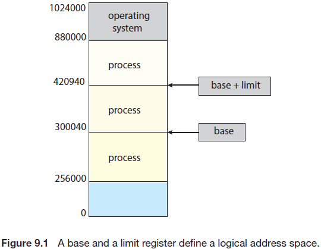
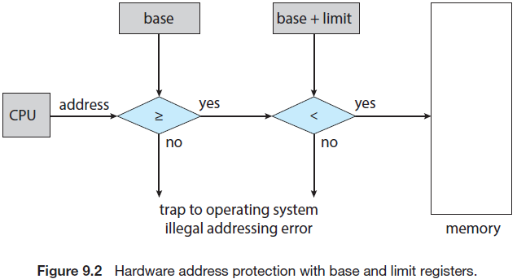
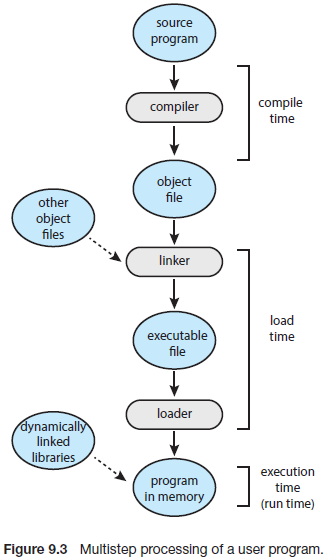
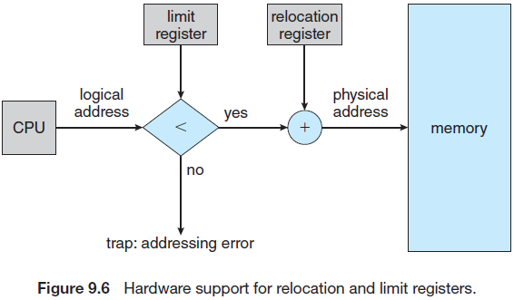
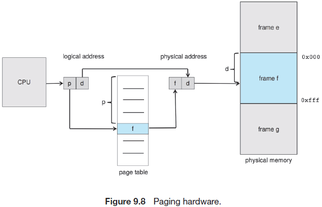
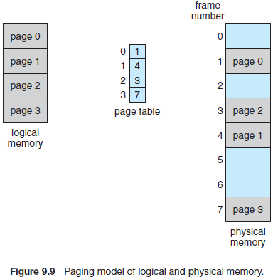
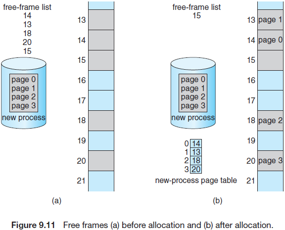

[TOC]

## Main Memory

在第5章中展示了一个进程集如何共享CPU。使用CPU调度，可以同时提升CPU利用率和计算机的响应速度。为了提升性能，必须在内存中保存很多进程，即必须使用共享内存。

本章中将会讨论管理内存的几种方式，(内存管理算法)从原始的裸机方法到使用分页策略不等。每种方式都有其各自的优势和劣势。为一个特定系统选择内存管理需要基于多种因素，特别是系统的硬件设计。大多数算法需要硬件支持，导致很多系统具有相似的硬件以及操作系统内存管理。

### 9.1 Background

正如在第1章中看到的，内存在现代操作系统的操作中至关重要。内存由一个大字节数组组成，每个字节拥有各自的地址。CPU根据程序计数器从内存中获取指令，这些指令可能会触发载入额外的数据，并存储到特定内存地址中。

典型的指令执行周期，例如，首先从内存中拉取指令，然后解码指令，解码时可能会触发从内存中拉取操作数。在在操作数上执行指令后，可能会将结果保存到内存中。内存单元仅看到内存地址流，它不知道这些地址是怎么生成的(由指令计数器，索引，间接寻址，文字地址等)或如何使用(指令或数据)。因此，我们可以忽略一个进程如何生成内存地址，主要关注正在运行的程序生成的内存地址顺序。

后面会讨论域内存管理相关的几个问题：基本的硬件，内存地址到实际物理地址的符号绑定，以及逻辑和物理地址之间的区别。在本节的最后，我们讨论了动态链接和共享库

#### 9.1.1 Basic Hardware

内置在每个处理核心中的主存和寄存器是CPU可以直接访问的唯一通用存储。机器指令使用内存地址而非硬盘地址作为参数，因此，任何执行的指令以及指令使用的任何数据，都必须位于某一种可以直接访问的存储设备中。如果数据不在内存中，则必须在CPU操作前移动这些数据。

在一个CPU时钟周期内，通常可以访问每个CPU核中内置的寄存器。一些CPU核可以解码指令并以每时钟周期一次或多次的速率对寄存器中的内容执行一些简单的操作。主存唯一的缺点是需要通过内存总线来传输数据。一个完整的内存访问可能需要花费多个CPU时钟周期。这种情况下，由于没有请求的数据来完成正在执行的指令，因此处理器通常会暂停。由于内存访问的频率过大，这种情况是无法容忍的。通常会在CPU和主存之间添加高速内存，该告诉内存位于CPU芯片上。1.5.5章节描述了这种缓存。为了管理CPU内置的缓存，硬件会自动在没有操作系统控制的前提下提高内存访问(回想5.5.2章节中，当内存访问暂替时，多线程核会从一个暂停的硬件线程切换到另一个硬件线程。)

我们不仅要关注访问物理内存的相对速度，也要保证操作的正确性。为了正确操作系统，必须防止操作系统被用户进程访问，以及防止一个用户进程被其他用户进程访问。由于操作系统不会经常干预CPU以及CPU内存访问(这样会影响性能)，因此必须由硬件提供这种防护。正如我们将在本章中看到的，硬件通常多种方式实现这种防护。这里给出一种可能的实现。

首先我们要确认每个进程都有一个独立的内存空间。每个进程特有的内存空间可以防止其他进程访问，且这种实现是内存加载多进程并发的基础。为了隔离内存空间，需要确定内存可能访问的合法地址范围以及确保进程只能够访问这些合法地址。我们可以使用两个寄存器实现这种防护功能，通常为如图9.1中所示的base和limit。base寄存器保存最小的合法的物理内存地址；Linux寄存器保存了合法的地址空间大小。例如，如果base寄存器保存的值为300040，Linux寄存器为120900，那么程序可以合法访问的地址为从300040到420939(不包含)。

CPU硬件可以通过将生成的用户空间地址与寄存器中的值进程比较来保护内存空间。当一个程序在用户模式尝试访问操作系统内存或其他用户内存是会被操作系统捕获，将其视为fatal错误(如图9.2)。这种方案防止用户程序的代码或数据结构被操作系统或其他用户修改。

base和limit寄存器尽可以被操作系统使用特权指令加载。由于特权只能只能运行在内核模式，且操作系统只能运行在内核模式，因此只有操作系统才能加载base和limit寄存器。这种方案允许操作系统修改寄存器值，但防止用户程序修改寄存器内容。

操作系统运行在内核模式，能够无限制访问操作系统内存和用户内存。这种规定允许操作系统将用户程序加载到用户内存中，在出错误时转存这些程序，访问和修改系统调用的参数，从/到用户内存进程的I/O，以及提供其他功能。例如多处理系统的操作系统必须执行上下文切换，在将下一个进程的上下文从主存加载到寄存器之前将当前进程的状态从寄存器保保存到主存中。

#### 9.1.2 Address Binding

通常，一个程序在硬盘上体现为一个可执行文件。为了运行该程序，必须将程序放入内存并放在进程的上下文中，这样才能在CPU上运行。进程执行时会从访问内存中的指令和数据。最终，当进程结束后，进程的内存会被其他进程回收利用。

大部分系统允许一个用户进程驻留在物理内存的任意部分。因此，虽然计算机的起始地址空间可能为00000，但用户进程的起始地址可能不是00000。后面会看到操作系统如何将一个进程放置到物理内存中。

大多数场景下，用户程序在执行前会经历一些阶段(其中一部分是可选的)。在些阶段中可能以不同的形式呈现地址。源程序中的地址通常是符号链接。一个编译器通常会将这些符号地址绑定到可重定位地址(如"模块开始的14个字节")。链接器和加载器(见2.5章节)则会将可重定位地址转变为绝对地址(如74014)。每个绑定就是一个地址到另一个地址的映射。

传统上，指令和数据与内存地址的绑定可以在过程的任意阶段完成：

- 编译时间。如果在编译时间内知道进程将会保存到哪段内存，则会生产绝对代码。例如，如果一个用户进程安置的起始位置为R，那么生成的编译代码会从该位置开始并从该位置延伸。如果后面起始位置发生了变化，那么需要重新编译这段代码。

- 加载时间。如果在编译时间内无法获知进程会安置的内存，那么编译器必须生成可重用代码。这种情况下，最终的绑定会推迟到加载时间。如果起始地址发生了变化，此时只需要重新加载用户代码来合并此更改的值
- 执行时间。如果进程能够在执行时间内从一个内存端转移到另外一个，那么绑定需要推迟到运行时间。可能需要特殊的硬件支持这种运行方案(见9.13章节)。大多数操作系统会采用这种方法。

本章最重要的部分是展示计算机系统如何实现各种绑定，并适当讨论了硬件支持。

#### 9.1.3 Logical Versus Physical Address Space

CPU生成的地址通常称为逻辑地址(logical address)。内存单元中看到的地址，即内存中的内存地址寄存器加载的地址通常关联到一个物理地址。

无论是编译时间还是加载时间的绑定地址都会生成逻辑和物理地址。然而，执行时间时的地址绑定方案会导致逻辑和物理地址的不同。这种情况下，通常将逻辑地址称为虚拟地址。下面逻辑地址和虚拟地址的概念可互换。一个程序生成的所有逻辑地址称为逻辑地址空间，与逻辑地址对于的所有物理地址称为物理地址空间。因此，执行时的地址绑定方案下，逻辑和物理地址空间是不同的。

运行时虚拟到物理地址的映射由称为内存管理单元(MMU)的硬件设备完成(图9.4)。我么可以选择多种方法来完成这种映射，如9.2章节到9.3章节中所讲到的。我们暂且使用9.1.1章节中描述的一般base寄存器方案作为简单的MMU来描述地址映射。

此时base寄存器称为可重定位寄存器(relocation register)。可重定位寄存器中的值会在用户进程生成的每个地址发送到内存时进行相加(图9.5)。例如，如果base是14000，当一个位于0位置的地址尝试发送到内存时会动态重定位到位置14000，346位置会映射到14346。

用户程序永远不会访问真实的物理地址。程序可以创建指向346位置的指针，将其保存在内存中，操作该指针，并与其他地址进行比较，这种情况下，指针的值都为346。值由在它作为一个基于base寄存器重定位的内存地址(可能是间接载入或存储)时，用户程序需要与逻辑地址打交道。内存映射硬件会将逻辑地址转化为物理地址，9.1.2章节中讨论了这种类型的执行时地址绑定。在被引用之前，无法确定被引用的内存的最终地址。

现在我们由两种类型的地址：逻辑地址(0到max)和物理地址(对于base=R，范围为R+0到R+max)。用户程序仅会生成逻辑地址，并认为内存中运行的地址的位置为0到max。然而，这些逻辑地址在使用前必须要映射到物理地址。逻辑地址空间绑定到独立的物理地址空间的概念对正确的内存管理至关重要。

#### 9.1.4 Dynamic Loading

到目前为止的讨论中，进程在执行前需要将整个程序以及进程的数据加载到物理内存中。程序的大小受限于物理内存的大小。为了更好地使用内存空间，引入了动态加载的概念。使用动态加载时，一个例程在调用前不会被加载。所有的例程均以可重载的格式保存在硬盘上。主程序在运行时会被加载到内存中，当一个例程调用两一个例程时，调用的例程首先会检查另外一个例程是都已经被加载，如果没有，会调用可重定位链接加载器将需要的例程加载到内存中，并更新程序的地址表，然后新加载的例程会控制调用过程。

动态加载的好处是只在需要的时候才会加载例程。这种方式在有大量代码需要处理，且这些代码不经常调用时非常有用，例如错误例程。这种情况下，虽然总的程序可能会很大，但可能只会使用到一小部分。

动态加载不需要操作系统的特定支持，应该在用户设计程序的时候考虑这种方法。但操作系统也可能会通过提供实现了动态加载的例程库帮助到编程人员。

#### 9.1.5 Dynamic Linking and Shared Libraries

动态链接库(DLLs)为在程序运行时连接到用户程序的系统库(见图9.3)。一些操作系统仅支持静态链接，在这种系统中，系统库与其他目标模块一样会被加载器组合为二进制程序镜像。动态链接类似动态加载，这里使用了链接，而非加载，表示操作推迟到了执行时间。这种特性通常与系统库一起使用，如标准C语言库。如果没有这种方式，系统中的每个程序必须在可执行的镜像中包含一个符合该程序语言的库(或至少程序引用的例程)副本。这种需求不仅增加了可执行镜像的大小，也可能会浪费主存。DLLs的第二个优势是这些库可以在多个进程间共享，因此内存中只会有一份DLL的实例，此时DLLs也被称为共享库，已经被广泛应用到Windows和Linux系统中。

当程序引用动态库中的例程时，加载器会在需要时寻址该DLL并加载到内存中，然后将动态库中的引用函数地址调节为DLL保存的内存位置。

动态链接库可以扩展到库更新(如bug修复)。此外，一个库可能被新的版本覆盖，所有使用该库的程序会自动使用新版本的库。如果没有动态链接，这些程序都需要通过重新链接来访问新库。这样重新就不会意外执行到新的，版本不兼容的库(版本信息保存在重新和库中)。一个程序可能会载入多个版本的库，且每个程序使用它定义的版本信息来决定使用哪个库副本。minor版本的修改会保持相同的版本号，而major版本的修改则会增加版本号。因此，只有使用新版本库编译的程序才会受该库中包含的不兼容修改的影响。其他链接到老库的则会继续使用老库运行。

与动态加载不同，动态链接和共享库通常需要操作系统的支持。如果内存中的进程受到保护，那么操作系统是唯一可以可以校验所需要的例程是否处理其他进程的内存空间中，或多进程来访问相同的内存地址。在9.3.4章节会详细描述该概念，DLL可以被多进程共享使用。

### 9.2 Contiguous Memory Allocation

主存必须能够同时适应操作系统和各种用户进程。因此我们需要使用尽可能有效的方式来分配主存。本章会介绍一种早期的方式，连续内存分配。

内存通常分为两部分：一部分给操作系统，另一部分给用户进程。我们可以将操作系统放在地内存地址或高内存地址，其位置取决于多种因素，例如中断的位置。大多数操作系统(包括Linu和Windows)将操作系统放在了高内存。

通常，在相同的时间，我们需要一些用户进程驻留在内存中，因此需要考虑如何为这些等待加载到内存中的进程分配有效的内存。在连续内存分配中，每个进程都会包含在一个内存部分中，且该部分与包含下一个进程的内存部分是连续的。在讨论内存分配方案前，必须解决内存防护中的问题。

#### 9.2.1 Memory Protection 

我们可以通过结合前面讨论的两个想法来防止进程访问它不拥有的内存。如果一个系统有一个relocation寄存器(9.1.3章节)，与一个limit寄存器(9.1.1章节)，则可以满足防护目标。relocation寄存器包含最小的物理地址值；limit寄存器包含逻辑地址的范围(例如，relocation=100040，且limit=74600)。每个逻辑地址必须在limit寄存器指定的范围内。MMU会自动将逻辑地址映射为逻辑地址加relocation寄存器中的值之和，该映射的地址会发送到内存(图9.6)。

当CPU调度器选择一个进程运行时，分发器会将正确的值加载到relocation和limit寄存器中，作为上下文切换的一部分。由于CPU生成的每个地址都会跟这些寄存器进行校验，因此，可以防止操作系统和其他用户程序以及数据被正在运行的进程修改。

取决于内存总量和平均进程的大小，外部碎片造成的问题或大或小。例如，对首次拟合的统计分析表明，即使使用了一些优化手段，假设给定分配N个内存块，另外0.5N个块会因碎片而丢失。即三分之一的内存可能不可用！此属性称为50％规则。

内部和外部的内存碎片一样。考虑18,464字节下的多分区分配方案漏洞，假设下一个进程请求18,462字节，如果分配了请求的内存块，将会剩下2字节的漏洞。跟踪该漏洞的开销将大大大于漏洞本身。通常使用的避免该问题的方法是将物理内存切分为固定大小的块，并使用块大小作为单位分配内存。通过这种方法，分配个进程的内存可能会稍微比请求的内存大。这两个数值的区别在于内部碎片，即分区内部未使用的内存。

外部碎片的一种解决方案是使用压缩。目标是重新整理内存内容，以便将所有可用内存放在一个大的块中。压缩并不总是有效的，如果在组合或加载时重定位是静态的，则不能使用压缩。只有在执行时间内使用动态重定位时才能使用压缩。如果地址是自动重定位的，此时重定位仅会移动程序和数据，然后使用新的base地址来修改base寄存器。当可以使用压缩时，我们必须要确定其状态。最简单的压缩算法时将所有的进程移动到内存的一端，所有的内存漏洞移动到另一端，这样会生成一个大的内存漏洞，以供后面使用。但这种方案的代价比较高。

另一种解决外部碎片问题的方法是保证进程的逻辑地址空间是非连续的，这样允许在这段内存可用时能够给进程分配物理地址。这种策略称为页，页是最通用的计算机系统内存管理技术。后面章节将会讲述页。

碎片是计算种的常见问题，在管理数据时会发生内存碎片。我们将会在存储管理章节(11章到15章)中进行详细描述。

### 9.3 Paging

目前讨论的内存管理需要进程的物理地址空间是连续的。现在引入页的概念，页是一种允许进程的物理地址空间非连续的内存管理方案。页避免了外部碎片以及压缩这两个困扰连续内存分配的问题。由于页提供的众多优势，它在从大型服务器到移动设备的大多数操作系统中以各种形式被使用。页实现了操作系统和计算机硬件的协作。

#### 9.3.1 Basic Method

实现页的基本方法是将物理内存分割成称为帧的固定大小的块，并将逻辑内存分割为与页相同大小的块。当一个进程将要被执行时，它的页会从源头(文件系统或块存储)加载到任何可用的内存帧中。块存储会被分割成与内存帧或多帧簇长度相同的块。这个简单的想法具有强大的功能和广泛的影响。例如，现在逻辑地址空间完全与物理地址空间翻开，因此一个进程可以有64-bit大小的逻辑地址空间，即使物理内存小于2^64^字节。

CPU生成的每个地址分为两部分，页号(p)和页偏移(d)。

页号作为每个进程的页表的索引。如图9.8所示，页表包含物理内存的每个帧的基地址，偏移量为被引用的帧中的位置。因此，帧的基地址结合页偏移定义了物理内存地址。图9.9展示了内存页模型。

下面展示了MMU将CPU生成的逻辑地址转换为物理地址的步骤：

1. 取出页号p，并将其作为页表的索引
2. 从页表中取出对应的帧号f
3. 使用帧号f替换掉逻辑地址的页号p

由于偏移量d没有变化，它不会被替换，这样帧号和偏移量构成了物理地址。

页大小(与帧大小相同)由硬件定义。一个页的大小是2的倍数，一个页的大小通常在4KB到1GB之间，具体取决于系统架构。使用2的倍数作为页大小的方式，使得将一个逻辑地址转变为页号和页偏移变得非常简单。如果逻辑地址空间的大小为2^m^，一个页大小为2^n^字节，逻辑地址的高m-n位表示页号，低n位表示页偏移。因此逻辑地址为：

p为页表中的索引，d为页面内的位移。

举一个具体的例子，如图9.10中，n=2且m=4，页大小为4字节，物理内存为32字节(8页)，以编程人员的视角看内存如何映射到物理内存中的。逻辑地址0为页0，偏移量0。在页表的索引中可以看到，页0在帧5中，因此逻辑地址0映射到物理地址20[=5*4+0]。逻辑地址3(页0，偏移量3)映射到物理地址23[= (5 × 4) +3]。逻辑地址为页1，偏移量0；根据页表，页1映射到帧6，因此逻辑地址4映射到物理地址24 [= (6 × 4) + 0]。逻辑地址13映射到物理地址9。

可能注意到，页其实是一种动态重定位。分页硬件将每个逻辑地址绑定到某个物理地址。使用分页类似于使用基址（或重定位）寄存器表，每个内存帧对应一页。

当使用页方案时不会遇到外部碎片，任何空闲的帧都可以被分配到需要的内存。然而，仍然可能遇到内部碎片。注意帧是以一定单位进行分配的。如果一个进程的内存需求与页边界不重合，则分配的最后一个帧可能不会完全被使用。例如，如果页大小为2048字节，一个72766字节的进程会需要35个页加上1086个字节。该进程将会被分配到36个帧，最终会导致2048-1086=962字节的内部碎片。在最糟糕的情况下，一个进程可能会使用n个页，加1字节的内存，此时该进程会分配到n+1个帧，导致由几乎一个帧的内部碎片。

如果进程大小独立于页大小，则预期平均每个进程中有一半页面存在内部碎片，这种考虑表明小的页长度是可取的。然而每个页表项都会有开销(性能开销)，且这种开销随着页大小的增加而下降(正如硬盘I/O在传输大数据时效率更高)。通常，页大小随着时间的推移而增长，数据集和主存都会变大。今天，页大小为4KB或8KB，一些系统会支持更大的页大小。一些CPU和操作系统甚至可以支持多种页大小。例如，在X86-64系统上，Windows支持4KB和2MB的也大小。Linux也支持两种也大小：默认页大小(通常是4KB)和架构独立的大的页大小，称为大页。

在一个32-bit CPU系统上，一个页表项大小为4字节，但该大小也可以变化。一个32-bit的表项可以指向2^32^物理页帧的某一帧。如果帧大小为4KB(2^12^)，那么一个使用4字节大小的表项可以寻址2^44^字节(或16TB)的物理内存。这里需要注意的是，内存系统中的物理内存大小通常与进程的最大逻辑大小不同，在后面对页的探讨种，会看到页表项中还需要保存其他信息(除了帧位置)。这些信息减少了寻址页帧的比特位。因此一个使用32-bit页表项的系统能够寻址物理内存小于可能的最大内存。

当一个进入系统的进程将被执行时，需要检查以页为单位的进程大小。进程的每个页需要一个帧。因此如果该进程需要n个页，则内存中至少需要n个可用的帧。如果有n个可用的帧，则会将这些帧分配给该进程。进程的第一个页会加载到这些帧的某一个帧中，且进程的帧号会被放到页表中。下一个页会加载到另一个帧中，该帧号会也会被放到页表中，以此类推(见图9.11)。

页的一个重要的特点是从编程人员的角度看，将内存和实际物理内存完全分割开来。在编程人员看来，内存是一个包含一个程序的空间。实际上，用户程序和其他程序被分散在整个物理内存中。地址转换硬件协调了用户视角看的内存和实际内存之间的区别。将逻辑地址转换为物理地址，这种映射隐藏在用户程序背后，并由操作系统控制。注意用户进程不能访问不属于它的内存，它无法寻址到不在其页表的内存，且页表中仅包含进程所拥有的内存。

由于操作系统管理着物理内存，其必须了解物理内存的分配细节，即分配了哪些帧，哪些帧是可用的，一共有多少帧等。这种信息通常保存在一个系统范围的数据结构中，称为帧表。帧表中的每个表项对应一个物理帧，表示后者是否可用或已经被分配，如果已经被分配，那么分配给了哪个进程(或哪些进程)。

此外，操作系统必须注意到进程在用户空间的操作，所有逻辑地址必须通过映射来生成物理地址。如果用户使用了系统调用(如 I/O操作)，并提供一个地址参数(如buffer)，那么该地址必须被映射为正确的物理地址。操作系统为每个进程维护了页表的副本，就像维护了进程的指令计数器和寄存器内容的副本。该副本用于在操作系统必须手动将一个逻辑地址映射到物理地址时将逻辑地址转换为物理地址。此外，CPU分发器也会在进程分配到该CPU时使用该副本来定义一个硬件页表，因此分页会增加上下文切换时间。

#### 9.3.2 Hardware Support

页表属于单进程数据结构，指向页表的指针与其他寄存器值(如指令指针)一起保存在每个进程的进程控制块中。当CPU调度器选择一个进程执行时，必须重载用户寄存器，并从保存的用户页表中重载合适的硬件页表值。可以使用多种方式实现硬件页表。最简单的场景是使用专用高速硬件寄存器组(用于提高页表转换效率)来实现页表。然而，由于每个寄存器在上下文切换中必须进行交换，因此这种办法会增加上下文切换时间。

如果页表相当小(比如，256个表项)，可以使用寄存器来实现页表。然而大多数当代CPU支持非常大的页表(如2^20^个表项)。对于这种机器，使用寄存器来实现页表就不可行，而应该将页表保存在主存中，并使用一个页表基寄存器(PTBR)指向页表。修改页表仅需要修改一个寄存器，减少了后续的上下文切换时间。

#### 9.3.2.1 Translation Look-Aside Buffer

