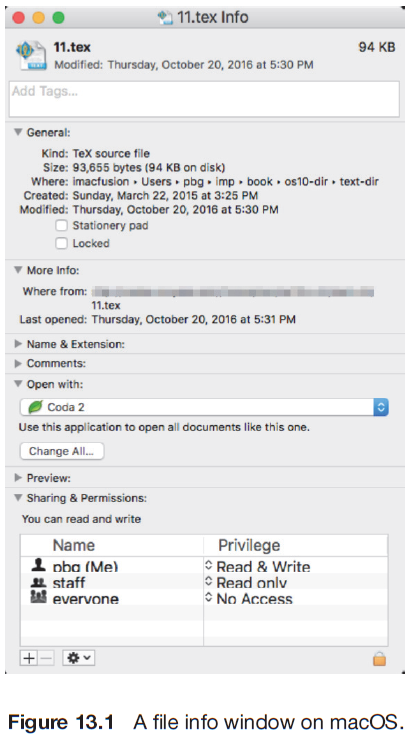
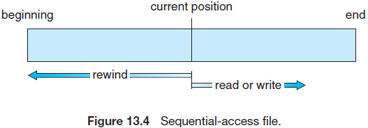
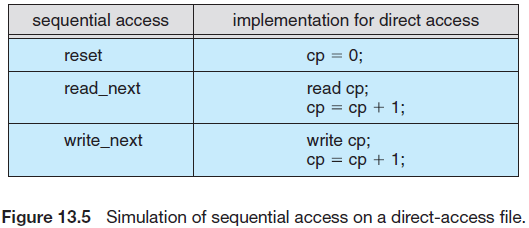
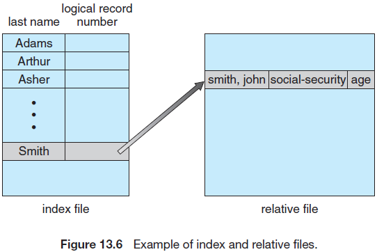
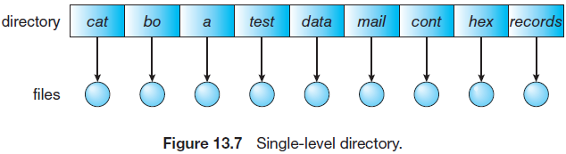
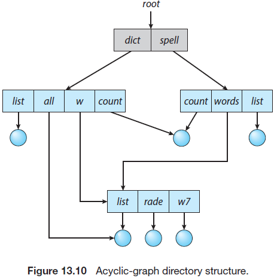
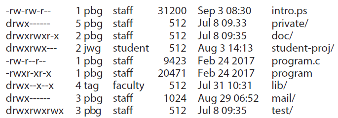
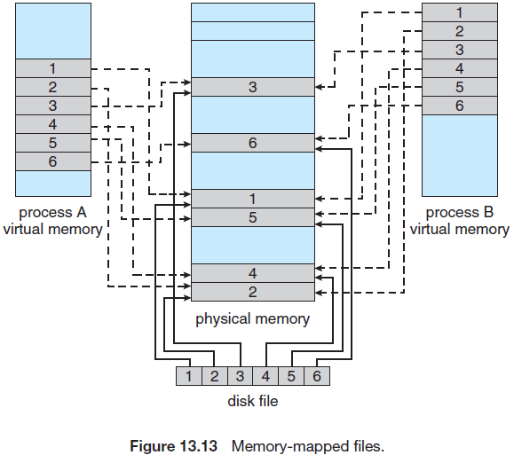

## File System

文件收集了创建者定义的相关信息。操作系统会将文件映射到物理上的大存储设备。一个文件系统描述了文件是如何映射到物理设备上的，以及如何被用户和程序访问和操作的。

访问物理存储通常比较慢，因此文件系统必须支持高效的访问。对文件系统还有其他需求，包括提供支持文件共享和远程访问等。

## File -System Interface

对于大多数用户，文件系统是最可见的操作系统的功能之一。它提供了操作系统和计算机系统上所有用户的数据和程序的在线存储和访问机制。文件系统包含两个不同的部分：文件的采集部分，保存相关的数据；目录结构，组织和提供关于系统上所有文件的信息。大多数文件系统位于存储设备上，这部分已经在第11章节进行过讲解，并在后续章节继续讨论。本章节中，我们会讨论多进程，多用户和多计算机间共享文件的语义。最后，我们会讨论文件防护的方法，用于在多用户时控制哪些用户可以访问文件以及如何访问文件。

### 13.1 File Concept

计算机可以将信息存储在多种存储媒体中，如NVM设备，HDDs，磁带和光盘。因此可以方便地使用计算机系统，操作系统提供了存储信息的统一逻辑视图。操作系统将存储设备的物理特性进行了抽象，并定义了一种逻辑存储单元，文件。操作系统会将文件映射到物理设备。这类存储设备通常不易丢失数据，因此在系统重启后能够保存内容不变。

一个文件就是相关信息的采集器，并将采集到的信息记录到二级存储中。从用户的视角看，一个文件是从逻辑二级存储上分配的最小存储块，即，除非使用文件，否则数据不能写入二级存储。通常，文件表项为程序(源和目标格式)和数据。数据文件可能是数字的，字母的，字母数字或二进制的。文件可以是自由格式，如文本文件，也可以进行严格的格式化。通常，一个文件是顺序的比特位，字节，行或记录等，具体含义由文件创建者和用户定义。文件的概念特别广泛。

由于文件是用户和程序用来保存或检索数据的方式，以及文件的用途如此广泛，因此它们的用途已经超出其原始范围。例如，UNIX，Linux和其他一些操作系统通过`proc`文件系统提供了访问系统信息的文件系统接口。

创建者定义了文件的信息。一个文件中可能存储了很多不同类型的信息，源或可执行文件，数据或文本数据，照片，音乐，视频等等。一个文件有一个特定的结构，结构类型取决于文件类型。一个文本文件是一系列组织为行(或页)的字符。一个源文件包含一系列功能，每个功能进一步被组织为声明，后跟可执行语句。一个可执行文件是一系列代码段，加载器可以将其加载到内存并执行。

#### 13.1.1 File Attributes

一个文件的名称指代该文件，可以方便用户的使用。一个名字通常是一个字符串，如`example.c`。一些系统上的文件名字会有大小写上的不同，而其他系统则不会。当命名一个文件时，该文件会独立于进程，用户，甚至创建该文件的系统。例如，一个用户可能会创建example.c，而其他用户可能会通过指定名称来编辑该文件。文件的所有者可能会将该文件写入USB设备，通过邮件附件发生，或通过网络进行拷贝，而在目标系统上，该文件仍然叫example.c。除非有共享和同步方案，使得第二个副本可以独立于第一个副本，并可以单独更改。

不同的操作系统上文件的属性不同，但通常包括如下内容：

- 名字：符号文件名是唯一使用用户可读格式保存的信息
- 识别：唯一标签，通常是一个数字，标识了文件系统中的文件。非用户可读名称。
- 类型：系统使用该信息支持不同类型的文件。
- 位置：该信息是指向文件所在的设备中的位置指针。
- 大小：当前文件的大小(单位为字节，字或块)以及可能存在的该属性允许的最大长度。
- 防护：访问控制信息确定了哪些用户可以读取，写入，执行等。
- 时间戳和用户识别：可能会保存创建，上一次修改和最后使用的信息。这些信息可以用户防护，安全和监控

一些新的文件系统也支持扩展文件属性，包括文件的字符编码和安全属性(如检验码)。图13.1描述了macOS上的文件信息窗口，展示了一个文件的属性。

所有文件的信息都保存在目录结构中，该目录结构与文件一起保存在相同的设备上。通常一个目录表项包含文件名字以及文件的唯一标识符。该标识符可以定位其他文件属性。每个文件可能会使用大于1千字节来记录文件信息。在有很多文件的系统中，目录大下可能是兆字节或千兆字节。由于目录必须与文件的易失性匹配，例如文件，它们必须存储在设备上，并且通常会在需要时将部分加载到内存中。



#### 13.1.2 File Operations

文件是一种抽象的数据类型。为了正确定义一个文件，我们需要考虑使用该文件进行的操作。操作系统可以提供创建，写，读，重定位，删除和截断文件的系统调用。让我们看一下操作系统在这些中操作中必须做些什么事情。由此可以看出其他类型的操作，如重命名文件。

- 创建文件。需要两个步骤来创建一个文件。首先在文件系统中找到属于该文件的空间。在14章中将会讨论如何为文件分配空间。第二在目录中创建新文件的表项。
- 打开文件。并不是所有的文件操作都需要指定一个文件名(会导致操作系统校验名称和访问权限等)，但除了创建和删除外的操作都需要首先`open()`一个文件。如果打开成功，打开调用会返回文件句柄，作为其他调用的一个参数。
- 写文件。为了写一个文件，系统调用需要指定打开的文件句柄和写入文件的信息。系统必须保存一个写指针，用于指定顺序写情况下下一次发生写文件的(位置的)指针。每次发生写后都需要更新写指针。
- 读文件。为了读取一个文件，系统调用需要指定文件句柄和放置(内存中)下一个文件块的位置。操作系统也会保存一个指向下一次读文件位置的指针(顺序读情况下)。一旦发生读，会更新读指针。由于进程经常会读取或写入一个文件，当前操作的位置可以保存在进程的当前文件位置指针。读和写都会使用相同的指针来节省空间和降低系统复杂性。
- 在文件中重定位。将一个给定的值赋予打开文件的当前文件位置指针。在一个文件中进行重定位并不需要实际的I/O。这种文件操作称为文件查找(seek)。
- 删除文件。为了删除一个文件，需要在目录种查找被命名的文件。在找到相关的目录表项后，释放所有文件空间，并清除或标记该目录表项为空闲，这样释放后的可空间可以被其他文件所使用。注意一些系统允许硬链接，即相同的文件有多个名字(多个目录表项)。这种情况下，在所有链接删除前，实际的文件空间不会被释放。
- 截断文件。用户可能会希望删除文件内容，但保留其属性。该功能允许除了文件长度外的其他属性保持不变(而不是强制用户删除文件然后重新创建)。文件长度可以被重置为0，此时会释放文件空间。

这七个基本的操作构成了最基础的文件操作。其他通用的操作包括在一个现有的文件最后拼接新的信息以及重命名现有文件。这些基本的操作可以组合为其他文件操作。例如，我们可以通过创建一个新文件，然后从旧文件读取并写入新文件的方式来创建一个文件副本。我们也可以允许获取并设置文件的属性，例如，可能希望有一个操作来允许一个用户确定文件的状态，如文件的长度以及设置文件的属性，如文件所有者。

正如前面所述，大多数已经提到的文件操作都需要在目录中查找与文件相关的表项。为了避免这种查找，很多系统在使用文件前都需要使用`open()`系统调用。操作系统会保存一个表，称为打开文件表，包含了所有打开文件的信息。当需要执行文件操作时，会通过该表中的索引指定需要操作的文件，这样就不需要查找了。当不再使用文件时，进程需要关闭该文件，操作系统会将其从打开文件表中移除，过程中可能会释放锁。`create()` 和 `delete()`时需要关闭文件，而不需要打开文件。

一些系统在首次引用一个文件时会隐式地打开文件。而当打开该文件的任务或程序结束后会自动关闭文件。然而，大多数系统需要程序员在使用一个文件前调用`open()`系统调用明确地打开该文件。`open()`操作会使用文件名来查找目录，并将找到的目录表项拷贝到打开文件表中。`open()`调用也接收访问模式信息，创建，只读，读写，只附加等等。这些模式会与文件的权限进行对比，如果文件的模式允许，则进程可以打开该文件。`open()`系统调用通常会返回打开指向文件表项的指针。该指针通常不是实际的文件名，可以用于所有I/O操作，避免后续的查找并简化系统调用接口。

在多进程可能同时打开一个文件的场景下，`open()`和`close()`操作的实现会更加复杂。当多个不同的应用同时开打一个文件时可能会发生这种情况。通常，操作使用会使用两级内部表：一个单进程表和系统层面的表。单进程表会跟踪一个进程打开的所有文件，该表中保存着进程所使用的所有文件。例如，可以在该表中找到当前每个文件的指针。也可以保存访问文件的权限和账户信息。(可以在/proc/$pid/fd目录中查看打开的文件)

单进程表中的每个表项会指向系统的打开文件表。系统表包含独立的进程信息，如文件在硬盘的位置，访问日志，和文件大小。一旦一个进程打开一个文件，系统表会包含该文件的表项。当另外一个进程执行了`open()`调用，会在进程的打开文件表中增加一条表项，并指向系统表中的合适的表项。通常，打开文件表也包含一个与每个文件相关的打开数(*位于系统表中*)，指示了进程打开的文件数。`close()`会降低打开数，当打开数降低到0时，该文件则不会再被使用，此时会从打开文件表中移除该文件的表项。

总之打开一个文件涉及以下信息：

- 文件指针。如果一个系统中的`read()`和`write()`系统调用不包含文件偏移量，则系统必须能够追踪上一次读写的位置，体现为当前文件位置指针。该指针对于在文件上操作的每个进程都是唯一的，因此必须单独保存在硬盘上的文件属性中。
- 文件打开数。当关闭文件时，操作系统必须重新使用其打开文件表项，否则可能会用尽表空间。多个进程可能打开同一个文件，系统在从打开文件表中移除该文件前，必须等待关闭最后一个文件。打开文件数跟踪打开的数目，并在该值为0时关闭，此时系统可以移除该表项。
- 文件位置。大多数文件操作需要系统从文件中读取或写入数据。首先需要获得文件位置，文件可能位于大存储设备上，使用网络链接的文件服务器或保存在内存中(这样在进行每个操作时，系统不必从目录结构中读取该文件）。
- 访问权限。进程会使用访问模式来打开一个文件。这种信息保存在单进程表中，这样操作系统可以允许或拒绝后续的I/O请求。

一些操作系统提供了锁定打开文件(或文件中的一部分)的方式。文件锁允许一个进程对一个文件进行加锁，防止其他进程访问该文件。文件锁在多进程共享一个文件时非常有用，例如，一个系统日志文件可能会被系统中的多个进程访问和修改。

文件锁提供了类似读写锁的功能(7.1.2章节)。一个共享锁类似一个读锁，多个进程可以同时获得该锁。一个互斥锁类似写锁，一次仅允许一个进程获得该锁。需要注意，并不是所有的操作系统都会提供这两种锁，一些系统仅会提供互斥的文件锁。

进一步讲，操作系统可能会提供强制性或建议性的文件锁定机制。使用强制锁时，一旦一个进程需要一个互斥锁，操作系统会防止其他进程访问被加锁的文件。例如，假设一个进程使用互斥锁加锁了`system.log`文件，如果另外一个进程(如文件编辑器)尝试打开`system.log`文件，操作系统会阻止该操作，直到互斥锁被释放。或者，如果使用建议性的锁，那么文件系统不会阻止文件编辑器访问`system.log`文件，然而，必须编写文件编辑器以便能够在访问文件前手动获取锁。换句话说，如果锁是强制的，操作系统保证锁的完整性。而对于建议性锁，则依赖软件开发者来保证正确地获取和释放锁。

使用文件锁时需要与普通进程同步相同的预防措施。例如，程序员在使用强制性锁的系统上进行开发时，必须注意只能在访问文件时持有互斥锁。否则会导致其他进程也无法访问文件。此外，必须采取一些措施来保证两个或多个进程不会在获取锁时产生死锁。

#### 13.1.3 File Types

当设计一个文件系统时，需要考虑操作系统是否需要识别和支持文件类型。如果一个操作系统识别文件类型，则可以使用合适的方式操作该文件。例如，当一个用户尝试输出二进制格式的程序时，通常会产生错误。这种操作一般会产生无用的信息。然而，如果操作系统事先知道该文件是一个二进制对象的程序时，这种操作则会成功。

实现文件类型的一种通用技术是将类型作为文件名字的一部分。文件名字分为两部分，名字和扩展，通常用句点分隔(图13.3)。通过这种办法，用户和操作系统就可以通过名字了解文件的类型。大多数操作系统允许用户将文件名指定为一个字符序列，后跟一个句点，并使用由其他字符组成的扩展名结尾。例如`resume.docx`, `server.c`,和`ReaderThread.cpp`


系统使用扩展来指定一个文件的文件类型和操作类型。假设，只有具有`.com`，`.exe`，和`.sh`扩展的文件才能够被执行，`.com`，`exe`文件是两种格式的二进制可执行文件，而`.sh`文件是包含(ASCII格式的)操作系统命令的shell脚本。应用程序也会使用扩展来标识其期望的文件类型。例如，Java编译器期望源文件具有`.java`扩展，而微软Word文本处理器则期望文件具有`.doc`或`.docz`扩展。由于并不经常需要这些扩展，因此一个用户可能在没有扩展的情况下指定一个文件，且应用会根据给定名字和扩展来查找一个期望的文件。因为操作系统不支持这些扩展，因此它们可以被视作给(操作对应的文件的)程序的一个"提示"。

考虑macOS操作系统，在这种系统上，每个文件都带一个类型，如`.app`(应用程序)。每个文件也有一个创建者属性，包含了创建该程序的名字。操作系统会在`create()`期间设置该属性，因此系统会强制并支持该属性。例如，一个文本处理器产生的文件会将文本处理器名称作为其创建者。当用户通过双击代表该文件的图标来打开该文件时，会自动唤醒文件处理器加载该文件，然后就可以编辑该文件了。

UNIX系统会在一些二进制文件起始处保存一个魔鬼数字来指定该文件类型(例如，将镜像文件格式)。类似地，可以在文本文件起始处保存一个文本魔鬼数字来标识文件的类型(脚本使用的shell语言)等等。(更多魔鬼数字和其他计算机术语，参见http://www.catb.org/esr/jargon/)。不是所有的文件都有魔鬼数字，因此不能仅使用该信息作为系统特性。UNIX不会记录创建程序的名字。UNIX允许文件名扩展提示，但这些扩展不是强制的，且不会依赖操作系统，大部分用于辅助用户判断文件包含的内容的类型。一个应用可以根据应用程序员的需要来忽略文件扩展。

#### 13.1.4 File Structure

文件类型也可以用于标识文件的内部接口。源和目标文件的结构符合读取它们的程序的预期。此外，特定的文件必须遵循可以被操作系统理解的结构。例如，操作系统需要一个可执行文件包含特定的结构，该结构可以用于确定加载到内存的文件位置，以及第一个指令的位置。一些操作系统会将这种理念扩展为一组系统支持的文件结构，并使用一组特殊操作来使用这些结构操作文件。

当操作系统支持多种文件类型时会导致一些不利因素：它使系统变得更大，更笨重。如果操作系统定义了五种文件结构，同时也需要包含支持这些文件结构的代码。此外，可能会需要将每个文件定义为操作系统支持的某种文件类型。当新的应用需要需要一种操作系统不支持的信息结构时，可能会导致问题。

例如，假设系统支持两种类型的文件：文本文件(包含用回车和换行分隔的ASCII字符)和可执行二进制文件。现在，如果用户需要定义一个加密文件来防止未授权用户的读取，我们可能会发现没有合适的类型支持这种文件。该加密文件既不是ASCII文本行也不是看似随机的比特位。虽然加密文件看起来像一个二进制文件，但它不可执行。结果，我们可能会规避或滥用操作系统的文件类型机制或丢弃我们的加密方案。

一些操作系统强制(或支持)最小的文件结构数。UNIX，Windows和其他操作系统采纳了这种方法。UNIX将每个文件视为一系列的8比特位字节，操作系统不会解析这些比特位。该方案提供了最大的灵活性，但仅提供了很少的操作系统方面的支持。每个应用程序必须将解析输入文件的代码包含在内。然而，所有的操作系统必须支持至少一个结构，即可执行文件，这样系统才能加载并运行程序。

#### 13.1.5 Internal File Structure

对操作系统来说，使用偏移量来在一个文件内部进行定位是比较复杂的。硬盘系统通常有一个使用扇区大小明确定义的块大小。所有的硬盘I/O都以块(物理记录)为单位执行，且所有的块的大小都相同。物理记录的大小可能与期望的逻辑记录大小不同。逻辑记录的长度可能会改变。一种通用的解决方案是将逻辑记录打包到物理记录中。

例如，UNIX操作系统将所有文件定义为字节流。可以通过从文件开头(或结束)的偏移量来单独定位每个字节。这种情况下，逻辑记录的大小为1字节，文件系统会将字节自动打包和解包到物理磁盘块，即，每个块512字节(根据需要)。

逻辑记录大小，物理块大小和打包技术确定了每个物理块中的逻辑记录数。打包可以由用户的应用程序或操作系统完成。在任何一种场景下，文件都被认为是一系列的块。所有的基本I/O功能都基于这些块。从逻辑记录到物理块的转换是一个相对简单的软件问题。

因为磁盘空间总是以块为单位分配，每个文件的最后一个通常块会被浪费掉。例如，如果每个块的大小为512字节，那么一个1949字节的文件会分配到4个块(2048字节)；最后一个块的99字节会被浪费掉。将所有数据以块为单位保存时导致的浪费称为内部碎片。所有的文件系统都会遭受内部碎片。块越大，内部碎片越大。

### 13.2 Access Methods

文件会存储信息，当使用文件时，必须访问这些信息并读入内存中。可以使用多种方式访问文件中的信息，一些系统仅提供了一种访问文件的方式，其他(如大型操作系统)则提供了多种方式，且为特定应用选择正确的访问方式是一个主要的设计点。

#### 13.2.1 Sequential Access

最简单的访问方式是顺序访问。按顺序处理文件中的信息，一个记录接一个记录。这种访问方式是最普遍的。例如，编辑器和编译器通常使用这种方式访问文件。

读和写构成了大部分的文件操作。一个读操作，如`read_next()`或读取文件的下一个部分并自动向前移动文件指针，以此跟踪I/O位置。类似地，写操作，`write_next()`将写入的数据附加到文件尾，并前进到新写的材料的结尾(新的文件尾)。这种文件可以被重置到开头，在一些系统上，一个程序可能向前或向后跳过n个记录，n为整数，有可能仅支持n=1。图13.4描述了基于文件的磁带模型的顺序访问，并且在顺序访问设备上和在随机访问设备上一样运行良好。



#### 13.2.2 Direct Access

另一种方式是直接访问(或相对访问)。这里，一个文件由固定长度的逻辑记录构成，允许程序可以不按照特定顺序快速地读和写记录。直接访问方式基于文件的硬盘模型，因此硬盘允许随机访问任何文件块。对于直接访问，文件可以看作大量顺序的块或记录。这样，我们可能先读块14，然后读取块53，然后块17。并没有限制一个直接访问的文件的读或写的顺序。

直接访问文件有利于立即访问大量信息。数据库通常使用这种方式。当接收到一个关于某个特定主题的查询时，我们会计算哪个块包含应答，然后直接读取那个块，并提供期望的信息。

看一个简单例子，在一个航空公司预订系统上，我们可能会在使用航班号标识的块上保存特定航班的所有信息(如航班713)。这样，713航班上可用的位置号保存在块713上的文件中。为了保存一个大的集合信息，如人，我们可能会根据人名运行一个哈希函数或通过搜索较小的内存索引来决定读或查找的块。

对于直接访问方式，必须修改操作方式，将块号作为一个参数。这样，当我们调用`read(n)`时，n为块号，而不是`read_next()`，`write(n)`也不是`write_next()`。一种替代方式是保存`read_next()`和`write_next()`，并增加一个操作`position file(n)`，n为块号。为了产生`read(n)`的效果，需要首先执行`position file(n)`，然后执行`read_next()`。

用户给操作系统提供的块号通常是一个相对块号。一个相对块号是一个相对文件起始位置的索引。因此，第一个相对块号是0，下一个是1，以此类推。即使第一个块的绝对硬盘地址可能是14703，第二个块为3192。使用相对块号允许操作系统决定哪里放置该文件(称为分配问题，14章节会讨论)以及帮助防止用户访问不属于她的文件所在的文件系统部分。一些系统的起始相对块号为0，其他为1。

然而，系统对满足对文件中第N个记录的请求吗？假设逻辑记录长度为L，对第N个记录的请求转变为对文件中L*(N)位置开始的L字节的I/O请求。由于逻辑记录都是固定长度，因此可以很容易地读，写或删除一个记录。

并不是所有的操作系统都支持顺序和直接访问文件。一些系统仅允许顺序文件访问，而其他则仅允许直接访问。一些系统需要在创建文件时指定是顺序的(访问)还是直接的(访问)。这种文件只能使用其声明的方式进行访问。我们可以使用定义了当前位置的变量cp来很容易地在直接访问文件上模拟顺序访问，见图13.5。然而，在一个顺序访问文件上模拟直接访问文件则极其低效和笨拙的。



#### 13.2.3 Other Access Methods

其他访问方式可以构建在直接访问方式上。这些方式通常与文件索引的构建有关。索引，就像书后的索引一样，包含指向何种块的指针。为了查找文件中的一个记录，我们首先查找索引然后使用该指针直接访问文件来找到期望的记录。

例如，一个零售价格档案可能会列出商品的通用产品代码(UPCs)，以及相关的价格。每条16字节的记录包含10个数字的UPC和6个数字的价格。如果一个硬盘的每个块为1024字节，则一个块可以存储64个记录。一个120000个记录可能会占用2000个块(2百万字节)。为了使得文件按照UPC排序，我们可以定义由每个块中的第一个UPC组成的索引。这样会有2000个10个数字的表项，或20000字节，并保存在内存中。为了找出特定商品的价格，我们需要二分查找索引。通过查找，我们可以知道那个块包含期望的记录，并访问该块。这种结构允许我们使用较小的I/O访问较大的文件。

当有大量文件时，内存中的索引也会变多。一种解决方案是为索引文件创建索引。主索引文件指向二级索引文件，二级索引文件中的块会指向实际的数据。

例如，IBM的索引顺序访问方式(ISAM)会使用一个较小的主索引，指向二级索引的硬盘块的。二级索引块会指向实际的文件块。文件按照定义的键进行排序。为了找到一个特定条目，我们首先二分查找主索引，找到一个二级索引中块号，读取该块然后执行二分查找，找出包含期望记录的块。最后，顺序查找该块。通过这种方式，最多使用两次直接访问读取就可以根据键定位任何一个记录的位置。图13.6展示了由OpenVMS和相对文件实现的类型场景。



### 13.3 Directory Structure

目录可以看作是将文件名转换为文件控制块的符号表。如果我们采取这样的观点，可以看到目录有多种组织方式，这种方式必须允许插入表项，删除表项，按照名称查找表项以及罗列出目录中的所有表项。本章中，我们将会考察几种定义了逻辑结构的文件系统。

当考虑到特定的目录结构时，我们需要注意一个目录中需要执行的操作：

- 查找文件。我们需要查找目录来找出特定文件的表项。由于文件有多种符号名字，相似的名字可能表示文件之间的关系，我们可能需要查找符合某一特定模式的所有文件。
- 创建文件。创建新文件并添加到目录中。
- 删除文件。当不再需要一个文件时，我们需要从目录中移除该文件。注意移除操作会在目录结构中留下一个空位，文件系统可能有一种方法来对目录结构进行碎片整理。
- 遍历目录。我们需要能够遍历目录中的文件以及每个文件在目录中的内容。
- 重命名文件。由于一个文件名代表其提供给用户的内容，我们必须能够在文件内容改变后改变其文件名。重命名文件也允许改变其在目录结构中的位置。
- 遍历文件系统。我们可能需要访问目录结构中的每一个目录和每个文件。为了可靠性，一种比较好的方式是定期保存整个文件系统的内容和目录。通常，我们会通过将所有的文件拷贝到磁带，其他二级存储或通过网络拷贝到其他系统或云。这种技术为系统失败场景提供了备份。此外，如果不再使用一个文件，该文件可以复制到备份目标，并释放该文件所使用的硬盘空间。

在后面的章节中，我们会描述定义目录的逻辑结构的通用方案。

#### 13.3.1 Single-Level Directory

最简单的目录结构是单级目录，所有的文件都包含在系统的目录中，很容易支持并理解这种结构，见图13.7



然而，当文件数目增加或系统中有多个用户时，单级目录有一个重要的限制。由于所有的文件都在系统的目录中，这些文件的名字必须保持唯一。如果两个用户的数据文件名都是`text.txt`，那么会违反唯一名字的规则。例如，在一个编程类中，23名学生他们的第二个任务的程序称为`prog2.c`，其他11名学生则将其称为`assign2.c`。幸运的是，大多数文件系统最大支持255个字符的文件名，因此选择唯一的文件名相对比较容易。

在单级目录上，在文件数增长的情况下，即使是单用户也比较难记住所有的文件名。一个用户在一个计算机系统上有数百个文件，在另一个系统上有额外相同数量的文件，这种情况并不常见。持续跟踪这些文件是一项艰巨的任务。

#### 13.3.2 Two-Level Directory

正如我们前面看到的，单级目录会导致多用户在文件命名上的困扰。标准的解决方案是为每个用户创建一个独立的目录。

在两级目录结构中，每个用户都有其自己的用户文件目录(UFD)。UFD的结构大体类型，不同的是每个UFD仅会包含属于该用户的文件。当开始一个用户任务或登陆一个用户时，会查找系统的主文件目录(MFD)。通过文件名或账户号索引MFD，且每个MFD中的表项指向该用户的UFD(图13.8)。


当一个用户引用一个特定的文件时，只会查找该用户的UFD。这样，由于每个UFD中的所有的文件名都是唯一的，不同的用户可能会有相同名字的文件。为了给一个用户创建一个文件，操作系统仅会查找该用户的UDF来确定是否存在相同名字的文件。当删除一个文件时，操作系统将搜索限制在本地UFD，这样就不会删除具有相同名字但属于其他用户的文件。

在需要时，可以创建或删除用户目录本身。当一个特殊的系统程序使用特定的用户名和账户信息运行时。程序会创建一个新的UFD并添加到MFD中。可能仅允许系统管理员运行该程序。分配给用户目录的磁盘空间可以使用14章节中讨论的技术进行处理。

虽然两级目录结构解决了名字冲突的问题，但它也有一些不足。这种结构有效地隔离了用户。隔离可以使用户完全独立，但当多用户需要协作完成一些工作或需要相互访问时又显出其不足。一些系统会简单地禁止其他用户访问本地用户文件。

如果允许访问，用户必须能够在其他用户目录中命名一个文件。为了能在两级目录中命名一个特定的文件，我们必须给出用户名和文件名。一个两级目录可以看作是一棵树，或一个倒立的树，高度为2。这棵树的根是MFD，它的直接后代是UFD，而UFD的后代就是文件本身。文件就是这棵树的叶子。指定一个用户名和一个文件名就可以指定从根(MFD)开始的到叶子(特定文件)的一条路径。这样，一个用户名和一个文件名定义了一条路径名。系统中的每个文件都有一条路径名。为了唯一命名一个文件，用户必须知道文件期望的路径名。

例如，如果用户A期望访问她自己的文件`test.txt`，她可以简单地引用`text.txt`。然而，为了访问用户B(目录名为`userb`)的名为`text.txt`的文件，她可能不得不指向`/userb/test.txt`。每个系统都有其语法来命名非本用户的目录中的文件。

还需要其他语法来指定文件的卷。例如，在Windows中，一个卷使用一个字符，后面根跟一个冒号来表示。这样，一个特定的文件可能为`C:\\userb\test`。一些系统走的更远，将卷，目录名和文件部分进行了分割。例如在OpenSVMS中，文件`login.com`可能指定为`u:[sst.crissmeyer]login.com;`u为卷名，sst为目录名，`crissmeyer`为子目录名，`1`为版本号。其他系统，如UNIX和Linux则将卷名作为目录名的一部分。第一个名字给出了卷，其他则为目录和卷。例如`/u/pgalvin/test`可能指定了卷`u`，目录`pgalvin`和文件`test`。

需要特殊对待系统文件。程序作为系统的一部分，如加载器，组装器，编译器，实用程序，库等，通常会被定义为文件。当给操作系统传入合适的命令后，操作系统会加载这些文件并运行。很多命令解析器仅简单地将文件名作为一个命令，加载并运行。在上面定义的目录系统中，会在当前UFD中查找该文件名。一种解决方案是将系统文件拷贝到每个UFD中，然而，拷贝所有的系统文件会浪费很大的空间。(如果系统文件需要5M，那么支持12个用户需要5 x 12 = 60MB)。

标准的解决方案是稍微使搜索过程复杂化。使用一个特殊的用户来包含系统文件(例如，用户0)。当需要加载任意文件名时，操作系统会首先查找本地UFD，如果找到，则使用该文件。如果没有找到，系统会自动搜索包含该系统文件的特殊用户目录。查找一个文件的目录顺序成为查找路径。可以将搜索路径扩展为包含目录的无限列表，在给出命令名称时进行搜索。大部分UNIX和Windows使用了这种方式。系统也可以设计为每个用户都有各自的查找路径。

#### 13.3.3 Tree-Structured Directories

一旦我们将二级目录看作一颗二级树，本质就概括为将目录结构扩展为具有任意高度的树(图13.9)。这种概括允许用户创建其子目录和组织相应的文件。一棵树是最通用的目录结构。该树有一个根目录，且系统中的每个文件都有唯一的路径名。


一个目录(或子目录)包含一系列文件或子目录。在很多实现中，一个目录也即另一个文件，但使用特殊的处理方式。所有的目录都有相同的内部格式。每个目录表项中使用一个比特位标识文件(0)或子目录(1)。使用特殊的系统调用来创建和删除目录。这种情况下，操作系统(或文件系统代码)实现了其他文件格式，即目录格式。

在使用中，每个进程都有一个当前目录。当前目录包含了该进程当前感兴趣的大部分文件。当引用一个文件时，会在当前目录中查找，如果该文件不在当前目录中，则用户必须指定一个路径名称或修改当前目录来包含该文件。为了修改目录，系统调用需要使用命令名作为一个参数，并使用它来重定义当前目录。这样，用户可以在任何时候修改其当前目录。其他系统则会将这些处理留给应用(如shell)，来跟踪或操作当前目录(不同的进程有不同的当前目录)。

当启动一个用户任务或用户登陆时，会给用户登陆shell分配一个初始的当前目录。操作系统会通过查找账户文件(在一些预先定义的位置)来查找该用户的表项。在账户文件中，会有一个指向用户初始目录的指针。该指针会被拷贝到指定用户初始当前目录的变量中。从这个shell中可以生成其他进程。任何子进程的当前目录通常是其生成时父级的当前目录。

路径名称由两种类型：绝对和相对。在UNIX和Linux中，一个绝对路径名称由根(分配一个初始的"/")开始，后跟到达到指定文件的路径，给出路径中的目录名称。一个相对路径名称为一个从当前目录开始的路径。例如，在图13.9中的树结构文件系统中，如果当前路径为`/spell/mail`，那么相对路径名称`/prt/first`在据对路径体现为`/spell/mail/prt/first`。

允许一个用户通过定义其子目录来在文件上加上结构。这种结构可能是由不同主题(例如，一个子目录包含了本书的内容)的相关文件或不同格式的信息构成的独立目录。例如，目录`programs`可能包含源程序；目录`bin`可能包含所有的二进制。(作为旁注，可执行文件在很多系统中为二进制，导致它们通常被保存在`bin`目录中)

确定一个树结构的目录需要关注如何处理删除掉的目录。如果一个目录为空，则可以删除目录对应的表项。然而，假设需要被删除的目录非空，且包含一些文件或子目录。可以使用如下两个办法中的任何一个。除非目录为空，否则一些系统无法删除该目录。如果存在任何子目录，必须递归地处理每个子目录，使其最后能够被删除。这种办法可能会导致大量后续工作。一个替代方式是使用如UNIX中的`rm`命令。当请求删除一个目录时，该目录中的所有文件和子目录也会被删除。这两种办法实现起来都比较简单，问题是采取哪种策略。后一种策略更加方便，但页更危险，因为使用一个命令就可以移除整个目录结构。如果该命令出现问题，需要恢复大量文件和目录(假设有备份)。

使用文件树系统，用户可以访问属于本用户和其他用户的文件。例如，用户B可以通过指定路径名称来访问用户A的文件。用户B可以指定绝对或相对路径名称。或者，用户B可以将其当前目录修改为用户A的目录来通过文件名进行访问。

#### 13.3.4 Acyclic-Graph Directories

考虑两个正在联合项目中工作的程序员。与项目相关的文件会被保存在一个子目录中，与这两个程序员的其他项目和文件隔离开来。但是既然两个程序员都对这个项目负有同样的责任，他们都希望该子目录位于他们的目录中。这种情况下，需要共享共同的子目录。一个共享的目录或文件同时存在于文件系统中的两个(或更多)地方。

一棵树结构禁止共享文件或目录。一个非循环图，即没有循环的图，允许目录共享子目录和文件(图13.10)。两个不同的目录中可能具有相同的文件或子目录。非循环图是树结构目录方案的天然特性。



需要注意，共享文件(或目录)与文件的两个副本不同。当使用两个副本时，每个程序员看到的是副本而非源，当一个程序员修改文件时，该修改不会出现在另一个副本上。使用共享文件时，只会存在一个实际的文件，因此一方做的任何修改都会立即被另一方看到。子目录的共享特别重要：当一方创建一个新文件时，该文件会出现在所有共享的子目录中。

当人们以团队方式进行工作时，他们需要共享的文件都可以放到一个目录中。每个团队成员都可以在主目录中将共享目录作为一个子目录。即使是在单用户情况下，用户的文件组织可能会需要将一些文件放在不同的子目录中。例如，一个特殊项目的程序需要放在同时放在所有程序的目录中，以及该项目的目录中。

可以使用多种方式实现共享目录和子目录。以UNIX系统为例，一个通用的方式是使用称为链接(link)的方式创建一个新目录表项。一个链接为指向其他文件或子目录的指针。例如一个链接可以是一个绝对或相对路径名称。当引用一个文件时，我们会查找该目录。如果目录表项被标记为一个链接，那么该链接会包含真实文件的名字。我们使用路径名称解析该链接并定位到实际文件。很容易根据目录条目中的格式(或系统上的支持的特定类型)来识别链接，且链接是有效的间接指针。当操作系统遍历目录树来保留系统的非循环结构时会忽略这些链接。

另一种实现共享文件的方式是在每个共享目录中复制所有的信息。这样，这两个目录表项都相同。考虑这种方式和创建链接的不同。链接不同于源目录表项，因此，两者并不相同。然而使用复制的目录表项时，无法区分原件和副本。使用副本目录表项的主要问题是，需要在文件修改时保持一致性。

一个无循环图结构要比简单的树结构更灵活，但也更复杂。必须要考虑到一些问题。一个文件可能具有多个绝对路径名称。因此，不同的文件名称可能指向相同的文件。这种情况类似编程语言的别名问题。如果我们尝试遍历整个文件系统来查找一个文件或收集所有文件的信息，或将所有文件拷贝到备份存储中，这种问题会变得严重(我们不会期望多次遍历共享结构)。

另一个问题涉及删除。什么时候可以释放并重用一个共享文件的空间？一种可能是在任何人执行删除时移除该文件，但这种方式可能会遗留指向当前不存在的文件的残留指针。更坏的情况下，如果遗留指向实际磁盘地址的指针，且这块空间已经被其他文件重用，这些遗留的指针可能会指向其他文件的中间位置。

在一个使用符号链接实现的共享系统上可以比较简答地解决这种问题。删除一个链接不会影响源文件，只会移除链接。如果文件表项被删除，就可以释放该文件的空间，留下链接。我们也可以通过查找并移除这些链接，但是除非每个文件都有相关链接的列表，这种查找的代价比较高。或者我们可以留下这些链接，直到这些链接再次被使用。这时，我们可以通过链接名称确定给定的文件已经不存在，无法解析链接名称，此次访问被视为与任何其他非法文件名一样。(这种情况下，系统设计者需要认真考虑，在使用符号链接指向的源文件前，删除该文件然后创建一个相同名称的文件时应该怎么处理)。在UNIX上，当一个文件删除后会留下符号链接。当用户意识到源文件不存在或被取代时，链接的处理却决于用户。微软Windows也使用相同的方式。

另外一种删除办法是保留文件，直到所有的引用被删除。为了实现这种方法，我们必须使用一种机制来确定最后一个被删除的引用。我们可以保存一个文件(目录表项或符号链接)引用列表。当创建一个链接或目录表项的副本时，会在文件引用列表中添加一个新的表项。当一个连接或目录表项删除后，我们可以从该列表中移除该表项。当列表为空时可以删除该文件。

这种办法的一个问题是变量和可能的大规模文件引用列表。然而，我们确实不需要保存整个列表，只需要保存引用的次数。添加一个新的链接或目录表项会增加引用次数。删除一个链接或表项会减少次数。当次数为0时，可以删除文件，此时没有任何引用指向该文件。UNIX操作系统在非符号链接(或硬链接)中使用这种方式，在文件信息块(见C.7.2章节)中保存引用计数。通过有效地禁止对目录的多次引用，我们可以维持一个非循环图结构。

为了避免上述讨论的问题，一些系统简单地不允许共享目录或链接。

#### 13.3.5 General Graph Directory

使用无循环图接口的重要问题是需要保证没有循环。如果使用两级目录时允许用户创建子目录，进而创建一个树结构目录。很容易看出，只需将新文件和子目录添加到现有的树结构目录中，就可以保留树结构的特性。然而，当添加一个链接时，会破坏树结构，产生一个简单的图结构(图13.11)。


一个非循环图的主要优势是使得遍历图算法变得相对简单以及确定何时不再引用文件。我们需要避免遍历两次共享的非循环图的部分(基于性能因素)。如果通过搜索一个主共享子目录来查找一个特定文件，但最后没有找到，我们需要避免二次查找该子目录。二次查找会浪费时间。

如果现有目录中允许循环，则需要避免二次遍历任何组件。一个差劲的算法可能会导致无限循环查找该循环图，且永远不会停止。一种解决方案是限制查找时访问的目录的数量。

一个类似的问题是决定何时删除一个文件。当使用非循环目录结构时，引用计数为0表示没有再引用文件或目录，此时该文件可以被删除。然而，当存在循环且再引用目录和文件时，引用计数也可能非0。这种异常可能是由于目录结构中存在自引用（或循环）导致的。这种情况下，我们需要使用垃圾回收方式来决定何时删除最后一个引用并释放磁盘空间。垃圾回收涉及遍历整个文件系统，标记每个可以访问的文件或目录。然后，第二次遍历收集所有未标记在可用空间列表上的内容。(类似的标记过程可以用于保证文件系统中的每个元素，仅会执行一次遍历或查找。)然而对于基于磁盘的文件系统来说，垃圾回收会花费很多时间，因此很少会使用。

仅会在可能有循环图时才会使用垃圾回收。因此，更容易使用非循环图结构。难点是如何避免添加到结构中的链接产生循环。如何知道新加的链接会产生循环？可以使用算法检测出图中的循环，然而这些算法会占用大量运算，特别是当这些图位于磁盘存储上时。一个简单的算法是在遍历目录期间绕过特殊的目录和链接。这样可以避免循环，也不会产生额外的开销。

### 13.4 Protection

当信息保存在计算机系统上时，我们希望能够物理损坏(可靠性)并防止非法访问(防护)。

通常使用文件的多个副本提供可靠性。很多计算机系统中的系统程序会定期(每天或每周一次)自动(或通过计算机操作员干预)将磁盘文件拷贝到磁带上，通过维护副本来防止文件系统意外损坏。硬件问题(如读或写问题)可能会损坏文件系统，如电涌或故障，头部撞击，灰尘，极端温度和蓄意破坏等。文件可能会被意外删除。文件系统软件的缺陷也可能导致文件内容丢失。第11章描述了更多关于可靠性的细节。

可以使用多种方式实现防护。对于一个运行现代操作系统的笔记本系统来说，我们可能通过用户名和密码认证，加密二级存储(这样即使在有人打开笔记本并移除驱动后仍然难以访问其数据)，以及网络防火墙(这样在使用时很难接入它的网络)来提供防护。在多用户系统上，即使是有效的系统访问，也需要更加先进的机制来限制为对数据的有效访问。

#### 13.4.1 Types of Access

防护文件就是限制访问文件的能力。系统上不允许访问的属于其他用户的文件则不需要防护。因此，我们可以通过禁止访问来提供完全的防护。或者，我们可以提供无防护的访问。两种方式都很极端，需要对访问进行控制。

可以通过限制文件访问类型来提供防护机制。访问的允许或拒绝取决于多种因素，一种是根据访问请求的类型。需要控制以下一种操作类型：

- 读。从文件读
- 写。写或重写文件
- 执行。将文件加载到内存并执行。
- 追加。在文件尾写入新的信息。
- 删除。删除文件并释放空间。
- 罗列。罗列文件名和文件属性。
- 修改属性。修改文件的属性。

也需要控制其他操作，如重命名，拷贝和编辑文件。然而对于很多系统，这类高级别功能可能由系统程序通过调用低级别系统调用来实现。例如，可能通过顺序读请求实现拷贝一个文件。这种情况下，具有读访问权限的用户也可以实现文件拷贝，打印等等。

目前已经提出了很多保护机制，每个提议都各有优缺点，且必须适合其预期用途。例如，一个研究组可能会使用一台小型的计算机系统，可能不会需要与用于研究，金融和人员操作的大型公司计算机相同的防护等级。我们会在后面的章节中讨论一些合适的防护，并在第17章中提出一个更完整的处理方法。

#### 13.4.2 Access Control

最通用的解决防护问题的办法是将用户身份与访问权限结合起来。不同的用户可能需要使用不同的访问类型来访问文件或目录。最通用的实现独立访问的方案是将每个文件和目录关联一个访问控制列表(ACL)，指定每个用户的用户名和访问类型。如果发起请求的用户在列表中，则允许访问。否则会发生防护冲突，并拒绝用户的任务访问该文件。

这种办法能够利用复杂的访问方法论。主要问题是访问列表的长度。如果我们需要允许一个用户读一个文件，则必须遍历所有具有读权限的用户，该技术会导致两种非期望的后果。

- 构造这样一个列表可能是一个单调乏味的工作，特别是当无法提前知道系统中的用户列表时。
- 目录表项，之前是固定长度，现在变长，导致更加复杂的空间管理

这些问题可以使用精简版的访问列表解决。

为了精简访问控制列表的长度，很多系统上的每个文件会与三类用户关联。

- 拥有着。创建文件的用户
- 组。用户以组或工作组方式共享文件和类似的访问。
- 其他。系统中的其他用户

最新最通用的方法是将访问控制列表与更通用(更容易实现)的拥有着，组和刚刚描述的universe(其他)访问控制方案进行结合。例如，Solaris默认使用三种类型的访问，但在需要更多细粒度访问控制时，可以将访问控制列表添加到特定的文件和目录中。

> UNIX系统中的权限
>
> 在UNIX系统中，目录防护和文件防护类似。每个文件和目录都与三个字段有关，拥有者，组和其他，每个字段包含3个比特位rwx，r控制读访问，w控制写访问，x控制执行。这样，当r设置在合适的字段后，用户就可以列举一个子目录中内容。类似地，如果假设foo子目录的x比特位设置在了合适的字段上，用户就可以将当前目录切换到foo目录。罗列UNIX环境中的目录的一个简单例子如下：
>
> 
>
> 第一个字段描述了文件或目录的防护。第一个字符d表示一个目录。其他字段为拥有着名称，组名，文件字节大小，修改日期和文件名等。

为了描述，假设一个用户Sara需要写一本新书，她雇佣了三名研究生(Jim,Dawn,和Jill)来帮助完成该项目。书的文本文件名为book.tex。与该文件有关的防护包括：

- Sara应该能够执行文件的所有操作。
- Jim，Dawn和Jill能够读和写文件；不应该删除该文件
- 其他用户应该能读文件，但不可以写文件(Sara可能会需要更多人来阅读该文档，以便得到反馈)

为了达到防护目的，我们需要创建一个新的组，即text，成员为Jim，Dawn和Jill。组名text必须与文件book.tex进行关联，并设置我们前面描述过的权限。

现在假设Sara需要给一个读者赋予临时读取Chapter 1的权限。该读者不能添加到text组中，因为这样会给他访问所有章节的权限。由于一个文件仅能属于一个组，Sara不能给Chapter 1添加其他组。然而，使用额外的访问控制列表功能，可以将该读者添加到Chapter 1的访问控制列表中。

为了使该方案正确运行，必须严格控制访问列表的权限。可以使用多种方式实现这种控制。例如，在UNIX系统中，只有管理员(或超级用户)才能创建和修改组。这样，控制是通过人的互动来实现的。17.6.2章节会进一步介绍访问列表。

由于防护等级有限，仅需三个字段即可定义防护。每个字段包含一些比特位，每个比特位表示允许或绝与其相关的权限。例如，UNIX系统定义了三个比特位，rwx，r控制读访问，w控制写访问，x控制执行。给文件所有者，文件组和其他用户各字保留一个独立的字段。例如，文件book.tex的防护字段为：对于Sara，设置所有比特位；对于组text，设置r和w；对于其他，则仅设置r。

组合这些方法的一个困难点在于用户界面。用户必须能够判断一个文件何时设置了可选的ACL权限。在Solaris系统上，"+"会跟在常规权限之后，如

```
19 -rw-r--r--+ 1 jim staff 130 May 25 22:13 file1
```

可以使用一对命令，`setfacl` 和`getfacl`来管理ACL。

Windows用户通常使用GUI来管理访问控制列表。图13.12展示了Windows 7 NTFS文件系统的文件权限窗口。在这个例子中，用户"guest"被拒绝访问文件`ListPanel.java`。


另一个难点是权限和ACL冲突。例如，如果Walter是一个文件组，具有读权限，但该文件的ACL授予Walter读和写权限，那么Walter是否可以写？Solaris和其他操作系统会优先ACL(颗粒度更细，且默认不会设置)。这遵循了一个一般规则，即特定性应具有优先权。

#### 13.4.3 Other Protection Approaches

其他解决防护问题的方式与每个文件的密码有关。正如访问计算机系统需要一个密码，访问每个文件也可以使用相同的方式。如果密码是随机的且经常变更，该方案可以有效地限制文件的访问。然而，使用密码也有一些缺陷。首先用户需要需要记忆的密码可能会变得更大，使该方案不切实际。再者，如果所有文件都是用了一个密码，那么一旦该密码泄漏，所有文件都可以被访问，防护就称为了要么都防护要么都不防护。一些系统允许用户设置子目录的密码，而不是单独的文件来解决这种问题。更多通用的加密方式给文件的一部分或单独的文件提供了更高的防护，但密码管理是关键。

在一个多级命令结构中，我们不仅要防护单独的文件也要防护子目录中的文件，即我们需要给目录防护提供一种机制。目录操作的防护与文件操作的防护有些地方是不一样的。我们希望控制目录中文件的创建和删除。此外，我们还可能希望控制一个用户是否可以确定目录中是否存在某个文件。有时，对文件的存在和名称的了解本身就很重要。因此，必须对罗列目录内容的操作进行防护。类似地，如果一个路径名指向目录中的一个文件，用户必须允许同时访问目录和文件。在一个文件可能由多个路径名称(如肺循环和普通图)的系统中，一个给定的用户可能对一个特定的文件由不同的访问权限，具体取决于使用的路径名称。

### 13.5 Memory-Mapped Files

可以通过将磁盘块映射到一个内存页的方式实现内存映射文件。初始访问文件时会使用到按需分页，此时会产生分页错误。文件中分页大小的部分会从文件系统读取到物理分页中(一些系统可能会选择一次读取大于一个分页的内存块)。后续对该文件的读写使用内存访问例程进行处理。通过内存操作文件不会产生使用`read()`和`write()`系统调用造成的开销，简化并加速了文件的访问和使用。

注意，写入文件映射的内存并不会立即(同步到)写入二级存储中。通常，系统仅在文件关闭时根据对内存镜像的更改更新文件。在内存有压力时，系统会将一些中间修改的部分放到交换空间来防止数据丢失，并释放这部分内存给其他地方使用。当文件关闭后，所有的内存映射数据会写回到文件所在的二级存储中，并从进程的虚拟内存中移除。

一些操作系统使用一个特定的系统调用提供了内存映射，并使用标准的系统调用来执行所有的文件I/O。然而，一些系统会选择在内存映射文件时不会关注该文件是否是内存映射的，以Solaris为例，如果一个文件被指定为内存映射的(使用`mmap()`系统调用)，Solaris会将该文件映射到进程的地址空间。如果打开一个文件并使用普通系统调用进行访问，如`open()`，`read()`和`write()`，Solaris仍然会使用内存映射该文件，但是，该文件映射到了内存地址空间。不管文件是怎么打开的，Solaris会将所有的文件I/O视为内存映射，允许通过高效的内存子系统来访问文件，避免传统的`read()`和`write()`系统调用产生的开销。

可以将多进程同时映射到相同的文件来共享数据。任何进程的写操作都会修改虚拟内存中的数据，映射到文件同一部分的所有其他进程都可以看到被修改的数据。根据我们之前对虚拟内存的讨论，应该清楚如何实现内存的内存映射部分的共享：每个共享的进程的虚拟内存指向相同的物理内存(保存磁盘块副本的分页)。13.13描述了这种内存共享。内存共享系统调用也支持写时拷贝功能，允许进程以只读方式共享一个文件，但保留了修改的数据的副本。这样就可以协调共享的数据，相关的进程可能会使用第6章节中描述的某一种实现了互斥的机制。



通常，共享内存实际上会通过内存映射文件来实现。这种场景下，进程可以使用共享内存进行通信，将相同的文件映射到需要通信的进程的虚拟地址空间中。内存映射文件充当通信进程之间共享内存的区域(图13.14)。3.5章节中我们已经看过这种场景，即，创建一个POSIX共享内存对象，并将该对象映射到每个通信的进程的地址空间中。


#### 13.5.2 Shared Memory in the Windows API  --ignore