## Chapter 5 CPU Scheduling

CPU调度是多程序操作系统的基础。通过进程间CPU的切换，操作系统可以更好地利用计算机。本章节中，将会介绍基本的CPU调度概念以及目前的几种CPU调度算法，包含实时系统，同时也会考虑到特定系统选择算法时遇到的问题。

第4章中介绍了线程和进程模型。在现代操作系统中，操作系统会对内核级别的线程(非进程)进行调度。然而，"进程调度"和"线程调度"可以等同使用。本章中，当涉及通用的调度概念时会用到进程调度，当涉及线程概念时会用到线程调度。

类似的，在第1章中介绍了核是基本的CPU计算单元，一个进程运行在一个核上。然而，本章的大多数场景中，当使用通用术语"将一个进程调度到一个CPU上"意味着该进程运行在CPU的一个核上.

### 5.1 Basic Concepts

在单CPU核系统上，仅允许同时运行一个进程。其他进程必须等待该CPU核释放后才能被调度。多程序编程中需要同时运行多个进程来最大化利用CPU资源。这种想法非常简单，即一个进程在其必须等待(通常是等待I/O请求结束)前会一直运行。在简单的计算机系统中，CPU会保持空闲状态，此时不会进行任何工作。通过多程序编程，可以尝试将这些空闲时间充分利用起来。同一时间会将一些进程载入到内存中，当一个进程等待时，操作系统会释放该进程的CPU并将这些CPU资源分配给其他进程，这种模式会持续进行。当一个进程等待时，其他进程可以接管CPU。在一个多核系统中，保持CPU繁忙的概念扩展到了系统上的多个处理核。

CPU调度是操作系统的基本功能，几乎所有的计算机资源在使用前都会被调度分配。CPU是主要的计算机资源之一，CPU的调度是操作系统设计中最重要的一环。

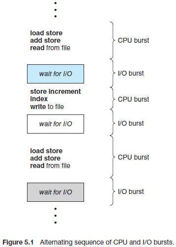

#### 5.1.1 CPU–I/O Burst Cycle

CPU的成功调度依赖于观察到的进程特性：进程执行包含CPU的周期性执行以及I/O等待。进程会在这两种状态之间进行转换。进程开始执行时会导致CPU突发(CPU burst)，然后是I/O突发(I/O burst)，然后再接一个CPU突发，I/O突发等等。最终，当系统请求结束运行时会触发最后一个CPU突发(图5.1)。

CPU突发的持续时间已经被广泛地测量。虽然不同进程，不同计算机上CPU突发时间有所差异，但都趋向于如图5.2所示的频率曲线。

曲线的特征通常是指数或超指数的，即在很短时间的高CPU突发之后，会有很长时间的低CPU突发。一个I/O密集型程序通常由很多低CPU突发，而一个CPU密集型程序可能会有一段高CPU突发。在实现CPU调度算法时需要关注这种分配方式。

#### 5.1.2 CPU Scheduler

当CPU空闲时，操作系统必须在ready队列中选择一个进程执行。选择的进程由CPU调度器调度执行，CPU调度器会从内存中的进程中挑选一个进程来执行，并将CPU分配给该进程。

注意FIFO队列中不需要ready队列，正如后面会看到的多种调度算法，ready队列可以使用FIFO队列，优先级队列，树或无序链表实现。从概念上讲，ready队列中的所有进程都会排队等待CPU(来运行)。队列中记录的内容通常是进程的进程控制块(PCB)。

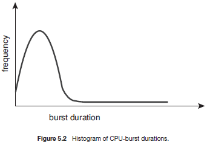

#### 5.1.3 Preemptive and Nonpreemptive Scheduling

以下四种场景会产生CPU调度：

1. 当一个进程从running状态切换到wait状态时(例如，由于I/O请求或调用了`wait()`来中断子进程)
2. 当一个进程从running状态切换到ready状态(例如，当发生中断时)
3. 当一个进程从waiting状态切换到ready状态(例如，I/O结束)
4. 当一个进程结束

对于1到4的场景，在调度时没有选择的余地，在发生CPU调度时必须从ready队列中选择一个进程运行。

当在1到4场景下发生CPU调度时，该调度方案被称为非抢占或合作，否则称为抢占。在非抢占调度下，一旦一个进程分配到了CPU，该进程会在释放或(切换到waitting状态)终止前持有CPU。实际上所有的操作系统，包括Windows，macOS和UNIX都是用了抢占调度算法。

不幸的是，抢占调度会导致多个进程共享数据时发生竞争。考虑两个共享数据的进程，当一个进程在更新数据时，第二个进程抢占运行，如果第二个进程尝试读取该数据，此时会导致状态不一致。第6章会详细讲解这种问题。

抢占机制也会影响到操作系统内核的设计。在处理系统调用时，内核可能正在代表进程忙于处理某种事务，该事务可能涉及修改重要的内核数据(如I/O队列)，如果该进程在修改途中被抢占，且内核(或设备驱动)需要读或修改相同的数据结构时会发生什么？--混乱。6.2章节会讨论这种情况。操作系统内核可以被设计为非抢占或抢占的。一个非抢占内核在进行上下文切换前会等待当前系统调用结束或I/O请求结束。由于在内核数据结构不一致时，内核不会抢占一个进程，这种处理方式保证内核结构足够简单。不幸的是，这种内核执行模型仅用于支持实时运算(任务必须在给定的时间内结束运行)。5.6章节中将会介绍实时系统的调度。一个抢占内核需要互斥锁在访问共享的内核数据结构时防止竞争。大多数现代操作系统的内核运行模式是完全抢占式的。

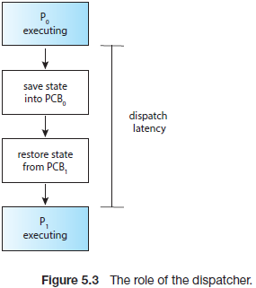

因为在任何时间都可能发生中断，且不能总是被内核忽略，因此必须保护不受中断影响的代码段的运行。操作系统几乎在任何时间都可能接收到中断，因此可能会发生输入丢失或输出被覆盖的情况。因此这段代码不能被多个进程同时访问，且在进入这段代码时取消中断，并在退出时恢复中断。需要注意的是，取消中断的代码并不会被经常触发，且通常仅包含很少的说明。*这段描述的应该是使用如local_bh_disable/enable函数保证操作的原子性*。

#### 5.1.4 Dispatcher

另外一个于CPU调度功能有关的组件是分配器(dispatcher)。分配器会将对CPU核的控制分配到CPU调度器选择的进程上。该功能涉及以下内容：

- 将一个进程切换到其他进程
- 切换到用户模式
- 通过将用户程序跳转到合适的(代码)位置来恢复该程序

由于分配器涉及到每个进程的上下文切换，因此分配器应该尽可能快的工作。分配器停止一个进程并启动另外一个进程花费的时间被称为分配延时，如图5.3所示。

需要考虑的一个有趣的问题是，多长时间会进行一次上下文切换？在系统层面，可以通过Linux系统上的`vmstat`命令查看上下文切换的次数。下面是命令的输出(被截断)

```
vmstat 1 3
```

该命令每秒会输出1行内容，总计3行

```
------cpu-----
24
225
339
```

第一行为从系统启动后平均每秒的上下文切换次数。下面两行为每2个1秒期间的上下文切换次数。在上面例子中，从机器启动后，每秒的上下文切换次数为24，在上秒内发生了255次上下文切换，在上上秒内发生了339次上下文切换。

可以使用`/proc`文件系统来查看给定进程的上下文切换次数。例如，`/proc/2166/status`文件中给出了`pid=2166`的进程的各种信息:

```
cat /proc/2166/status
```

给如如下已截断的输出：

```
voluntary ctxt switches    150
nonvoluntary ctxt switches 8
```

该输出显示了进程生命期间的上下文切换的次数。注意`voluntary`和`nonvoluntary`上下文切换的区别。当一个线程因为请求当前无法获得的资源(如，I/O阻塞)时会放弃CPU控制，该上下文切换被称为自发上下文切换。当CPU被其他进程抢占(如CPU时间片超时或被更高优先级的进程抢占)时的上下文切换被称为非自发上下文切换。

### 5.2 Scheduling Criteria

不同的CPU调度算法有不同的特征，特定算法选择的进程也可能不同于另外一个算法。在特定场景下选择算法时，必须考虑到不同算法的特点。

有很多用于比较不同CPU调度算法的准则。使用不同特征(进行比较来)选择的最优算法可能存在巨大差异。这些准则包括：

- CPU利用率。我们期望CPU保持繁忙。从概念上讲，CPU利用率范围可以从0%到100%，但在真实的系统上CPU利用率的范围为40%(低负载系统)到90%(高负载系统)。(Linux，macOS和UNIX系统上可以使用`top`命令查看CPU利用率)。
- 吞吐量。如果CPU忙于执行进程，则说明正在完成工作。吞吐量是一种衡量在单位时间内完成多少进程的方法。对于长时间运行的进程，该速率可能是每秒处理一个进程；对于短时间的进程，可能每秒能够处理10个进程。
- 周转时间(turnaround time)。从特定进程的角度看，最重要的准则是该进程需要花多少时间运行。从提交进程的时间到进程结束的时间称为周转时间。周转时间为进程在ready队列中等待的时间，CPU执行时间和I/O时间之和。
- 等待时间。CPU调度算法不会影响一个进程执行或进行I/O的时间，仅影响到进程在ready队列中等待的时间。等待时间是进程在ready队列中花费的时间周期之和。
- 响应时间。在一个交互式系统中，使用周转时间并不是一个好的准则。通常一个进程早期可以产生一些输出，并且在前一个结果显示给用户期间继续计算新的结果。因此应该策略从提交请求到生成第一个响应的时间，这种测量方法称为响应时间，该时间点为开始响应的时间，而非显示响应的时间。

应该最大化CPU利用率和吞吐量以及最小化周转时间，等待时间和响应时间，在大多数场景下会优化衡量的平均值。然而在一些场景下更倾向于优化最小或最大值，而非平均值。例如，为了保证所有用户都能等到优质的服务，应该减小最大响应时间。

研究人员建议，对于交互式系统(如PC桌面或台式机系统)，减小响应时间方差比减小平均响应更重要。具有合理且可预测响应时间的系统可能比平均速度更快但变化很大的系统更优。然而，在最小化方差的CPU调度算法方面，所做的工作很少。

下面章节会讨论各种CPU调度算法并描述其操作。一个精确的描述可能会涉及很多进程，每个进程都包含上百个CPU突发和I/O突发。为了简化，下面例子中仅考虑了一个CPU突发(单位毫秒)，通过平均等待时间比较。5.8章节中给出了更详尽的评估机制。

### 5.3 Scheduling Algorithms

CPU调度需要处理如何确定ready队列中的哪些进程应该被分配CPU核的问题。有多种不同的CPU调度算法，本章中描述了部分算法。虽然大多数现代CPU架构采用了多处理核，但此处描述了仅使用一个处理核的调度算法，即一个CPU只有一个处理核，因此在同一时间，该系统只能运行一个进程。在5.5章节中会讨论多处理器系统下的CPU调度。

#### 5.3.1 First-Come, First-Served Scheduling

目前为止，最简单的CPU调度算法是先进先出(FCFS)调度算法。在该方案下，首先请求CPU的进程会首先获得CPU。可以使用FIFO队列来简单实现FCFS策略。当一个进程进入ready队列后，会将该进程的PCB连接到该队列的尾部。当CPU空闲时，会将CPU分配给位于队列头的进程，然后将该进程从ready队列中移除。很容易编写并理解FCFS调度代码。

FCFS的负面效果是，该调度算法的平均等待时间通常会很长。加入一些进程加入队列的时间为0，CPU突发的长度(毫秒)如下:

```
Process Burst Time
   P1       24
   P2       3
   P3       3
```

如果进程加入FCFS队列的顺序为P1, P2, P3，使用如下甘特图展示结果，该条形图描述了特定的调度，包括每个特定进程的开始和结束时间。

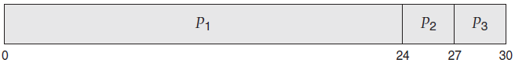

P1进程的等待时间为0毫秒。P2进程的等待时间为24毫秒，P3进程的等待时间为27毫秒。因此平均等待时间为(0+24+27)/3=17毫秒。如果进程加入队列的顺序为P2, P3, P1，如下面甘特图所示：

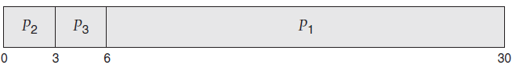

则平均等待时间为(6+0+3)/3=3毫秒，这种减小是非常客观的。因此FCFS策略下的平均等待时间通常不会很小，且当CPU进程的突发时间很大时可能会导致该值非常大。

此外，需要考虑动态场景下FCFS调度的性能。假设有一个CPU密集型进程和很多I/O密集型进程，随着进程在系统上的运行，可能会导致如下场景：CPU密集型程序会在运行期间获取并持有CPU，而其他进程在结束I/O后会转移到ready队列中等待CPU，由于此时这些进程处于ready队列中，I/O设备为空闲状态。最后，CPU密集型进程会结束CPU突发并开始处理I/O设备。此时所有的I/O密集型进程会短暂触发CPU突发，快速执行并返回I/O队列中。此时，CPU保持空闲状态。随后CPU密集型进程会转移到ready队列并获得CPU。此时所有的I/O密集型进程会在ready队列中等待，直到CPU密集型进程结束。当所有其他进程都在等待一个进程释放CPU时会造成车队效应。如果低运行时间的进程没有首先执行，此时会影响到CPU和设备的利用率。

应该注意到FCFS调度算法是非抢占的。一旦一个进程分配到CPU，该进程会在释放前(终止或请求I/O)持有该CPU。由于交互式系统中要求在固定时间每个进程都能获得CPU，因此FCFS算法在交互式系统会存在问题。允许一个进程长时间持有CPU将会是灾难性的。

#### 5.3.2 Shortest-Job-First Scheduling

一种实现CPU调度的算法为最短作业优先(SJF)调度算法。该算法与每个进程的下一个CPU突发长度有关。当CPU可用时，该算法会将CPU分配给下一个CPU突发最短的进程。如果两个进程的下一个CPU突发相同，则使用FCFS调度来解决。由于调度基于进程的下一个CPU突发长度，因此更适合该算法的术语为最短时间优先(shortest-next-CPU-burst)算法。因为多数人和教科书将该调度算法称之为SJF，因此沿用了该术语。

考虑下面四个使用SJF调度的进程，CPU突发单位为毫秒

```
Process Burst Time
   P1       6
   P2       8
   P3       7
   P4       3
```

使用SJF调度的结果如下：

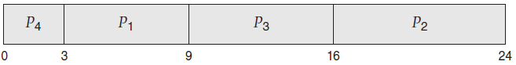

进程P1的等待时间为3毫秒，进程P2的等待时间为16毫秒，进程P3为9毫秒，进程P4为0毫秒。因此，平均等待时间为(3 + 16 + 9 + 0)/4 = 7毫秒。作为对比，如果使用FCFS调度方案，则平均等待时间为10.25毫秒。

由于SJF算法减小了给定进程集的平均等待时间，由此证明该调度算法是最优的。将耗时短的进程移动到耗时长的进程前，通过这种方式减小了耗时短的进程的等待时间，最终减小了平均等待时间。

虽然SJF算法是最优的，但由于无法事先知道下一个CPU突发的长度，因此无法事先CPU层面的调度。一种解决方式是尝试近似的SJF调度。虽然无法知道下一个CPU突发的长度，但可以预测到该值，将下一个CPU突发近似等同于上一个CPU突发长度。通过计算下一个CPU突发的近似长度，来选择具有最短CPU突发的进程。

通常使用上一个CPU突发测量出来的指数平均数来预测下一个CPU突发。公式如下。设置tn等于第n个CPU突发的长度，τn+1为下一个CPU突发的预测值，那么对于α, 0 ≤ α ≤1，定义：

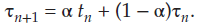

tn的值包含最新的信息，而τn保存了历史信息。参数α控制最新和历史信息的比重。如果α = 0, 那么τn+1 = τn,此时最新信息没有影响(假设当前状态为瞬态)。如果α = 1, 那么τn+1 = tn,此时仅与最新CPU突发有关(历史信息被认为是旧的且无关紧要的)。通常α = 1/2，此时最新信息和历史信息同等重要。τ0定义为一个常数或总的系统平均值。图5.4显示了当α = 1/2且τ0 = 10时的指数平均数


为了理解指数平均数的行为，将公式中的τn+1替换为τn：

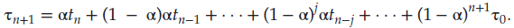

通常，α小于1，因此(1 − α) 也小于1，每个连续项均小于前一项。

SJF算法可以是抢占的或非抢占的，取决于一个新进程加入ready队列时，是否有进程正在执行。当新加入的进程的下一个CPU突发小于正在执行的进程剩余的CPU突发时，如果SJF算法是抢占的，新进程会抢占当前正在执行的进程，而非抢占式SJF算法会允许当前正在允许的进程继续执行，直到其CPU突发结束。抢占式SJF调度有时也被称为最短剩余时间优先调度(shortest-remainingtime-firs)。

例如下面四个进程，其CPU突发单位为毫秒：

```
Process Arrival Time Burst Time
   P1         0           8
   P2         1           4
   P3         2           9
   P4         3           5
```

如果进程加入ready队列的时间和突发时间如上表所示，那么抢占式SJF调度的结果如下：

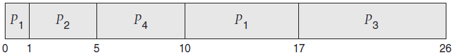

由于队列为空，P1进程的开始时间为0。进程P2的开始世间为1，此时进程P1剩余时间(7毫秒)大于进程P2所需要的时间(4毫秒)，进程P1会被P2抢占。计算得出的平均等待时间为[(10 − 1) + (1 − 1) + (17 − 2) + (5 − 3)]/4 = 26/4 = 6.5毫秒。非抢占式SJF调度得出的平均等待时间为7.75毫秒。

#### 5.3.3 Round-Robin Scheduling

轮询(RR)调度于FCFS调度类似，但增加了抢占功能，允许系统在多个线程间切换。该算法定义了一个短的时间单位，称为时间量(time quantum)或时间片(time slice)。一个时间量通常为10到100毫秒。轮询算法下，ready队列为环形队列，CPU调度器会遍历ready队列并将为每个进程分配1一个时间量。

为了实现RR调度，我们将ready队列视作FIFO进程队列。新的进程会添加到ready队列末尾。

CPU调度器会从ready队列中挑选第一个进程，并分配1时间量的定时器，然后分发该进程。

然后会发生两种事情之一：进程的CPU突发小于1时间量。在这种场景下，进程会主动释放CPU，此时调度器继续处理ready队列中的下一个进程；如果当前运行的进程的CPU突发大于1个时间量，则定时器会超时并给操作系统发出中断，此时会发生上下文切换，并将该进程放到ready队列的末尾。然后CPU调度器会从ready队列中选择下一个进程。

RR策略的平均等待时间通常会比较长。如下面进程到达ready队列的时间为0，CPU突发的单位为毫秒：

```
Process Burst Time
   P1       24
   P2       3
   P3       3
```

如果一个时间量为4毫秒，P1进程会获得第一个4毫秒。由于该进程会请求额外的20毫秒，它会在第一个时间量后被抢占，然后CPU会释放给队列中的下一个进程，即进程P2。进程P2不需要4毫秒。因此它会在时间量超时前结束。然后CPU会释放给下一个进程，即进程P3。一旦每个进程都接收到1个时间量后，CPU会返回给进程P1。RR调度结果如下：

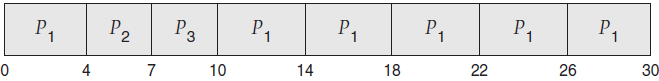

计算以下该调度的平均等待时间。P1等待6毫秒(10-4)，P2等待4毫秒，P3等待7毫秒。因此平均等待时间为17/3=5.66毫秒。

在RR调度算法中，没有进程会连续分配到大于1个时间量的CPU(除非该进程是唯一可运行的进程)。如果一个进程的CPU突发超过1个时间量，该进程会被抢占，并放回ready队列。因此RR调度算法是抢占式的。

如果ready队列中有n个进程，且时间量为q，那么每个进程最多会以q为时间单位获得1/n个CPU。每个进程在下一个时间量前不能等待超过(n-1)*q个时间单位。例如，有5个进程，且时间量为20毫秒，每100毫秒中，每个进程会获得20毫秒的CPU运行时间。

RR算法的性能依赖时间量的长度。极端情况下，如果时间量非常大，RR策略等同于FCFS策略。相反，如果时间量非常小(如1毫秒)，RR会导致大量上下文切换。假设只有一个进程，且有10个时间单位的CPU。如果时间量为12个时间单位，则该进程会在1时间量内结束而不会溢出。如果时间量为6个时间单位，此时该进程需要2个时间量，这样会导致上下文切换。假设时间量为1个时间单位，那么将会发生9次上下文切换，这样减缓了进程的运行(图5.5)

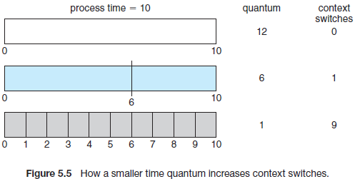

因此，为了减少上下文切换，时间量应该设置的足够大。假如上下文切换时间为时间量的10%，那么将会有10%的时间花费在上下文切换中。实际中，大部分现代系统的时间量从10到100毫秒。上下文切换的时间通常小于10毫秒，因此上下文切换时间属于时间量的一部分。

周转时间也与时间量长度有关。正如图5.6中所示，进程集的平均周转时间并不会随着时间量的增加而提升。通常情况下，如果大部分进程能够在一个时间量中完成下一个CPU突发，此时平均周转时间会得到提升。例如，假定有3个进程，每个进程分配10个时间单位，且时间量为1个时间单位，则平均周转时间为29。如果时间量为10，此时平均周转时间下降到20。如果考虑到上下文切换时间，小时间量下的平均周转时间会更大。

由于上下文切换需要花费时间，因此时间量映射设置足够大，但不能太大。正如之前所指出的，如果时间量过大，RR调度会蜕化为FCFS策略。经验上，应该将时间量设置为大于80%的进程的CPU突发。

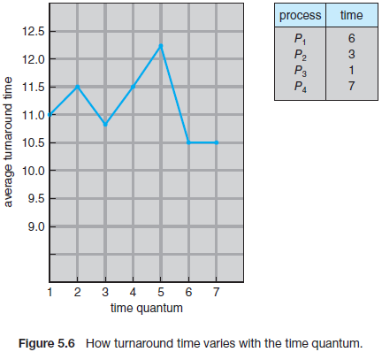

#### 5.3.4 Priority Scheduling

SJF算法属于优先级调度算法的特殊使用场景。每个进程都有一个优先级，CPU会分配给具有最高优先级的进程。相同优先级的进程使用FCFS顺序处理。SJF算法也是一个简单的优先级算法，其优先级与进程的(预测的)下一个CPU突发成反比。CPU突发越大，优先级越低，反之亦然。

在讨论该调度时使用了术语高优先级和低优先级。通常会将优先级固定在一个范围内，如0到7或0到4095。然而，并没有公认的协议来规定0是最高还是最低优先级。一些系统将小数值作为低优先级，而其他系统则会将小数值作为高优先级。这样可能会导致困惑。下面我们假设低数值代表高优先级。

假设有如下进程集，到达ready队列的时间为0，顺序为P1，P2，...，P5，CPU突发长度单位为毫秒。

```
Process Burst Time Priority
   P1       10      3
   P2       1       1
   P3       2       4
   P4       1       5
   P5       5       2
```

使用优先级调度时得出如下调度结果，平均等待时间为8.2毫秒。

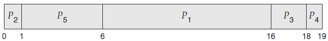

优先级可以时内部或外部定义的。内部定义的优先级使用一些可测量量来计算进程的优先级。例如，时间限制，内存需求，打开文件的数量或计算优先级时的平均I/O突发数与平均CPU突发数的比率。外部优先级由操作系统外部的标准设定，如进程的重要性，类型，计算机使用的资金，资助工作的部门以及其他因素(大部分是政策因素)。

优先级调度可以是抢占或非抢占的。当一个进程到达ready队列时，会将该进程的优先级与当前运行的进程的优先级进行比较。抢占优先级调度算法下，如果新到达的进程的优先级高于当前运行的进程的优先级，则会抢占现有进程的CPU。非抢占优先级调度算法下，则会将新进行放置在ready队列的首部。

优先级调度算法的主要问题是无限期阻塞和饥饿。当一个正常准备运行，但必须等待CPU时的状态被认为是阻塞的。一个优先级调度算法可能会导致一些低优先级的进程处于无限等待状态。在一个高负载计算机系统中，源源不断的高优先级进程可能会导致低优先级进程永远无法获得CPU。通常会发生这两种情况之一：该进程最终会运行(r如周日下午2点，系统负载下降)，或计算机系统最终崩溃并丢失所有的低优先级进程(传言MIT在1973年关闭了IBM 7094，原因就是在1967年提交的低优先级进程没有运行)。

解决低优先级进程无限阻塞问题的一种解决方式是使用老化。老化方案下，会逐渐增加系统中处于等待状态的进程的优先级。例如，如果优先级范围为127(低)到0(高)，我们可以周期性(如每2秒)将等待进程的优先级加1。最终优先级为127的进程会拥有系统中最高的优先级，此时该进程会被执行。实际上总共需要花费2分钟时间将一个优先级为-127的进程老化为优先级为0的进程。

另一种选择是将轮询和优先级调度进行结合，这样系统可以执行最高优先级的进程并对相同优先级的进程进行轮询调度。假设有如下进程，其突发时间单位为毫秒：

```
Process Burst Time Priority
   P1       4         3
   P2       5         2
   P3       8         2
   P4       7         1
   P5       3         3
```

使用高优先级调度并对相同优先级的进程轮询，得出如下进程调度结果，时间量为2毫秒：

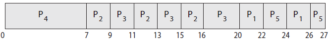

本例中，P4进程具有最高优先级，因此它会一直运行，直到结束。进程P2和P3为下一个最高优先级的进程，它们会使用轮询方式执行。注意当进程P2执行到时间16时，进程P3为最高优先级的进程，因此它会运行，直到结束。现在剩下进程P1和P，由于它们有相同的优先级，会使用轮询顺序执行，直到结束。*这种方式仅解决了阻塞，并没有解决饥饿问题。*

#### 5.3.5 Multilevel Queue Scheduling

使用优先级和轮询调度时，所有的进程都放在一个队列中，调度器从中选择具有最高优先级的进程运行。调度器会执行O(n)搜索来选出具有最高优先级的进程，n取决于队列的长度。实践中，不同优先级会对于不同的队列，且优先级调度仅会从最高优先级队列中调度进程，见图5.7。这种方式称为多级队列(multilevel queue)，同时也会结合优先级调度和轮询：如果最高优先级队列中有多个进程，会以轮询方式执行。这种方法最普遍的形式是给每个进程分配一个静态的优先级，并在运行期间保存在相同的队列中。

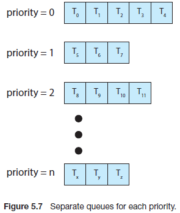

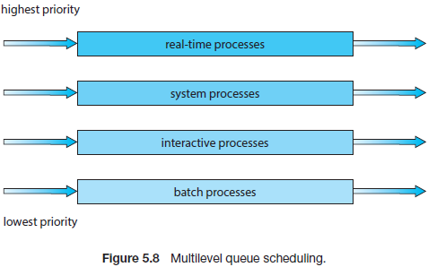

多级队列调度算法也会按照进程类型(如图5.8)将进程划分到不同的队列中。例如，一个典型的划分方法是将后台进程和前台进程进行划分。这两种类型的进程有不同响应时间要求，且可能会包含不同的调度需求。此外，前台进程的优先级(外部定义的)可能会高于后台进程。前台和后台进程使用不同的队列，且每个队列可能会有各自的调度算法。例如，前台队列可能使用RR算法，而后台队列使用FCFS算法。

此外，必须存在队列中之间进行调度，通常的实现为固定优先级抢占调度。例如实时队列的调度必须绝对优先于交互式队列。

下面看一个包含四个队列的多级队列调度算法，按照优先级排序：

- 实时进程
- 系统进程
- 交互式进程
- 批处理进程

每个队列都拥有高于低优先级队列的绝对优先级。例如，在实时进程，系统进程和交互式进程非空的情况下，不能运行批处理队列中的任何进程。如果在一个交互式进程进入ready队列时，有一个正在运行的批处理进程，此时批处理进程可能会被抢占。

另外一种可能是队列之间分配的时间片。这里，每个队列获取特定一部分CPU时间，后续会调度到队列中的各个进程。以前后台队列为例，前台队列可以在RR调度中获取80％的CPU时间，而基于FCFS的后台队列会获得20%的CPU时间。

#### 5.3.6 Multilevel Feedback Queue Scheduling

一般情况下，使用多级队列调度算法时，进程在进入系统时会永久分配到一个队列中。例如，如果前后台进程使用不同的队列，由于进程不会改变其前后台属性，则进程不会从一个队列转移到其他队列。这种处理在调度开销低时有利，但不够灵活。

相比之下，多级反馈队列(multilevel feedback queue)调度算法允许进程在不同队列间移动。主要通过进程的CPU突发特点来划分进程。如果一个进程花费了太多的CPU时间，则它会被转移到低优先级队列。这种方案将I/O密集型进程和交互式进程(这两类进程的CPU突发通常都比较短)放置到了高优先级队列中。此外，如果一个进程在一个低优先级中等待时间过长，可能会将该进程转移到高优先级队列。通过这种方式来放置饥饿。

例如，一个多级反馈队列调度器包含3个队列(如图5.9)，序号为0到2。调度器会首先执行队列0中的所有进程。当队列0为空时会执行队列1中的进程。类似的，在队列0和1都为空时会执行队列2中的进程。当一个进程进入队列1时会抢占队列2中的进程，而队列1中的进程会被进入队列0的进程抢占。

进入队列0的进程会分配一个时间量(8毫秒)。如果在这段时间内进程没有结束，则会将该进程转移到队列1的末尾。如果队列0为空，会分配队列1一个时间量(16毫秒)。如果在一个时间量内，队列1中的进程没有执行结束，则会将该进程转移到队列2中。队列2使用FCFS运行进程，并且仅在队列0和队列1为空时才能运行。为了防止接，在低优先级队列中等待足够长时间的进程会被转移到高优先级队列中。

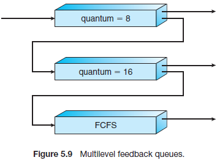

这种调度算法能够处理高优先级队列中CPU突发等于或小于8毫秒的所有进程。这类进程会快速获得CPU，并完成CPU突发，并转到下一个I/O突发。CPU突发大于8毫秒但小于24毫秒的进程虽然比执行时间短的进程拥有更低的优先级，也会被快速执行。长时间运行的进程会自动下沉到队列2，并在队列0和队列1处理完后按照FCFS顺序运行。

通常多级反馈队列调度器由如下参数定义：

- 队列数目
- 每个队列的调度算法
- 何时将一个进程升级到高优先级队列的方法
- 何时将一个进程降级到低优先级队列的方法
- 当一个进程出现时如何决定将该进程放到哪个队列的方法

多级反馈队列的定义使其成为了最通用的CPU调度算法，可以通过配置以适应正在设计中的特定的系统。不幸的是，为了定义最好的调度器，需要一些方法来从所有的参数中选择一些数值，因此该算法也是最复杂的算法。

### 5.4 Thread Scheduling

在第四章中在进程模型中加入了线程，并区份了用户级别(user-level)和内核级别(kernal-level)线程。大多数现在操作系统调度的时内核级别的线程，而非进程。用于线程由线程库管理，内核对其并不知晓。为了在CPU上运行，用户级别的线程必须最终映射到一个内核线程上，这种映射可能不是直接的，有可能通过轻量级进程(LWP)进行映射。本章节中会介绍与用户级别和内核级别的线程有关的问题，并提供一些例子来调度Pthreads。

#### 5.4.1 Contention Scope

用户级别和内核级别线程的区别之一是它们的调度方式。系统实现了多对一(4.3.1章节)和多对多(4.3.3章节)模式，线程库会将用户级别线程调度到一个可用的LWP上。由于相同进程中的线程会竞争CPU，这种方案称为进程竞争范围(PCS)。(当讲到线程库调度将线程到可用的LWP上时，并不意味着线程实际正在CPU上运行，还需要操作系统将LWP内核线程调度到物理CPU核)为了确定应该将哪个内核线程调度到CPU上，内核使用了系统竞争范围(SCS)。系统上所有的线程都会使用到SCS调度。使用一对一模型(4.3.2)的系统，如Windows和Linux的线程调度仅使用SCS。

通常PCS根据优先级处理，即调度器会选择具有最高优先级的线程运行。用户级别线程的优先级由编程人员设置并且不能线程库进行调节(虽然一些线程库允许编程人员修改线程的优先级)。需要注意的是，PCS通常会抢占当前运行的线程以支持高优先级的线程，但不能保证相同优先级的线程之间分配的时间片。

*PCS就是在进程内部范围内竞争CPU，SCS就是在系统范围内竞争CPU*

#### 5.4.2 Pthread Scheduling

在4.4.1章节中提供了一个简单的POSIX Pthread程序，并介绍了如何使用Pthreads创建线程。现在我们重点讲述允许在线程创建时指定PCS或SCS的POSIX Pthread API。Pthreads标识了如下竞争范围数值：

- PTHREAD_SCOPE_PROCESS：使用PCS调度线程
- PTHREAD_SCOPE_SYSTEM：使用SCS调度线程

在实现了多对多模型的系统上，`PTHREAD_SCOPE_PROCESS`策略会将用户级别线程调度到空闲的LWP上。线程库可能会使用调度激活机制(4.6.5)管理LWP的数目。`PTHREAD_SCOPE_SYSTEM`调度策略会将每个用户级别线程对应的LWP使用一对一策略绑定到多对多系统上。

```
• pthread_attr_setscope(pthread_attr_t *attr, int scope)
• pthread_attr_getscope(pthread_attr_t *attr, int *scope)
```

两个函数的第一个参数都包含一个指向线程的属性集的指针。`pthread_attr_setscope`函数的第二个参数为`PTHREAD_SCOPE_SYSTEM`或`PTHREAD_SCOPE_PROCESS`，指定了设置的竞争范围。而`pthread_attr_getscope`的第二个参数包含了一个指向当前竞争范围的`Int`型数值的指针。如果发生了错误，这两个函数都会返回非0值。

在下面代码描述了一个Pthread调度API。该程序首先确定当前的竞争范围，然后设置为`PTHREAD_SCOPE_SYSTEM`。然后会创建5个使用SCS调度策略的的线程。注意，在一些系统上，仅允许包含特定的竞争范围。例如，Linux和macOS系统仅允许`PTHREAD_SCOPE_SYSTEM`。

```
#include <pthread.h>
#include <stdio.h>
#define NUM THREADS 5

int main(int argc, char *argv[])
{
    int i, scope;
    pthread t tid[NUM THREADS];
    pthread attr t attr;
	
    /* get the default attributes */
    pthread attr init(&attr);
	
    /* first inquire on the current scope */
    if (pthread attr getscope(&attr, &scope) != 0)
        fprintf(stderr, "Unable to get scheduling scope∖n");
    else {
    if (scope == PTHREAD SCOPE PROCESS)
        printf("PTHREAD SCOPE PROCESS");
    else if (scope == PTHREAD SCOPE SYSTEM)
        printf("PTHREAD SCOPE SYSTEM");
    else
        fprintf(stderr, "Illegal scope value.∖n");
    }
    /* set the scheduling algorithm to PCS or SCS */
    pthread attr setscope(&attr, PTHREAD SCOPE SYSTEM);

    /* create the threads */
    for (i = 0; i < NUM THREADS; i++)
        pthread create(&tid[i],&attr,runner,NULL);

    /* now join on each thread */
    for (i = 0; i < NUM THREADS; i++)
        pthread join(tid[i], NULL);
    }
    /* Each thread will begin control in this function */
    void *runner(void *param)
    {
    /* do some work ... */
	
    pthread exit(0);
}
```

### 5.5 Multi-Processor Schedulingd

到目前为止主要关注单核系统上CPU的调度，如果使用了多CPU，多线程可能会并行，这种情况下的调度会相当复杂。由于我们熟悉的是单核CPU的CPU调度，因此在多核时没有合适的解决办法。

传统上，术语"多处理器"指代提供了多个物理处理器的系统，每个处理器包含一个单核CPU。然而多处理器的概念演化非常迅速，在现代操作系统上，多处理器适用于如下系统架构：

- 多核CPU
- 多线程核
- NUMA系统
- 异构多处理

这里会讨论这几种与多处理器调度相关的架构。前3个例子中主要关注哪些系统的处理器在功能上是相同的。最后一个例子中将会探讨一个系统中的进程的哪部分能力是不同的。

#### 5.5.1 Approaches to Multiple-Processor Scheduling

一种多处理器系统CPU调度需要执行很多调度决议，包括在主服务上处理I/O以及其他单处理器负责的系统活动，其他处理器则仅执行用户代码。由于只有一个核能访问系统数据结构，降低了数据共享的需求，因此这种非对称多处理模式非常简单。这种模式的缺点是主服务可能会称为导致系统性能下降的潜在瓶颈。

支持多处理器的标准方法是对称多处理(SMP)，即每个处理器各自调度。通过让每个处理器的调度程序检查ready队列并选择要运行的线程来进行调度。注意该方法提供了两种线程调度的策略：

1. 所有的线程都在同一个ready队列中
2. 每个处理器有其私有的线程队列

图5.11对比了这两种策略。如果选择第一种，则可能会共享的ready队列中发生竞争，并且必须保证两个独立的处理器不会选择调度系统的线程，且线程不会从队列中丢失。正如将在第6章中讨论的，我们将使用一些类型的锁来保护通用的ready队列，防止引发竞争。锁定将极具争议，然而，由于访问队列需要请求锁，因此访问共享队列可能会是性能瓶颈。第二个选择允许每个处理器使用其私有的队列调度线程，此时不会因为共享一个队列导致可能的性能问题，因此该方式能够更好地支持SMP。此外，正如5.5.4章节中所述，每个处理器使用私有队列的方式也会更高兴地使用缓存。单处理器运行队列的方式也会导致问题，最显著的问题是负载数量的变化。但是，正如后面会看到的，可以使用均衡算法来在所有进程之间均衡负载。

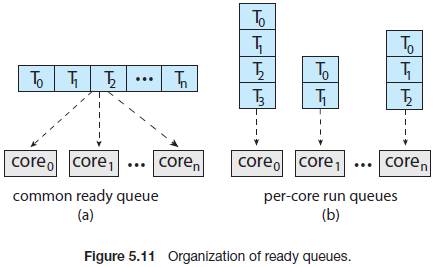

几乎所有的现代操作系统都支持SMP，包括Windows，Linux和macOS，以及移动系统Android和iOS。在剩余的章节中会讨论SMP系统在设计CPU调度算法时的问题。

#### 5.5.2 Multicore Processors

传统上讲，SMP系统通过提供多个物理处理器来允许并行多个进程。然而，大多数当代计算机硬件目前都会在一个物理芯片中安置多核心，即多核处理器。每个核心维护其状态，并为操作系统提供一个独立的逻辑CPU。使用多核处理器的SMP系统比一个物理芯片一个CPU的系统节省电能。

多核处理器可能会使调度变得复杂。研究人员发现，当一个处理器访问内存时，将会花费大量时间等待数据就绪。这种情况被称为内存暂停(memory stall)，主要发生在当处理器操作比内存更快的场景。然而，内存暂停也可能由缓存miss导致。图5.12描述了一个内存暂停。这种场景下，处理器可能会花费50%的时间来等待内存中的数据就绪。

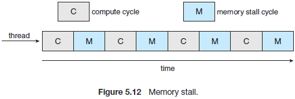

为了改进这种情况，许多最新的硬件已经实现了多线程处理核，其中的两个（或更多）硬件线程会分配给每个核。通过这种方式，如果一个硬件线程由于等待内存暂停，那么对应的核可以切换到另外一个线程。图5.13描述了在多线程处理核上交错运行线程0和线程1。从一个操作系统的角度看，每个硬件线程维护其状态，如指令指针和寄存器集。这种技术称为芯片多线程(CMT)，见图5.14，这里处理器维护了四个计算核，每个核包含两个物理线程。从操作系统角度看，有八个逻辑CPU。

Intel处理器使用了术语超线程(即同时多线程或SMT)来描述为一个处理核分配多条硬件线程。当前的Intel处理器，如i7，每核支持两条线程，而Oracle Sparc M处理器每核支持8条线程，每个处理器支持八核，因此可以给操作系统提供64个逻辑CPU。

通常有两种方式来实现处理核的多线程：粗粒度(coarse-grained)和细粒度(fine-graine)的多线程。当使用粗粒度的多线程时，一个核上运行的线程可以一直运行，直到发生长时延事件，如发生内存暂停。由于长时延事件会导致延迟，核必须切换到另一个线程运行。然而，由于在处理核允许其他线程运行前必须刷新指令流水线，因此线程间的上下文切换的代价是高昂的。一旦新的线程开始运行，该线程会使用其指令填充流水线。细粒度(或交替)多线程则以更精细的方式在线程间切换上下文，通常发生在指令周期的边界。然而细粒度系统的架构设计包含线程切换逻辑，因此线程上下文切换的代价比较小。

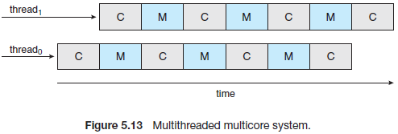

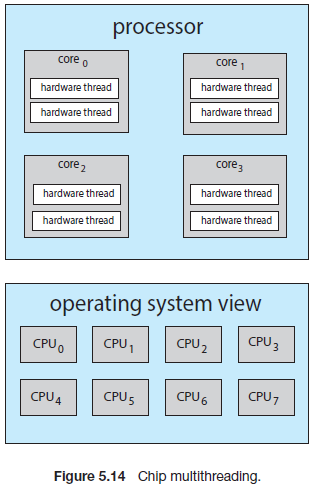

需要注意到，硬件核心的资源(如缓存和流水线)必须在其硬件线程间共享，因此，一个处理核在同一时间仅能运行一条硬件线程，所以一个多线程，多核处理器实际需要两层调度，如图5.15描述了多线程处理核。

在第一层中，由操作系统决定哪条软件线程运行在那条硬件线程(逻辑CPU)上。处于实际目的，本章节主要关注操作系统如何做出决定。因此，本层的调度中，操作系统可能会选择任何调度算法，其中包含5.3章节中描述的算法。

第二层中的调度指定了每个核决定运行到那条物理线程上。这种场景下，有多种策略可以采纳。一种方法是使用简单的轮询调度算法将硬件线程调度到处理核上，该方法被UltraSPARCT3采纳。另外一种方法被Intel Itanium采纳，即双核处理器，每个核包含两个硬件管理的线程。使用动态的`urgency`值分配每个硬件线程，`urgency`值范围为0到7，0表示最低的`urgency`，7表示最高的`urgency`。Itanium标识了可能导致线程切换的五种不同的事件。当发生其中一种事件时，通过比较两个线程的`urgency`，并将具有最高`urgency`值的线程调度到该处理核上运行，此时会发生逻辑线程上下文切换。

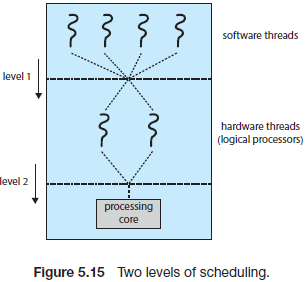

注意，图5.15中展示的两个不同层面的调度不一定互相排斥，实际上，如果操作系统调度器(第一层)能够意识到共享的处理器资源，那么就更高效地进程调度。例如，假设一个CPU有两个处理核，且每核有两个硬件线程。如果该系统上有两个软件线程正在运行，则这两个线程可以在相同或不同地核上运行，如果两个线程都调度到相同的核，则必须共享处理器资源，此时会明显慢于运行在不同核的情况。如果操作系统意识到处理器共享了资源，则可以将软件线程调度到不共享资源的逻辑处理器上。

#### 5.5.3 Load Balancing

在SMP系统上，在所有处理器上保持负载均衡非常重要，有利于充分利用多处理器的优势。否则，当其他处理器高负载运行时，一个或多个处理器可能处理空闲状态，此时ready队列中还有等待CPU的线程。负载均衡尝试负载平均分配将一个SMP系统上的所有处理器。需要注意的是，通常只有当系统上的处理器拥有私有ready队列时才需要负载均衡。在使用通用运行队列的系统上，由于一旦一个处理器变为空闲状态，会立即从通用ready队列中选择可运行的线程，因此不需要负载均衡。

有两种通用的方法来实现负载均衡：推迁移(push migration)和拉迁移(pull migration)。使用推迁移时会有一个特定的任务周期性校验每个处理器上的负载，如果发现不均衡，会通过将线程从过载的处理器上移动(或推)到不那么繁忙的处理器。当一个空闲的处理器从一个繁忙的处理器上拉取等待的任务时会发生拉迁移。推和拉迁移并不互斥。实际上，负载均衡系统中会同时实现这两种技术。例如，Linux CFS调度器(5.7章节描述)和FreeBSD系统的ULE调度器都实现了这两种技术。

"均衡负载"的意义有所不同，负载均衡可能会要求所有线程的请求大致相同。或者在所有队列中平均分配线程优先级。此外，在特定场景下，这两种策略都不能满足要求，可能会与调度算法相悖。*调度算法调度线程结束后，可能会被均衡策略打乱调度结果*

#### 5.5.4 Processor Affinity

考虑当一个线程运行在一个特定的处理器上时的缓存，线程使用最近访问的数据填充处理器缓存。因此，线程可以通过缓存来满足对内存的持续访问(即，热缓存)。现在考虑，如果线程由于负载均衡迁移到另外一个处理的场景，此时第一个处理器的缓存内容必须作废，且必须填充第二个处理器的缓存。由于作废和重新填充缓存的代价高昂，大多数支持SMP的现代操作系统尝试避免将一个线程从一个处理器迁移到另一个处理器，而是会尝试将一个线程运行在相同的处理器上，以利用热缓存的优势，称为处理器亲和力，即一个进程与其正在运行的处理器保持亲和关系。

第5.5.1章节描述的用于调度的线程队列会影响到处理器亲和力。如果使用了通用ready队列，可能会将一个线程分配到任一处理器上运行。因此，一旦一个现此在一个新的处理器上运行，就必须重新填充该处理器的缓存。使用私有ready队列的处理器时，线程总是会被调度到相同的处理器上，因此线程能够使用热缓存中的内容。最终，单处理器ready队列可以无缝隙提供处理器亲和力。

处理器亲和力可以有多种格式。当一个操作系统使用一种策略尝试将一个进程调度到相同的处理器上运行，但不保证结果，这种策略被称为软亲和力。该策略下，操作系统会尝试将一个进程绑定到一个处理器上，单在负载均衡期间可能被迁移到其他处理器。相比之下，一些系统提供了称为硬亲和力的系统调用，允许进程挑选其允许的处理器子集。很多系统同时提供了软硬亲和力。例如，Linux 实现了软亲和力，但也通过`sched_setaffinity()`系统调用提供了硬亲和力，允许线程指定允许的CPU的集合。

系统的主存架构可能会影响处理器的亲和力。图5.16描述了NUMA架构的特性，该架构下，两个处理器芯片中的每个芯片都有其各自的CPU和本地内存。虽然系统的互连允许NUMA系统中所有的CPU关系一个硬件地址空间，但一个CPU在访问本地内存要快于访问其他CPU的本地内存。如果操作系统的CPU调度器和内存安置算法是NUMA感知的，那么一个调度到特定CPU的线程会被分配临近该CPU的内存，这样使得线程能够更快地访问内存。

有趣的是，负载均衡经常会抵消使用处理器亲和力的好处。将一个线程保持在系统的处理器上运行的方式可以充分利用该处理器缓存。而均衡负载时将一个线程从一个处理器迁移到另一个则抵消了这种好处。类似的，NUMA系统中也可能发生线程迁移，此时迁移到其他处理器的线程可能会需要更长时间来访问内存。换句话说，负载均衡和最小化内存访问互斥。因此现代多核NUMA系统的调度算法会比较复杂。5.7.1章节中给出了Linux CFS调度算法，以及它如何平衡这种竞争关系。

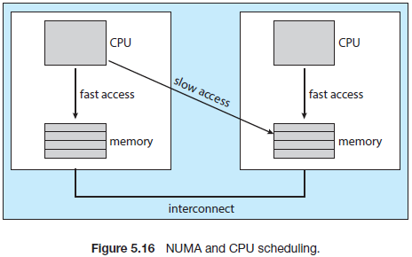

#### 5.5.5 Heterogeneous Multiprocessing

到目前为止的例子中，所有处理器的功能都相同，它们允许线程运行在任何一个处理核上。唯一不同点在于，负载均衡下的内存访问次数以及处理器亲和力策略等。

虽然移动相同目前包含了多核架构，一些系统也开始使用系统的指令集来设计使用多核，然而这些系统的始速度和电源管理(如，将核的功耗调整到核空闲的程度)都不尽相同。这类系统被称为异构多处理(HMP)。注意它与5.5.1章节中描述的非对称多处理(系统和用户任务都可以运行到任何核上)不同。HMP的目的是更好地管理根据特定的任务要求，将分配任务到特定核过程中的耗电量。

对于ARM处理器，这种架构称为big.LITTLE，即高性能big核会与高效的LITTLE核进行组合。big核会消耗更多的电能，因此应该仅运行一小段时间。类似的，little核会使用较少的电能，因此可以用于长时间运行的任务。

使用这种方法有几点优势，通过将一些慢速核和一些快速核结合，CPU调度器可以将一些不需要高性能，但需要长时间运行的任务调度到little核，这样可以节省电池电量。类似的，交互式应用比较耗电，但仅会运行一小段时间，因此可以被调度到big核。此外，如果移动设备处理节电模式，可能会取消耗能的big核，此时系统仅能够使用省电的little核。Windows 10通过允许线程根据电源管理要求选择调度策略来支持HMP调度。

### 5.6 Real-Time CPU Scheduling

实时系统中的CPU调度会涉及一些问题。通常实时系统分为软实时系统和硬实时系统。软实时系统不能保证一个关键的实时进程在调度时的运行，仅保证会优先于非关键进程。硬实时系统则有更严格的要求，**必须在deadline之前完成任务**，超过deadline后的进程运行与不配置实时的进程相同。本章中会介绍与软硬实时操作系统进程调度相关的问题。

#### 5.6.1 Minimizing Latency

考虑到实时系统的事件驱动性质，这种系统通常需要等待实时事件的发生。事件可以是由软件(如定时器超时)或硬件导致的(如遥控车检测到接近障碍物)。当发生这类事件时，系统必须发出响应并快速处理。我们将事件发生到事件处理中间花费的时间称为时间延迟。见下图：

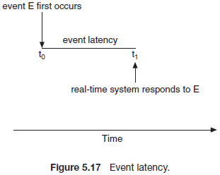

通常不同的时间有不同的延迟要求。例如，防抱死制动系统的延迟要求可能时3到5毫秒，即从轮胎一开始检测到滑行到系统控制防抱死的时间为3到5毫秒(包含响应和控制)。任何长时间的响应可能都会导致自动车辆的方向失控。相比之下，控制客机雷达的嵌入式系统可能会容忍几秒的延迟。

有两种类型的延迟会影响到实时系统的性能：

1. 中断延迟
2. 分发延迟

中断延迟为CPU的中断到达的时间到开始处理该终端的时间。当发生中断后，操作系统必须第一时间结束正在进程的指令并确定发生的中断的类型，然后在使用特定的中断服务处理程序(ISR)处理该中断前保存当前进程的状态。处理这些任务的总时间就是终端延迟(图5.18)。

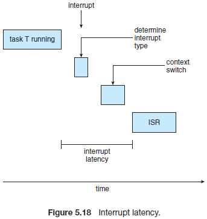

显然，实时操作系统需要通过减小中断延迟来保证实时任务能够立即接收到中断提醒。对于硬中断实时系统，必须严格符合这种系统的要求，不能简单地减小中断延时。

促成中断延迟的一个重要因素是，在内核数据结构升级期间可能会禁用中断时间，此时操作系统会要求在一个很短的时间内禁用中断。

调度分发器停止一个进程并启动另一个进程的时间称为分发延迟。为了使实时任务能够访问CPU，实时操作系统也需要减小这种延迟。保持低分发延迟的最有效方式是提供抢占式内核。对于硬实时系统，分发延迟通常为几毫秒。

在图5.19中描绘了调度延迟。分发延迟的conflict阶段包含两个组件：

1. 抢占内核中正在运行的任何进程
2. 从低优先级进程中释放出高优先级进程所需要的资源

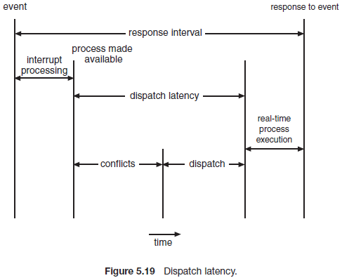

在conflict阶段之后，dispatch阶段会将高优先级进程调度到一个可用的CPU上。

#### 5.6.2 Priority-Based Scheduling

实时操作系统最重要的特性是在实时进程需要CPU时能够立即触发响应，因此实时操作系统必须支持基于优先级算法的抢占式调度器。回想一下，基于优先级的调度算法会根据进程的重要性给每个进程分配一个优先级，重要的任务会比不那么重要的任务分配更高的优先级。如果调度器支持抢占，那么当需要运行一个更高优先级的进程时，会抢占当前运行在CPU上的进程。

5.3.4中已经介绍了基于优先级的抢占式调度算法，在5.7章节中会给出Linux，Windows和Solaris操作系统上的软实时调度的例子。例如，Windows由32种优先等级，高优先级为16到31，保留给实时进程。Solaris和Linux的优先级方案类似。

注意提供了基于优先级的抢占式调度器仅保证软实时功能。硬实时相同必须能够保证实时任务的deadline要求，为了提供这种保障，需要实现其他的调度特性。在本章的剩余内容中将会涵盖硬实时系统的调度算法。

在继续介绍各个调度器前，必须定义被调度的进程的某些特性。首先进程是定期的(periodic)，即在恒定时间内(周期)会请求CPU。一旦一个定期进程获得了CPU，它由一个固定的处理时间t，CPU必须服务的deadline d以及周期p。处理时间，deadline和周期的关系为0 ≤ t ≤ d ≤ p。定期任务的发生率为1/p。图5.20描述了周期进程的运行情况。调度器可以充分利用这种特性并根据进程的deadline或发生率等要求来分配优先级。

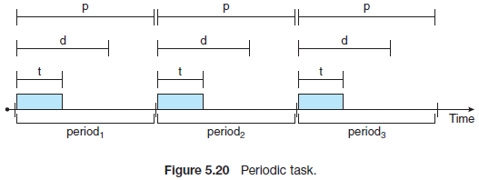

这种类型的调度的特殊点在于，一个进程可能会不得不为调度器提供其deadline要求。使用准入控制(admission control)算法的调度器可以实现：要么接受该进程，并保证进程会按时完成；或在无法保证任务的deadline时拒绝请求。

#### 5.6.3 Rate-Monotonic Scheduling

速率单调(rate-monotonic)调度算法使用具有抢占的静态优先级策略周期性调度任务。如果有一个低优先级的进程正在运行，如果此时需要运行高优先级的进程，则会抢占低优先级的进程。一旦进入系统，每个定期任务都会分配一个与周期成反比的优先级。周期越短，优先级越高；周期越长，优先级越低。该策略背后的基本原则是给更经常使用CPU的任务分配更高的优先级。此外，速率单调调度假设定期进程的处理时间等于CPU突发长度。

假设由两个进程P1和P2，P1和P2的周期为50和100(即，P1=50，P2=100)。P1的处理时间为t1=20，P2为t2=35。每个进程的deadline要求在开始下一个周期开始前完成CPU突发。

我们首先需要判断是否会调度这两个任务，并分配符合这两个任务的deadline。如果测量的进程P1的CPU利用率为其周期内的突发率，Ti/Pi，则P1的CPU利用率为20/50=0.40，P2为35/100=0.35，总的CPU利用率为75%。因此可以调度这两个任务并分配符合要求的deadline，此时CPU仍然持有可用的周期。

假设分配给P2的优先级高于P1，则P1和P2的执行情况如图5.21所示。正如我们看到的，P2的完成时间为35，此时，P1开始执行，并在55时完成CPU突发。然而P1的第一个deadline应该为时间50，因此调度器导致P1错过了其deadline(*deadline是一个绝对的截止时间*)。

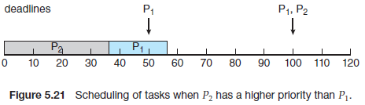

现在假设使用速率单调调度，由于P1的周期短于P2，因此会分配给P1更高的优先级。图5.22展示了这两个进程的执行情况。P1首先运行，并在时间20时结束CPU突发，因此符合其deadline。然后开始运行P2，直到时间50。虽然该进程还有剩下5毫秒的CPU突发，但此时它会被P1抢占(*因为P1的下一个周期开始了*)。P1会在时间70时结束CPU突发，然后重新运行P2，P2在时间75时结束CPU突发，也符合其deadline(*P2要求在时间100内运行完*)。然后系统保持空闲，直到时间100，然后再调度P1：

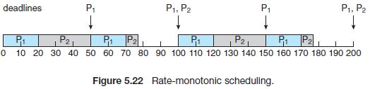

当一个进程集无法被其他算法调度且不能由分配静态优先级的任何其他算法调度时可能考虑使用速率单调调度。下面看下不能使用速率单调算法调度的进程集。

假设进程P1的周期p1=50，CPU突发t1=25。进程P2则为p2=80, t2=35。由于P1的周期短，因此速率单调算法会分配给P1进程一个更高的优先级。两个进程的CPU利用率为(25/50)+(35/80)=0.94，因此逻辑上会调度两个进程，且CPU或有6% 的空间时间。图5.23展示了进程P1和P2的调度。一开始会运行P1，直到其CPU突发结束，即时间25/然后会运行进程P2，直到时间50，然后被P1抢占，此时P2还需要10毫秒的CPU突发。进程P1会运行到时间75。最终P2会deadline要求的时间80之后(在时间85)结束其CPU突发。*这种情况下无法保证P2的deadline，无法使用速率单调调度*.

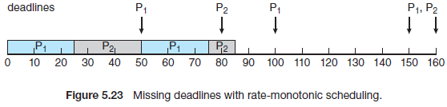

虽然速率单调算法可以优化调度，但它有一个限制：CPU利用率是固定的，即不可能总是最大化利用CPU资源。对N个进程调度的最坏情况为：

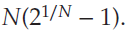

当系统上只有一个进程时，其CPU利用率为100%，随着进程数据接近无限，该值会下降到接近69%。当系统上有两个进程时，其CPU利用率大概是83% 。考虑图5.21和图5.22种的两个进程，其CPU利用率为75%，因此能够使用速率单调调度来保证这两个进程的deadline。对于图5.23中的两个进程，由于CPI利用率接近94%，因此速率单调调度无法保证它们的deadline。

#### 5.6.4 Earliest-Deadline-First Scheduling

最早deadline优先(EDF)调度会根据deadline动态分配优先级。deadline越早，优先级越高；deadline越晚，优先级越低。在EDF策略下，当一个进程可以运行，该进程必须向系统提交其deadline要求。当有新的可运行进程时，会对优先级进行调整，这与优先级不变的速率单调调度不同。

为了展示EDF调度，我们重新调度图5.23中无法使用速率单调调度的进程。P1的值为p1=50，t1=25；P2的值为，p2=80，t2=35。EDF的调度结果如图5.24所示。进程P1有最早的deadline，因此它的初始化优先级高于P2，P2会在P1的CPU突发之后开始运行。然而，速率单调调度允许uP1在下一个周期开始时(即时间50)抢占P2，而EDF下，由于P2的下一个deadline(时间80)早于P1(时间100)，因此EDF下此时P2的优先级高于P1，则允许P2继续运行。这样P1和P2的deadline都能得到满足。进程P1会在时间60再次运行，并在时间85结束第二个CPU突发，P1的第二个deadline开始时间为100。在时间100时，由于P1的deadline(时间150)早于P2(时间160)，因此P1会抢占P2。在时间125，P1结束了CPU突发，此时会恢复P2的运行，并在时间245结束(这种情况下也满足了deadline)。此后系统会保持空闲，直到时间150时重新调度P1运行。

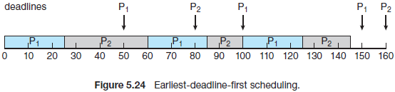

与速率单调算法不同，EDF调度不需要进程是周期性的，或每个突发必须是常量的CPU时间。唯一要求的是，进程需要给调度器提供其deadline值。EDF调度是理论上最佳的调度方式：理论上，它能够满足每个进程的deadline要求且能够100%利用CPU。实践中，由于由于进程间上下文切换和中断处理等原因，不可能达到100%的CPU使用率。

#### 5.6.5 Proportional Share Scheduling

比例股份调度器可以在所有应用间分配T股。当一个应用可以接收到N股时间时，需要保证应用的总处理器时间为N/T。例如，假设需要分配到3个进程(A ,B和C)的总股T=100，A分配到50股，B分配到15股，C分配到20股。这种方案保证A有50%的处理器时间，B有15%，C有20%。

比例股份调度器可能会与准入控制结合使用，保证应用接收到的时间股份。一个准入控制仅在股份充足时允许客户请求特定数目的股份。在上面例子中，总计分配了100股中的50+15+20=85股。如果一个新的进程D请求20股，则准入控制器会拒绝D进入系统。

#### 5.6.6 POSIX Real-Time Scheduling

POSIX标准也提供了实时计算扩展，POSIX.1b。本扩展覆盖了与实时线程调度相关的POSIX API。POSIX为实时线程定义了两种调度：

- SCHED_FIFO
- SCHED_RR

SCHED_FIFO使用如5.3.1中描述了FIFO队列，根据先进先服务策略来调度线程。然而，相同优先级的线程间没有使用时间片进程管理。因此FIFO队列中的高优先级实时线程可能会在其结束或阻塞前持有CPU。SCHED_RR使用轮询策略，与SCHED_FIFO类似，但在相同优先级的进程间提供了时间片功能。POSIX提供了一种额外的调度类型--SCHED_OTHER，但是它的实现是不确定的，并且依赖于特定的系统，不同系统的时间行为不同。

POSIX 指定了下面两种设置和获取调度策略的API：

- pthread_attr_getschedpolicy(pthread_attr_t *attr, int\*policy)
- pthread_attr_setschedpolicy(pthread_attr_t  *attr,  int\*policy)

两个函数的第一个参数指向了线程的属性，第二个参数：指向了用于设置了当前调度策略的整数(pthread_attr_getsched_policy())；或为pthread_attr_setsched_policy()函数提供了整型入参(SCHED_FIFO, SCHED_RR, 或SCHED_OTHER)。两个函数在发生错误时返回非0值。

图5.25描述了使用该API的POSIX Pthread程序，该程序首选确定当前的调度策略并设置调度算法为SCHED_FIFO。

### 5.7 Operating-System Examples